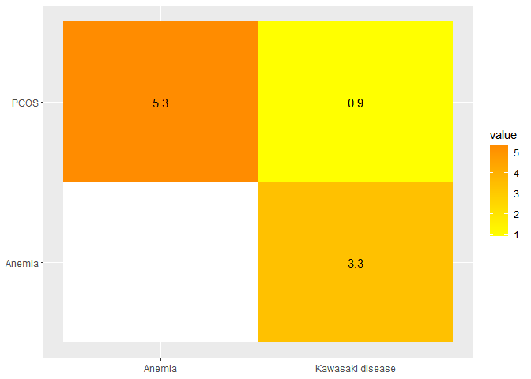

<!-- README.md is generated from README.Rmd. Please edit that file -->
# pcoskbR

pcoskbR provides an R interface to acess datasets related to PCOS in PCOSKBR2. As well as, data mining tools for comorbidity prediction and identification of enriched pathways and hub genes.

## Installation

You can install the developer version from github.

``` r
devtools::install_github("gaospecial/ggVennDiagram")
```

# Intoduction

PCOSKB is a manually curated knowledgebase on PCOS. PCOSKBR allows us. Information on associated genes, SNPs, diseases, gene ontologies and pathways along with supporting reference literature is collated and integrated in PCOSKB. Various tools are embedded in the database such as Comorbidity analysis for estimating the risk of diseases to co-occur with PCOS; Network analysis for identifying enriched pathways and hub genes and Venn analysis for finding common and unique genes, pathways and ontologies. The r "pcoskbR" package, provides an R interface to [PCOSKB](http://pcoskb.bicnirrh.res.in/). This vignette details pcoskbR functionalities and provides a number of example usecases that can be used as the basis for specifying your own queries.

# Selecting page and filters in pcoskbR

The R tool allows you to find information on genes, SNPs, diseases, gene ontologies and pathways associated with PCOS. The function `listPages()`will display information you can browse.

``` r
library(pcoskbR)
pages = listPages()
```

The function displays what kind of information associated to PCOS we can query in the database. The function `listFilters()` lists the filters you can apply to a given page.

``` r
gene_filters = listFilters("Genes")
gene_filters
#> [1] "all"              "Manually curated" "Expression study" "Other sources"
```

Now we can retrieve information on PCOS associated genes using the `browse()` function, using above filters.

``` r
gene_dataset = browse(page = "Genes", filter = "Manually curated")
head(gene_dataset)
#>       Gene Symbol Entrez ID                                           Aliases
#> row         ABCA1        19 ABC-1, ABC1, CERP, HDLCQTL13, HDLDT1, HPALP1, TGD
#> row.1       ACACA        31                     ACAC, ACACAD, ACC, ACC1, ACCA
#> row.2         ACE      1636                            ACE1, CD143, DCP, DCP1
#> row.3       ACTA2        59                                             ACTSA
#> row.4        ACTB        60                                  BRWS1, PS1TP5BP1
#> row.5       ACTG1        71                ACT, ACTG, DFNA20, DFNA26, HEL-176
#>                                       Gene Name Chromosomal Location
#> row   ATP binding cassette subfamily A member 1               9q31.1
#> row.1              Acetyl-CoA carboxylase alpha                17q12
#> row.2           Angiotensin I converting enzyme              17q23.3
#> row.3              Actin alpha 2, smooth muscle             10q23.31
#> row.4                                Actin beta               7p22.1
#> row.5                             Actin gamma 1              17q25.3
#>            Record type
#> row   Manually curated
#> row.1 Manually curated
#> row.2 Manually curated
#> row.3 Manually curated
#> row.4 Manually curated
#> row.5 Manually curated
```

# Tools available for analysis

## Comorbidity Analysis

The comorbidity Analysis tool allows us to check the comorbidity for PCOS and one or more diseases. We can call it using the function `generateComorbidityAnalysis()`. This function accepts a containing one or more diseases and the algorithm to perform the analysis. We can check a list of the available algorithms using the `listCAlgorithms()` function. For more details on how are scores are calculated refer to .

``` r
listCAlgorithms()
#> [1] "Shared genes"               "Uniqueness of shared genes"
#> [3] "Shared ontologies"          "Network-based seperation"
```

In this example we will use the algorithm based on shared genes.

``` r
generateComorbidityAnalysis(disease_list = c("Anemia", "Kawasaki disease"), algorithm = "Shared genes")
#> Warning: Removed 1 rows containing missing values (geom_text).
```



    #>          Anemia Kawasaki disease
    #> PCOS   5.328597        0.8880995
    #> Anemia       NA        3.3333333

The function returns a matrix with scores in each cell indicating the risk of comorbidity between two diseases and generates a heatmap with the risks.

## Network Analysis

### Disease-Disease Network

This tools allows us to illustrate a disease-disease network through shared genes. It can be called using the function `getNetworkAnalysis()`. It returns a dataframe with all input diseases and associated genes and displays a network of diseases where size of the node shows the size of a node is proportional to the number of genes associated with the disease and the width of each edge is proportional to the number the shared genes.

``` r
getNetworkAnalysis(disease_list = c("Cardiovascular Abnormalities","Xerotic keratitis", "Anemia",
 "Breast Cancer"), dataset = "Genes")
```

<!--html_preserve-->

<script type="application/json" data-for="htmlwidget-102aeff71113bb8ac8e0">{"x":{"nodes":{"id":["Cardiovascular Abnormalities","Xerotic keratitis","Anemia","Breast Cancer"],"label":["Cardiovascular Abnormalities","Xerotic keratitis","Anemia","Breast Cancer"],"value":[25,1,30,129]},"edges":{"from":["Cardiovascular Abnormalities","Cardiovascular Abnormalities","Anemia"],"to":["Anemia","Breast Cancer","Breast Cancer"],"value":[3,13,12]},"nodesToDataframe":true,"edgesToDataframe":true,"options":{"width":"100%","height":"100%","nodes":{"shape":"dot"},"manipulation":{"enabled":false}},"groups":null,"width":"100%","height":null,"idselection":{"enabled":false},"byselection":{"enabled":false},"main":null,"submain":null,"footer":null,"background":"rgba(0, 0, 0, 0)"},"evals":[],"jsHooks":[]}</script>
<!--/html_preserve-->
If this your first time using , you might wonder how to find diseases associated with PCOS. The function `listDiseases()` can be used to see all diseases associated with PCOS in the database.

``` r
listDiseases(dataset = "Genes", disease_group = "Renal Disorder")
#>  [1] "Albuminuria"                        "Allanson Pantzar McLeod syndrome"  
#>  [3] "Alport Syndrome"                    "Ascites"                           
#>  [5] "Atypical Hemolytic Uremic Syndrome" "Azotemia"                          
#>  [7] "Balkan Nephropathy"                 "Bladder Neck Obstruction"          
#>  [9] "CAKUT"                              "Diabetic Kidney Disease"           
#> [11] "Diabetic Nephropathy"               "Glomerular Hyalinosis"             
#> [13] "Glomerular Hypertrophy"             "Glomerulonephritis"                
#> [15] "Glomerulopathy"                     "Glomerulosclerosis"                
#> [17] "Hematuria"                          "Hemolytic-Uremic Syndrome"         
#> [19] "Hydronephrosis"                     "Hyperuricemic Nephropathy"         
#> [21] "Hypospadias"                        "Interstitial Cystitis"             
#> [23] "Kidney Calculi"                     "Kidney Failure"                    
#> [25] "Kidney Insufficiency"               "Kidney Tubular Necrosis"           
#> [27] "Nephritis"                          "Nephritis, Interstitial"           
#> [29] "Nephrolithiasis"                    "Nephropathy"                       
#> [31] "Nephrosis"                          "Nephrotic Syndrome"                
#> [33] "Oliguria"                           "Overactive Bladder"                
#> [35] "Oxalosis"                           "Painful Bladder Syndrome"          
#> [37] "Polycystic Kidney Diseases"         "Renal Fibrosis"                    
#> [39] "Renal Osteodystrophy"               "Uremia"                            
#> [41] "Ureteral Calculi"                   "Urinary Bladder Diseases"
```

The argument can either have "Genes" or "miRNAs" as value. To see the list of disease groups that can be used as input, you can use tbe 'listDiseaseGroup()' function. Default values are "Genes" and "all" for the and arguments.

``` r
listDiseaseGroup(dataset = "Genes")
#>  [1] "all"                                                            
#>  [2] "Blood Disorders"                                                
#>  [3] "Cardiovascular Diseases"                                        
#>  [4] "Congenital, Hereditary, and Neonatal Diseases and Abnormalities"
#>  [5] "Digestive System Diseases"                                      
#>  [6] "Ear Or Mastoid Diseases"                                        
#>  [7] "Endocrine System Diseases"                                      
#>  [8] "Eye Diseases"                                                   
#>  [9] "Immune System Diseases"                                         
#> [10] "Musculoskeletal Diseases"                                       
#> [11] "Neoplasms"                                                      
#> [12] "Nervous System Diseases"                                        
#> [13] "Nutritional and Metabolic Diseases"                             
#> [14] "Psychiatric/Brain disorders"                                    
#> [15] "Renal Disorder"                                                 
#> [16] "Reproductive disorders"                                         
#> [17] "Respiratory Tract Diseases"                                     
#> [18] "Skin and Connective Tissue Diseases"
```

This list of disease groups can be used as input in the function.

### Pathway Analysis

#### Getting enriched pathways

Explain about use of enriched pathways. The pathway analysis tool gives a of enriched pathways for selected diseases. We call it using the `generatePathwayAnalysis()` function. It accepts , and as arguments. Database can either be "KEGG" or "Reactome".

``` r
pathways.df = PathwayAnalysis(disease_list = c("Anemia"),
         dataset = "Genes",
          database = "KEGG")
head(pathways.df)
#>                                      Pathway name
#> row.1...1       Phospholipase D signaling pathway
#> row.2...2 Neuroactive ligand-receptor interaction
#> row.3...3  Adrenergic signaling in cardiomyocytes
#> row.4...4      Vascular smooth muscle contraction
#> row.5...5                Renin-angiotensin system
#> row.6...6                         Renin secretion
#>           Pathway genes associated with PCOS and the selected diseases
#> row.1...1                                                  AGT, PDGFRA
#> row.2...2                                                AGT, PRL, PTH
#> row.3...3                                                          AGT
#> row.4...4                                                          AGT
#> row.5...5                                                     AGT, REN
#> row.6...6                                                     AGT, REN
#>                                                                                                                                                                                                                                                                     Pathway genes associated with PCOS
#> row.1...1                                                                                                                                                                                    AKT3, AGT, EGFR, AKT1, AKT2, CXCL8, INS, INSR, PDGFRA, PIK3CA, PIK3CG, PIK3R1, PLCB2, PLCB3, MAPK1, MAPK3
#> row.2...2 CGA, UCN3, ADM, CRH, ADRB2, ADRB3, DRD2, AGT, APLNR, EDN1, FSHB, FSHR, GCG, GH1, GHR, GHRH, GIP, GLP1R, GNRH1, GNRHR, NR3C1, HTR2C, IAPP, INSL3, KISS1, KNG1, LEP, LEPR, LHB, LHCGR, MTNR1A, MTNR1B, NPY, OXT, GHRL, POMC, PRL, PYY, PTH, RLN1, RLN2, SST, TACR3, C3, CALCA, CCK, APLN, UCN2
#> row.3...3                                                                                                                                                                                                  AKT3, MAPK14, ADRB2, AGT, AKT1, AKT2, GNAQ, KCNQ1, ATF4, PIK3CG, PLCB2, PLCB3, MAPK1, MAPK3
#> row.4...4                                                                                                                                                                                                           ADM, AGT, EDN1, GNAQ, MYH11, NPPB, PLCB2, PLCB3, MAPK1, MAPK3, ACTA2, ACTG2, CALCA
#> row.5...5                                                                                                                                                                                                                                                                                ACE, AGT, REN
#> row.6...6                                                                                                                                                                                                                                 ADRB2, ADRB3, ACE, AGT, EDN1, GNAQ, PDE3B, PLCB2, PLCB3, REN
#>           Hypergeometric probability
#> row.1...1          0.159732685532648
#> row.2...2           0.23363353260246
#> row.3...3          0.371785240224444
#> row.4...4          0.364445361612939
#> row.5...5        0.00783718583187695
#> row.6...6         0.0819318218889266
```

This function returns a list of enriched pathways. Enriched pathways are identifed based on hypergeometric distribution with the threshold p value set as 0.05 (gene dataset) and 0.001 (miRNA dataset) based on the data size.

#### Visualizing enriched pathways

Output of the `generatePathwayAnalysis()` is used as input for the `viewNetwork()` function. This functions allows us to visualize the pathways as a network.

``` r
viewNetwork(pathways.df)
```

Each pathway is represented as a node and is connected to other pathways in the network based on common genes or miRNAs. Te thickness of the edge is proportional to the number of shared genes or miRNAs. In this example there are 151 nodes. We can also filter the data.frame to just obtain a network with enriched pathways for example.

``` r
#filter dataframe to only obtain enriched pathways
enriched_pathways.df = pathways.df[which(pathways.df$`Hypergeometric probability` <= 0.005),]
viewNetwork(enriched_pathways.df)
```

### Gene Network Analysis

This tool allows us to generate hypothesis about disease targets based on network properties. Experimentally validated interactions from STRING v11 were used for creating gene interaction networks for enriched pathways. Critical genes in these pathways were identifed based on network topological properties such as degree, closeness centrality, and betweenness centrality calculated using [igraph](https://igraph.org/) package in R. You can call it using the `getGeneNetworkAnalysis()` function.

``` r
gene_tbl.df = getGeneNetworkAnalysis(disease_list =  c("Psychomotor Disorders", "Psychosexual Disorders" , "Pubertal Disorder"),
database = "Reactome")
#> Submitting with 'Add'
```

Check [PCOSKB](http://pcoskb.bicnirrh.res.in/) for details on how bottleneck genes and hub genes are chosen.

#### Visualizing interactions

We can also visualize all gene-gene interactions using `viewInteractions()` function. It has one argument and the value is a gene Symbol.

``` r
viewInteractions("INS")
```

<!--html_preserve-->

<script type="application/json" data-for="htmlwidget-35e85aeba03a63bdbebe">{"x":{"nodes":{"id":["FGR","CFTR","M6PR","CD38","PDK4","HCCS","COPZ2","CREBBP","MPO","PON1","PDK2","ABCC8","TAC1","CX3CL1","CACNA1G","ADIPOR2","PROM1","NOS2","MATK","PAX6","CACNA2D2","SELE","FMO3","SYN1","CRY1","MMP25","GIPR","NISCH","PRSS3","BTK","HFE","FYN","FMO1","NME1-NME2","ABHD5","PIK3C2A","DCN","BRCA1","ERCC1","ALOX5","CAPN1","NPC1L1","ISL1","IGF1","SNAI2","HGF","ALAS1","HSD17B6","NR1H3","CD44","INSRR","TNFRSF1B","ANK1","GRN","ATP6V0A1","VCL","TIMP2","USP2","CASR","FLT4","CDH1","TG","ADRB1","EPHA3","HSPA5","ATP6V1H","TPR","CP","XK","ROS1","H6PD","FOXP3","MAPK9","PIK3CB","CYBA","KCNQ1","PTPRN","EIF2AK2","SERPINB3","SOAT1","ATG5","SLC2A3","WNK1","CREB3L3","CS","LTK","CASP8","NGFR","ERBB3","MYLK","TBC1D1","FGFR2","TNFRSF1A","PKM","RHOA","PRKCZ","ROCK1","HYAL2","FGFR3","COASY","SIRT2","PPP2R5B","GAL","RAB27A","SCT","ELP1","FGF10","EXOC5","POLB","CHAT","CDC42","TRPM5","NCK2","RPS6KA2","ATP6AP1","ALDH3A2","TFRC","SREBF1","SCARB1","PTGS2","IGF2BP2","TBX21","NSF","MGLL","FGF4","PLD1","ATP12A","ACACB","MCAM","GPC4","MAP2K7","DYNC1I2","SIRT6","TYR","CAPZB","FGFR1","MAP2","FAP","PIK3C3","TIGAR","PPP2R5C","EDN1","CDH17","TNS1","RAPGEF3","CEACAM1","LIPE","SCGN","KEAP1","CPB2","PSEN1","HSP90AA1","AFP","MEF2C","PTPRC","PGR","OPRK1","GSK3B","GSTP1","APOB","GCKR","CD59","ABCB1","AKR1B1","TMED2","ERO1B","FTL","MMP2","ADD1","PTHLH","PIR","SLC15A1","FKBP1A","RPLP0","PXN","SIRT4","NOS1","SLC9A1","ICAM1","SI","EXOC1","ITGA6","RAPGEF4","CPA1","ESR1","ANGPT2","MYH7","TYRO3","CAPN3","SNAP23","MAP3K1","ARCN1","SORBS1","PGC","MLN","ITPR3","SIRT1","JAK2","ABL1","SCD","IGFALS","MMP11","DDT","CABIN1","MAPK1","GGT1","SOX10","SLC5A1","KDELR3","HMOX1","PDGFB","PNPLA3","MYH9","EP300","PSMC6","ATP6V1D","CHGA","HIF1A","SERPINA4","DICER1","PCK2","NFKBIA","PLTP","MMP9","CD40","HNF4A","ARFGAP1","AVP","TRIB3","HAO1","PDYN","SAMHD1","JAG1","OXT","CST3","LPIN2","TLR8","XIAP","SYP","CD40LG","TIMP1","SYTL4","ACP5","FGF9","FLT1","MAPK3","CTCF","MMP15","COG4","MLYCD","TSC2","CAPN15","STX4","BCKDK","AQP9","CSK","CTSH","TJP1","CA2","DECR1","IKBKB","PLAT","IL7","DCTN6","GSR","TNFRSF10A","PPP2CB","GYS1","DMPK","PTOV1","TNNT1","ILVBL","AKT2","SLC1A5","TGFB1","PLIN3","CEACAM5","TYK2","SULT2A1","NAPA","KDELR1","FGF21","BCAT2","JAK3","PIK3R2","COPE","ATP4A","GAPDHS","FKBP8","GSK3A","NAMPT","PIK3CG","MTPN","ATP6V0A4","OGDH","CAV2","CAV1","MET","GRB10","STX1A","HSPB1","HYAL4","SPAM1","SERPINE1","NRF1","AHR","RHEB","GCK","YKT6","LIMK1","SLC1A1","TGFBR1","ASPN","ENG","GLIS3","CXCL12","MAPK8","BMPR1A","GBF1","GTPBP4","TFAM","TRIM37","GOSR2","RPS6KB1","GOSR1","CCL2","MLX","COL1A1","PPY","MYH1","MYH3","VTN","GNRHR","AREG","IL2","CPE","WFS1","SOD3","CRYAB","CTSC","CPT1A","CCND1","APOA4","APOC3","CBL","TCIRG1","VWF","CAMKK2","KRT18","TRPV4","FOXM1","SH2B3","CDKN1B","IFNG","GAPDH","ENO2","NANOG","GYS2","FRK","PPARD","OPRM1","MAPK14","SOD2","GPLD1","TBP","PPP2R5D","GHR","NNT","HBEGF","SPARC","HMGCR","NPR3","SLC27A6","LNPEP","IL4","IL5","PPP2CA","FGF1","NR3C1","PDGFRB","CD86","BCHE","GNAI2","HYAL1","ATP6V1A","SCAP","CISH","ACVR2B","GORASP1","EIF4G1","PIKFYVE","ZAP70","POMC","ACVR1","SLC30A3","GCG","GRB14","SPTBN1","DOK1","REG1A","FN1","STAT1","IL1R1","FHL2","TPO","ODC1","SDC1","PLEK","THADA","ATP6V1B1","NFE2L2","EPHA4","ALMS1","STXBP3","OPRD1","HDAC1","CAPZA1","LEPR","MFN2","PRG4","CD2","EXOC8","AKT3","ETV3","ACADM","SDHB","ECE1","SLC2A1","PIK3R3","FAAH","F3","FASLG","HSD11B1","SERPINC1","RPS6KA1","CTSD","STK11","KMT2A","MMP8","APOA1","ATF6","CREB1","TTR","CNR1","SGK1","ARG1","FOXO3","ABCG2","SPP1","CCND2","PTPA","NR4A3","EPCAM","IDE","ELOVL3","GPAM","PPP1R3C","GOT1","CRHR1","TEK","INSL6","KCNJ5","TNFSF11","EGR1","SOCS2","CLU","PTK2B","ADRA1A","IAPP","KCNJ8","CD80","CRY2","CAT","FABP3","KHDRBS1","PIK3CA","GPSM2","ACVR2A","SV2C","PAEP","PLG","COPA","NPY","NEUROG3","PLAU","ITPR2","NR4A1","CDK2","LRP1","ACVR1C","MC3R","PI3","SNAI1","PCK1","SIRT5","CDKN1A","ATXN1","RUNX2","GOT2","BMP4","SOX9","MYH2","IL37","INSIG2","C3","FOXA2","NAPB","NKX2-2","PCSK2","MMP24","TMEM115","FFAR2","THRA","STAT5A","BECN1","CANX","KLF2","SEM1","GNAI1","ZFP36","KDR","ADORA2A","ATF4","RAC2","LIF","ATP6V1F","GAD1","COPB1","TPH1","PLD2","CD68","NGDN","FOXA1","RNASE1","CDKN1C","INS-IGF2","SYT5","TNNI3","LDLR","APOE","ACE2","EPO","GDF15","SAG","CYP2E1","DNMT1","PKDREJ","RGN","GFAP","PYY","ATP6V1E1","COX4I1","IDO1","GFPT2","AOC3","ACLY","AOC2","EXOC4","SELENOS","LIN28A","LGALS3","RAF1","PPARG","PER2","DLG4","SNAP25","SSTR4","NES","CRP","APCS","LPIN3","ANGPTL3","CASP9","DCTN4","MYH8","MYH10","PEMT","COG6","TPT1","IRS4","EPHB2","MYH11","GGT2","NTS","KRAS","ARNTL","LOXL2","IER3IP1","BHLHE40","GSTM3","HMGCS2","PTPN22","SORT1","NAPG","SLC38A2","LPIN1","LDHA","FST","IL2RA","MTNR1B","APLNR","FADS2","CLOCK","PDGFRA","KLB","TMED7","CTSL","HNF1A","CD36","CSN2","NT5E","EPHA7","GLS2","CDK4","ACVR1B","MDM2","AGT","GLUL","CYP27A1","TBC1D4","COG3","EDNRB","KDELR2","IL6","SRSF1","GH2","CSH1","ACTL6A","BLK","GATA4","IL10","IL1RN","IL36B","GAD2","CDK9","TXN","KLF4","TOR1A","STXBP1","SLC2A8","ANGPTL2","TLR4","ATP6V1G1","DCTN3","RPS6","CAPN11","HMGA1","ARRB1","MMP7","MMP27","PPP2R1B","MMP13","CASP1","THBS1","RTF1","ADAM10","DUOX1","CYP19A1","SPTBN5","KHK","RAB1A","ACTR1A","CYP2C9","EXOC6","RBP4","ATIC","MSTN","PPIG","FGF2","PDE5A","USO1","HADH","MTTP","GABARAPL1","COL2A1","DUSP6","KERA","ASCL1","SLC7A1","PDX1","RB1","SSTR1","ESR2","SLC27A2","FGF7","CYP11A1","LINS1","CYP1A2","NTRK3","FURIN","SLC5A2","ITGAX","FTO","MAP1LC3B","PDPK1","NCOR1","KSR1","CTRL","NPEPPS","ADCYAP1","TP53","RPTOR","SMAD4","ERBB2","IGFBP4","CACNA1A","BRD4","SIRT3","SOD1","APP","AKT1","SLC6A3","CAPN10","KLK3","SLC2A5","WDTC1","HSPG2","ADCY10","MCL1","ACTA1","ARF1","PARP1","EPHX1","REN","ATP6V1C2","ABCG8","HSPD1","RAB5A","DYNC1LI1","MYH15","AGTR1","AHSG","GC","SNCA","ANK2","FABP2","CCNA2","SETD7","PDGFC","PIK3R1","PHIP","SLC2A12","VIP","EGFR","IGFBP1","EPHA1","CLTRN","OGT","ATP6V1B2","GNRH1","STAR","CRH","ATP6V0D2","NDUFB9","PLIN2","CDKN2A","NTRK2","LCN2","CACNA1B","HTR7","TCF7L2","CYP17A1","ADAM12","ADM","SYT8","ARFGAP2","CELF1","NCAM1","DRD2","ATM","AASDHPPT","ADAM33","FADS1","HMGA2","MMP3","ITGB1","IL18","PTS","FOXO1","ITPR1","CACNA1C","ANK3","EIF4E","THRSP","ATP6V1G3","NR3C2","ADAM17","ACSL1","PTH","PFKM","MBNL1","GJA1","HHEX","CPB1","BCL2L11","BMP6","HNRNPU","JAZF1","DDAH1","PPP2R5E","THY1","ANGPT1","PRKCA","PPP1R3A","C10orf90","PTPRN2","ATP6V1C1","PI4K2A","SLC16A1","OXA1L","DEPTOR","ADCY8","KIF5A","MMP16","FGF18","HK1","SST","GHRL","NRG1","CPT2","MMP14","CACNA1D","KIT","MYO1E","APPL1","BRAF","ACAN","KCNB1","NCF1","DYNC1I1","COPG2","GPAT4","TAGLN2","USF1","NIT1","FGF17","APOA2","MIS18A","LAD1","STC1","GIP","BTG2","HK2","ACE","ATP6V0D1","AGRP","TNFRSF13C","CALM3","FNDC5","ABCG1","CBS","G6PD","AIRE","SPTBN4","ZBTB7B","SHC1","CRTC2","LMNA","FGFR4","CYP3A4","SH2B2","SQSTM1","NPHS1","ACOX1","CYGB","HCRT","FGF11","STX5","LRP5","FGF19","ELAVL4","SLC1A7","JAK1","CTRC","ALPL","OMA1","VCAM1","NLRP3","ATF3","CAPN2","REL","CAPN13","KCNJ3","NEUROD1","HPGDS","TGFA","ALPP","ALPI","IGFBP7","PRKCI","SLC2A2","FABP1","SPICE1","NKX6-1","ALB","ADAMTS9","KLF15","RHO","MST1R","HAND2","ANXA5","IL15","GPX8","CASP3","CFAP97","CARTPT","RICTOR","TLR3","TERT","CITED2","COG5","FABP5","COL1A2","CTSB","SOX17","SLC30A8","TNFRSF11B","GPER1","NOS3","CDK5","ALDH7A1","SYK","ABCA1","NFIL3","FXN","ALDH1A1","HNRNPK","CYBB","ATP7A","AQP3","TSHR","INPPL1","TSC1","HPRT1","RET","CACNB2","ASPG","ILK","TMED3","HSP90B1","MC4R","MMP10","COG1","PLIN1","ANPEP","DCTN5","STAT6","SMAD3","GOLGA2","SLC27A4","CRK","IGF2","RBFOX3","LPO","GPX4","LALBA","AQP2","AXL","EEF2","GPT","KLK4","ANGPTL4","IGFBP6","SOST","MLST8","BSCL2","RPSA","CTNNB1","DDIT4","KIF5C","INSM2","COG7","STAT3","GDNF","MAT2A","ENHO","INPP5D","MAP2K1","IRS1","AR","CPT1C","ADRB2","PTK2","CXCL8","VPREB1","DRD5","AGPAT2","ASPSCR1","FASN","HNRNPF","ONECUT1","WNT10B","ITGAM","TAS1R3","ALCAM","UBE2E3","SERPINA6","MRAP","STX8","CDK1","FABP4","PRDM10","FOS","TMED10","SP7","KRT8","KISS1","ELOVL6","PFKFB3","CDH2","HSPA4","SOCS6","KIF5B","CEL","PLA2G1B","TRH","GSTA4","PDGFD","ALK","INSR","PRKCE","KRT19","RXFP1","BCL2L1","LGALS4","PTEN","ADRA1D","SYNPO","REG3A","EIF2AK3","CYCS","PRL","CEBPB","BSG","INSL5","CFL1","CES2","MYD88","GRK2","RELA","ADCY5","GLRX","GOLGB1","SLC2A14","PPP1R3B","PC","STAT5B","PLK3","SPTBN2","RBM4","CD34","SELP","LEP","HRAS","RAB1B","DDIT3","DCTN2","NPPA","PTPN2","SMAD2","PCSK1","PNLIP","UCP3","UCP2","FOSL1","A2M","YES1","MC5R","GPX2","HSD11B2","BDNF","MTHFR","RPS6KA3","CD19","CD163","JUN","GBA","PNPLA2","GRB2","CAPZA3","BET1L","STAP2","UCN3","CD28","ERBB4","MAF","ERN1","ZBTB7A","CALR","PTPN11","HLA-DQB1","CDH5","ITLN1","GPBAR1","SOCS4","TH","F2","NRIP1","SSTR2","BHLHE22","CXCR2","NQO1","ADIPOQ","NPM1","SOX2","COPG1","SLC2A4","UBE2E2","EXOC7","CAV3","CSF1R","RXFP3","PAPPA","HCAR2","LCK","PYCR1","DDX41","HMCES","NOG","TBK1","ACTG1","ADRA2C","IRAK1","PRKD1","ZDHHC23","COPB2","FOXO4","GAST","SOCS3","TMED9","WT1","DGAT1","RFX6","MC2R","SOCS1","ATP6V0A2","PRKG1","DLK1","SP1","P4HB","NTF3","FFAR3","IRS2","PPP1CC","BACE1","THBS2","RXRA","KRT14","MAPT","FGF3","PPARA","CCK","CIDEC","KCNJ11","SIRT7","AMY1C","EIF4EBP1","SELL","HBA2","ADRB3","CNR2","LRRK2","HMGB1","HLA-DRB1","AKR1C3","CTSE","PPIA","CD55","PTPN1","EPHB4","MME","SULF2","SLC30A10","TLR7","NF1","HLA-DQA1","ADA","ANXA6","IGF2R","DYNC1H1","SRC","SND1","SERPINA1","HTT","CYP2B6","MAP3K5","PDGFA","GALP","MYO5A","ATG7","ELANE","MYH6","DPP4","SPTAN1","OCLN","TEAD4","ERO1A","MBP","MB","ASPH","NTRK1","HLA-DRB5","STK39","CALM1","LPA","MTOR","MT-CO1","GK","OPA1","CES1","CAPZA2","SREBF2","DMD","TGM2","HSD3B1","MAFB","AWAT1","BMPR2","HLA-DRA","AGER","HSPA1A","CSHL1","AIF1","POU5F1","C6orf15","AKT1S1","MALRD1","DCTN1","PRSS1","CPT1B","HBA1","GPX3","CSH2","CHUK","GSTM2","COG8","VDAC1","CLIC1","DDAH2","ATP6V1G2","DNASE1","TM6SF2","NPS","CELA3B","HLA-DQB2","APOC2","MIF","ARFGAP3","CNTF","NME2","CEBPA","INSL3","ATP6V1E2","SELENOP","LYN","INS","HP","MGAM","GH1","MRC1","PECAM1","MYH4","TXNIP","KLF14","NUDT3","SOCS7","GGTLC3","CBSL","ADRA2B","HNF1B","SRCIN1","MARCKS","SSTR3","ACACA"],"label":["FGR","CFTR","M6PR","CD38","PDK4","HCCS","COPZ2","CREBBP","MPO","PON1","PDK2","ABCC8","TAC1","CX3CL1","CACNA1G","ADIPOR2","PROM1","NOS2","MATK","PAX6","CACNA2D2","SELE","FMO3","SYN1","CRY1","MMP25","GIPR","NISCH","PRSS3","BTK","HFE","FYN","FMO1","NME1-NME2","ABHD5","PIK3C2A","DCN","BRCA1","ERCC1","ALOX5","CAPN1","NPC1L1","ISL1","IGF1","SNAI2","HGF","ALAS1","HSD17B6","NR1H3","CD44","INSRR","TNFRSF1B","ANK1","GRN","ATP6V0A1","VCL","TIMP2","USP2","CASR","FLT4","CDH1","TG","ADRB1","EPHA3","HSPA5","ATP6V1H","TPR","CP","XK","ROS1","H6PD","FOXP3","MAPK9","PIK3CB","CYBA","KCNQ1","PTPRN","EIF2AK2","SERPINB3","SOAT1","ATG5","SLC2A3","WNK1","CREB3L3","CS","LTK","CASP8","NGFR","ERBB3","MYLK","TBC1D1","FGFR2","TNFRSF1A","PKM","RHOA","PRKCZ","ROCK1","HYAL2","FGFR3","COASY","SIRT2","PPP2R5B","GAL","RAB27A","SCT","ELP1","FGF10","EXOC5","POLB","CHAT","CDC42","TRPM5","NCK2","RPS6KA2","ATP6AP1","ALDH3A2","TFRC","SREBF1","SCARB1","PTGS2","IGF2BP2","TBX21","NSF","MGLL","FGF4","PLD1","ATP12A","ACACB","MCAM","GPC4","MAP2K7","DYNC1I2","SIRT6","TYR","CAPZB","FGFR1","MAP2","FAP","PIK3C3","TIGAR","PPP2R5C","EDN1","CDH17","TNS1","RAPGEF3","CEACAM1","LIPE","SCGN","KEAP1","CPB2","PSEN1","HSP90AA1","AFP","MEF2C","PTPRC","PGR","OPRK1","GSK3B","GSTP1","APOB","GCKR","CD59","ABCB1","AKR1B1","TMED2","ERO1B","FTL","MMP2","ADD1","PTHLH","PIR","SLC15A1","FKBP1A","RPLP0","PXN","SIRT4","NOS1","SLC9A1","ICAM1","SI","EXOC1","ITGA6","RAPGEF4","CPA1","ESR1","ANGPT2","MYH7","TYRO3","CAPN3","SNAP23","MAP3K1","ARCN1","SORBS1","PGC","MLN","ITPR3","SIRT1","JAK2","ABL1","SCD","IGFALS","MMP11","DDT","CABIN1","MAPK1","GGT1","SOX10","SLC5A1","KDELR3","HMOX1","PDGFB","PNPLA3","MYH9","EP300","PSMC6","ATP6V1D","CHGA","HIF1A","SERPINA4","DICER1","PCK2","NFKBIA","PLTP","MMP9","CD40","HNF4A","ARFGAP1","AVP","TRIB3","HAO1","PDYN","SAMHD1","JAG1","OXT","CST3","LPIN2","TLR8","XIAP","SYP","CD40LG","TIMP1","SYTL4","ACP5","FGF9","FLT1","MAPK3","CTCF","MMP15","COG4","MLYCD","TSC2","CAPN15","STX4","BCKDK","AQP9","CSK","CTSH","TJP1","CA2","DECR1","IKBKB","PLAT","IL7","DCTN6","GSR","TNFRSF10A","PPP2CB","GYS1","DMPK","PTOV1","TNNT1","ILVBL","AKT2","SLC1A5","TGFB1","PLIN3","CEACAM5","TYK2","SULT2A1","NAPA","KDELR1","FGF21","BCAT2","JAK3","PIK3R2","COPE","ATP4A","GAPDHS","FKBP8","GSK3A","NAMPT","PIK3CG","MTPN","ATP6V0A4","OGDH","CAV2","CAV1","MET","GRB10","STX1A","HSPB1","HYAL4","SPAM1","SERPINE1","NRF1","AHR","RHEB","GCK","YKT6","LIMK1","SLC1A1","TGFBR1","ASPN","ENG","GLIS3","CXCL12","MAPK8","BMPR1A","GBF1","GTPBP4","TFAM","TRIM37","GOSR2","RPS6KB1","GOSR1","CCL2","MLX","COL1A1","PPY","MYH1","MYH3","VTN","GNRHR","AREG","IL2","CPE","WFS1","SOD3","CRYAB","CTSC","CPT1A","CCND1","APOA4","APOC3","CBL","TCIRG1","VWF","CAMKK2","KRT18","TRPV4","FOXM1","SH2B3","CDKN1B","IFNG","GAPDH","ENO2","NANOG","GYS2","FRK","PPARD","OPRM1","MAPK14","SOD2","GPLD1","TBP","PPP2R5D","GHR","NNT","HBEGF","SPARC","HMGCR","NPR3","SLC27A6","LNPEP","IL4","IL5","PPP2CA","FGF1","NR3C1","PDGFRB","CD86","BCHE","GNAI2","HYAL1","ATP6V1A","SCAP","CISH","ACVR2B","GORASP1","EIF4G1","PIKFYVE","ZAP70","POMC","ACVR1","SLC30A3","GCG","GRB14","SPTBN1","DOK1","REG1A","FN1","STAT1","IL1R1","FHL2","TPO","ODC1","SDC1","PLEK","THADA","ATP6V1B1","NFE2L2","EPHA4","ALMS1","STXBP3","OPRD1","HDAC1","CAPZA1","LEPR","MFN2","PRG4","CD2","EXOC8","AKT3","ETV3","ACADM","SDHB","ECE1","SLC2A1","PIK3R3","FAAH","F3","FASLG","HSD11B1","SERPINC1","RPS6KA1","CTSD","STK11","KMT2A","MMP8","APOA1","ATF6","CREB1","TTR","CNR1","SGK1","ARG1","FOXO3","ABCG2","SPP1","CCND2","PTPA","NR4A3","EPCAM","IDE","ELOVL3","GPAM","PPP1R3C","GOT1","CRHR1","TEK","INSL6","KCNJ5","TNFSF11","EGR1","SOCS2","CLU","PTK2B","ADRA1A","IAPP","KCNJ8","CD80","CRY2","CAT","FABP3","KHDRBS1","PIK3CA","GPSM2","ACVR2A","SV2C","PAEP","PLG","COPA","NPY","NEUROG3","PLAU","ITPR2","NR4A1","CDK2","LRP1","ACVR1C","MC3R","PI3","SNAI1","PCK1","SIRT5","CDKN1A","ATXN1","RUNX2","GOT2","BMP4","SOX9","MYH2","IL37","INSIG2","C3","FOXA2","NAPB","NKX2-2","PCSK2","MMP24","TMEM115","FFAR2","THRA","STAT5A","BECN1","CANX","KLF2","SEM1","GNAI1","ZFP36","KDR","ADORA2A","ATF4","RAC2","LIF","ATP6V1F","GAD1","COPB1","TPH1","PLD2","CD68","NGDN","FOXA1","RNASE1","CDKN1C","INS-IGF2","SYT5","TNNI3","LDLR","APOE","ACE2","EPO","GDF15","SAG","CYP2E1","DNMT1","PKDREJ","RGN","GFAP","PYY","ATP6V1E1","COX4I1","IDO1","GFPT2","AOC3","ACLY","AOC2","EXOC4","SELENOS","LIN28A","LGALS3","RAF1","PPARG","PER2","DLG4","SNAP25","SSTR4","NES","CRP","APCS","LPIN3","ANGPTL3","CASP9","DCTN4","MYH8","MYH10","PEMT","COG6","TPT1","IRS4","EPHB2","MYH11","GGT2","NTS","KRAS","ARNTL","LOXL2","IER3IP1","BHLHE40","GSTM3","HMGCS2","PTPN22","SORT1","NAPG","SLC38A2","LPIN1","LDHA","FST","IL2RA","MTNR1B","APLNR","FADS2","CLOCK","PDGFRA","KLB","TMED7","CTSL","HNF1A","CD36","CSN2","NT5E","EPHA7","GLS2","CDK4","ACVR1B","MDM2","AGT","GLUL","CYP27A1","TBC1D4","COG3","EDNRB","KDELR2","IL6","SRSF1","GH2","CSH1","ACTL6A","BLK","GATA4","IL10","IL1RN","IL36B","GAD2","CDK9","TXN","KLF4","TOR1A","STXBP1","SLC2A8","ANGPTL2","TLR4","ATP6V1G1","DCTN3","RPS6","CAPN11","HMGA1","ARRB1","MMP7","MMP27","PPP2R1B","MMP13","CASP1","THBS1","RTF1","ADAM10","DUOX1","CYP19A1","SPTBN5","KHK","RAB1A","ACTR1A","CYP2C9","EXOC6","RBP4","ATIC","MSTN","PPIG","FGF2","PDE5A","USO1","HADH","MTTP","GABARAPL1","COL2A1","DUSP6","KERA","ASCL1","SLC7A1","PDX1","RB1","SSTR1","ESR2","SLC27A2","FGF7","CYP11A1","LINS1","CYP1A2","NTRK3","FURIN","SLC5A2","ITGAX","FTO","MAP1LC3B","PDPK1","NCOR1","KSR1","CTRL","NPEPPS","ADCYAP1","TP53","RPTOR","SMAD4","ERBB2","IGFBP4","CACNA1A","BRD4","SIRT3","SOD1","APP","AKT1","SLC6A3","CAPN10","KLK3","SLC2A5","WDTC1","HSPG2","ADCY10","MCL1","ACTA1","ARF1","PARP1","EPHX1","REN","ATP6V1C2","ABCG8","HSPD1","RAB5A","DYNC1LI1","MYH15","AGTR1","AHSG","GC","SNCA","ANK2","FABP2","CCNA2","SETD7","PDGFC","PIK3R1","PHIP","SLC2A12","VIP","EGFR","IGFBP1","EPHA1","CLTRN","OGT","ATP6V1B2","GNRH1","STAR","CRH","ATP6V0D2","NDUFB9","PLIN2","CDKN2A","NTRK2","LCN2","CACNA1B","HTR7","TCF7L2","CYP17A1","ADAM12","ADM","SYT8","ARFGAP2","CELF1","NCAM1","DRD2","ATM","AASDHPPT","ADAM33","FADS1","HMGA2","MMP3","ITGB1","IL18","PTS","FOXO1","ITPR1","CACNA1C","ANK3","EIF4E","THRSP","ATP6V1G3","NR3C2","ADAM17","ACSL1","PTH","PFKM","MBNL1","GJA1","HHEX","CPB1","BCL2L11","BMP6","HNRNPU","JAZF1","DDAH1","PPP2R5E","THY1","ANGPT1","PRKCA","PPP1R3A","C10orf90","PTPRN2","ATP6V1C1","PI4K2A","SLC16A1","OXA1L","DEPTOR","ADCY8","KIF5A","MMP16","FGF18","HK1","SST","GHRL","NRG1","CPT2","MMP14","CACNA1D","KIT","MYO1E","APPL1","BRAF","ACAN","KCNB1","NCF1","DYNC1I1","COPG2","GPAT4","TAGLN2","USF1","NIT1","FGF17","APOA2","MIS18A","LAD1","STC1","GIP","BTG2","HK2","ACE","ATP6V0D1","AGRP","TNFRSF13C","CALM3","FNDC5","ABCG1","CBS","G6PD","AIRE","SPTBN4","ZBTB7B","SHC1","CRTC2","LMNA","FGFR4","CYP3A4","SH2B2","SQSTM1","NPHS1","ACOX1","CYGB","HCRT","FGF11","STX5","LRP5","FGF19","ELAVL4","SLC1A7","JAK1","CTRC","ALPL","OMA1","VCAM1","NLRP3","ATF3","CAPN2","REL","CAPN13","KCNJ3","NEUROD1","HPGDS","TGFA","ALPP","ALPI","IGFBP7","PRKCI","SLC2A2","FABP1","SPICE1","NKX6-1","ALB","ADAMTS9","KLF15","RHO","MST1R","HAND2","ANXA5","IL15","GPX8","CASP3","CFAP97","CARTPT","RICTOR","TLR3","TERT","CITED2","COG5","FABP5","COL1A2","CTSB","SOX17","SLC30A8","TNFRSF11B","GPER1","NOS3","CDK5","ALDH7A1","SYK","ABCA1","NFIL3","FXN","ALDH1A1","HNRNPK","CYBB","ATP7A","AQP3","TSHR","INPPL1","TSC1","HPRT1","RET","CACNB2","ASPG","ILK","TMED3","HSP90B1","MC4R","MMP10","COG1","PLIN1","ANPEP","DCTN5","STAT6","SMAD3","GOLGA2","SLC27A4","CRK","IGF2","RBFOX3","LPO","GPX4","LALBA","AQP2","AXL","EEF2","GPT","KLK4","ANGPTL4","IGFBP6","SOST","MLST8","BSCL2","RPSA","CTNNB1","DDIT4","KIF5C","INSM2","COG7","STAT3","GDNF","MAT2A","ENHO","INPP5D","MAP2K1","IRS1","AR","CPT1C","ADRB2","PTK2","CXCL8","VPREB1","DRD5","AGPAT2","ASPSCR1","FASN","HNRNPF","ONECUT1","WNT10B","ITGAM","TAS1R3","ALCAM","UBE2E3","SERPINA6","MRAP","STX8","CDK1","FABP4","PRDM10","FOS","TMED10","SP7","KRT8","KISS1","ELOVL6","PFKFB3","CDH2","HSPA4","SOCS6","KIF5B","CEL","PLA2G1B","TRH","GSTA4","PDGFD","ALK","INSR","PRKCE","KRT19","RXFP1","BCL2L1","LGALS4","PTEN","ADRA1D","SYNPO","REG3A","EIF2AK3","CYCS","PRL","CEBPB","BSG","INSL5","CFL1","CES2","MYD88","GRK2","RELA","ADCY5","GLRX","GOLGB1","SLC2A14","PPP1R3B","PC","STAT5B","PLK3","SPTBN2","RBM4","CD34","SELP","LEP","HRAS","RAB1B","DDIT3","DCTN2","NPPA","PTPN2","SMAD2","PCSK1","PNLIP","UCP3","UCP2","FOSL1","A2M","YES1","MC5R","GPX2","HSD11B2","BDNF","MTHFR","RPS6KA3","CD19","CD163","JUN","GBA","PNPLA2","GRB2","CAPZA3","BET1L","STAP2","UCN3","CD28","ERBB4","MAF","ERN1","ZBTB7A","CALR","PTPN11","HLA-DQB1","CDH5","ITLN1","GPBAR1","SOCS4","TH","F2","NRIP1","SSTR2","BHLHE22","CXCR2","NQO1","ADIPOQ","NPM1","SOX2","COPG1","SLC2A4","UBE2E2","EXOC7","CAV3","CSF1R","RXFP3","PAPPA","HCAR2","LCK","PYCR1","DDX41","HMCES","NOG","TBK1","ACTG1","ADRA2C","IRAK1","PRKD1","ZDHHC23","COPB2","FOXO4","GAST","SOCS3","TMED9","WT1","DGAT1","RFX6","MC2R","SOCS1","ATP6V0A2","PRKG1","DLK1","SP1","P4HB","NTF3","FFAR3","IRS2","PPP1CC","BACE1","THBS2","RXRA","KRT14","MAPT","FGF3","PPARA","CCK","CIDEC","KCNJ11","SIRT7","AMY1C","EIF4EBP1","SELL","HBA2","ADRB3","CNR2","LRRK2","HMGB1","HLA-DRB1","AKR1C3","CTSE","PPIA","CD55","PTPN1","EPHB4","MME","SULF2","SLC30A10","TLR7","NF1","HLA-DQA1","ADA","ANXA6","IGF2R","DYNC1H1","SRC","SND1","SERPINA1","HTT","CYP2B6","MAP3K5","PDGFA","GALP","MYO5A","ATG7","ELANE","MYH6","DPP4","SPTAN1","OCLN","TEAD4","ERO1A","MBP","MB","ASPH","NTRK1","HLA-DRB5","STK39","CALM1","LPA","MTOR","MT-CO1","GK","OPA1","CES1","CAPZA2","SREBF2","DMD","TGM2","HSD3B1","MAFB","AWAT1","BMPR2","HLA-DRA","AGER","HSPA1A","CSHL1","AIF1","POU5F1","C6orf15","AKT1S1","MALRD1","DCTN1","PRSS1","CPT1B","HBA1","GPX3","CSH2","CHUK","GSTM2","COG8","VDAC1","CLIC1","DDAH2","ATP6V1G2","DNASE1","TM6SF2","NPS","CELA3B","HLA-DQB2","APOC2","MIF","ARFGAP3","CNTF","NME2","CEBPA","INSL3","ATP6V1E2","SELENOP","LYN","INS","HP","MGAM","GH1","MRC1","PECAM1","MYH4","TXNIP","KLF14","NUDT3","SOCS7","GGTLC3","CBSL","ADRA2B","HNF1B","SRCIN1","MARCKS","SSTR3","ACACA"],"color":["yellow","yellow","yellow","yellow","yellow","yellow","yellow","yellow","yellow","yellow","yellow","yellow","yellow","yellow","yellow","yellow","yellow","yellow","yellow","yellow","yellow","yellow","yellow","yellow","yellow","yellow","yellow","yellow","yellow","yellow","yellow","yellow","yellow","yellow","yellow","yellow","yellow","yellow","yellow","yellow","yellow","yellow","yellow","yellow","yellow","yellow","yellow","yellow","yellow","yellow","yellow","yellow","yellow","yellow","yellow","yellow","yellow","yellow","yellow","yellow","yellow","yellow","yellow","yellow","yellow","yellow","yellow","yellow","yellow","yellow","yellow","yellow","yellow","yellow","yellow","yellow","yellow","yellow","yellow","yellow","yellow","yellow","yellow","yellow","yellow","yellow","yellow","yellow","yellow","yellow","yellow","yellow","yellow","yellow","yellow","yellow","yellow","yellow","yellow","yellow","yellow","yellow","yellow","yellow","yellow","yellow","yellow","yellow","yellow","yellow","yellow","yellow","yellow","yellow","yellow","yellow","yellow","yellow","yellow","yellow","yellow","yellow","yellow","yellow","yellow","yellow","yellow","yellow","yellow","yellow","yellow","yellow","yellow","yellow","yellow","yellow","yellow","yellow","yellow","yellow","yellow","yellow","yellow","yellow","yellow","yellow","yellow","yellow","yellow","yellow","yellow","yellow","yellow","yellow","yellow","yellow","yellow","yellow","yellow","yellow","yellow","yellow","yellow","yellow","yellow","yellow","yellow","yellow","yellow","yellow","yellow","yellow","yellow","yellow","yellow","yellow","yellow","yellow","yellow","yellow","yellow","yellow","yellow","yellow","yellow","yellow","yellow","yellow","yellow","yellow","yellow","yellow","yellow","yellow","yellow","yellow","yellow","yellow","yellow","yellow","yellow","yellow","yellow","yellow","yellow","yellow","yellow","yellow","yellow","yellow","yellow","yellow","yellow","yellow","yellow","yellow","yellow","yellow","yellow","yellow","yellow","yellow","yellow","yellow","yellow","yellow","yellow","yellow","yellow","yellow","yellow","yellow","yellow","yellow","yellow","yellow","yellow","yellow","yellow","yellow","yellow","yellow","yellow","yellow","yellow","yellow","yellow","yellow","yellow","yellow","yellow","yellow","yellow","yellow","yellow","yellow","yellow","yellow","yellow","yellow","yellow","yellow","yellow","yellow","yellow","yellow","yellow","yellow","yellow","yellow","yellow","yellow","yellow","yellow","yellow","yellow","yellow","yellow","yellow","yellow","yellow","yellow","yellow","yellow","yellow","yellow","yellow","yellow","yellow","yellow","yellow","yellow","yellow","yellow","yellow","yellow","yellow","yellow","yellow","yellow","yellow","yellow","yellow","yellow","yellow","yellow","yellow","yellow","yellow","yellow","yellow","yellow","yellow","yellow","yellow","yellow","yellow","yellow","yellow","yellow","yellow","yellow","yellow","yellow","yellow","yellow","yellow","yellow","yellow","yellow","yellow","yellow","yellow","yellow","yellow","yellow","yellow","yellow","yellow","yellow","yellow","yellow","yellow","yellow","yellow","yellow","yellow","yellow","yellow","yellow","yellow","yellow","yellow","yellow","yellow","yellow","yellow","yellow","yellow","yellow","yellow","yellow","yellow","yellow","yellow","yellow","yellow","yellow","yellow","yellow","yellow","yellow","yellow","yellow","yellow","yellow","yellow","yellow","yellow","yellow","yellow","yellow","yellow","yellow","yellow","yellow","yellow","yellow","yellow","yellow","yellow","yellow","yellow","yellow","yellow","yellow","yellow","yellow","yellow","yellow","yellow","yellow","yellow","yellow","yellow","yellow","yellow","yellow","yellow","yellow","yellow","yellow","yellow","yellow","yellow","yellow","yellow","yellow","yellow","yellow","yellow","yellow","yellow","yellow","yellow","yellow","yellow","yellow","yellow","yellow","yellow","yellow","yellow","yellow","yellow","yellow","yellow","yellow","yellow","yellow","yellow","yellow","yellow","yellow","yellow","yellow","yellow","yellow","yellow","yellow","yellow","yellow","yellow","yellow","yellow","yellow","yellow","yellow","yellow","yellow","yellow","yellow","yellow","yellow","yellow","yellow","yellow","yellow","yellow","yellow","yellow","yellow","yellow","yellow","yellow","yellow","yellow","yellow","yellow","yellow","yellow","yellow","yellow","yellow","yellow","yellow","yellow","yellow","yellow","yellow","yellow","yellow","yellow","yellow","yellow","yellow","yellow","yellow","yellow","yellow","yellow","yellow","yellow","yellow","yellow","yellow","yellow","yellow","yellow","yellow","yellow","yellow","yellow","yellow","yellow","yellow","yellow","yellow","yellow","yellow","yellow","yellow","yellow","yellow","yellow","yellow","yellow","yellow","yellow","yellow","yellow","yellow","yellow","yellow","yellow","yellow","yellow","yellow","yellow","yellow","yellow","yellow","yellow","yellow","yellow","yellow","yellow","yellow","yellow","yellow","yellow","yellow","yellow","yellow","yellow","yellow","yellow","yellow","yellow","yellow","yellow","yellow","yellow","yellow","yellow","yellow","yellow","yellow","yellow","yellow","yellow","yellow","yellow","yellow","yellow","yellow","yellow","yellow","yellow","yellow","yellow","yellow","yellow","yellow","yellow","yellow","yellow","yellow","yellow","yellow","yellow","yellow","yellow","yellow","yellow","yellow","yellow","yellow","yellow","yellow","yellow","yellow","yellow","yellow","yellow","yellow","yellow","yellow","yellow","yellow","yellow","yellow","yellow","yellow","yellow","yellow","yellow","yellow","yellow","yellow","yellow","yellow","yellow","yellow","yellow","yellow","yellow","yellow","yellow","yellow","yellow","yellow","yellow","yellow","yellow","yellow","yellow","yellow","yellow","yellow","yellow","yellow","yellow","yellow","yellow","yellow","yellow","yellow","yellow","yellow","yellow","yellow","yellow","yellow","yellow","yellow","yellow","yellow","yellow","yellow","yellow","yellow","yellow","yellow","yellow","yellow","yellow","yellow","yellow","yellow","yellow","yellow","yellow","yellow","yellow","yellow","yellow","yellow","yellow","yellow","yellow","yellow","yellow","yellow","yellow","yellow","yellow","yellow","yellow","yellow","yellow","yellow","yellow","yellow","yellow","yellow","yellow","yellow","yellow","yellow","yellow","yellow","yellow","yellow","yellow","yellow","yellow","yellow","yellow","yellow","yellow","yellow","yellow","yellow","yellow","yellow","yellow","yellow","yellow","yellow","yellow","yellow","yellow","yellow","yellow","yellow","yellow","yellow","yellow","yellow","yellow","yellow","yellow","yellow","yellow","yellow","yellow","yellow","yellow","yellow","yellow","yellow","yellow","yellow","yellow","yellow","yellow","yellow","yellow","yellow","yellow","yellow","yellow","yellow","yellow","yellow","yellow","yellow","yellow","yellow","yellow","yellow","yellow","yellow","yellow","yellow","yellow","yellow","yellow","yellow","yellow","yellow","yellow","yellow","yellow","yellow","yellow","yellow","yellow","yellow","yellow","yellow","yellow","yellow","yellow","yellow","yellow","yellow","yellow","yellow","yellow","yellow","yellow","yellow","yellow","yellow","yellow","yellow","yellow","yellow","yellow","yellow","yellow","yellow","yellow","yellow","yellow","yellow","yellow","yellow","yellow","yellow","yellow","yellow","yellow","yellow","yellow","yellow","yellow","yellow","yellow","yellow","yellow","yellow","yellow","yellow","yellow","yellow","yellow","yellow","yellow","yellow","yellow","yellow","yellow","yellow","yellow","yellow","yellow","yellow","yellow","yellow","yellow","yellow","yellow","yellow","yellow","yellow","yellow","yellow","yellow","yellow","yellow","yellow","yellow","yellow","yellow","yellow","yellow","yellow","yellow","yellow","yellow","yellow","yellow","yellow","yellow","yellow","yellow","yellow","yellow","yellow","yellow","yellow","yellow","yellow","yellow","yellow","yellow","yellow","yellow","yellow","yellow","yellow","yellow","yellow","yellow","yellow","yellow","yellow","yellow","yellow","yellow","yellow","yellow","yellow","yellow","yellow","yellow","yellow","yellow","yellow","yellow","yellow","yellow","yellow","yellow","yellow","yellow","yellow","yellow","yellow","yellow","yellow","yellow","yellow","yellow","yellow","yellow","yellow","yellow","yellow","yellow","yellow","yellow","yellow","yellow","yellow","yellow","yellow","yellow","yellow","yellow","yellow","yellow","yellow","yellow","yellow","yellow","yellow","yellow","yellow","yellow","yellow","yellow","yellow","yellow","yellow","yellow","yellow","yellow","yellow","yellow","yellow","yellow","yellow","yellow","yellow","yellow","yellow","yellow","yellow","yellow","yellow","yellow","yellow","yellow","yellow","yellow","yellow","yellow","yellow","yellow","yellow","yellow","yellow","yellow","yellow","yellow","yellow","yellow","yellow","yellow","yellow","yellow","yellow","yellow","yellow","yellow","yellow","yellow","yellow","yellow","yellow","yellow","yellow","yellow","yellow","yellow","yellow","yellow","yellow","yellow","yellow","yellow","yellow","yellow","yellow","yellow","yellow","yellow","yellow","yellow","yellow","yellow","yellow","yellow","yellow","yellow","yellow","yellow","yellow","yellow","yellow","yellow","yellow","yellow","yellow","yellow","yellow","yellow","yellow","yellow","yellow","yellow","yellow","yellow","yellow","yellow","yellow","yellow","yellow","yellow","yellow","yellow","yellow","yellow","yellow","yellow","yellow","yellow","yellow","yellow","yellow","yellow","yellow","yellow","yellow","yellow","yellow","yellow","yellow","yellow","yellow","yellow","yellow","yellow","yellow","yellow","yellow","yellow","yellow","yellow","yellow","yellow","yellow","yellow","yellow","yellow","yellow","yellow","yellow","yellow","yellow","yellow","yellow","yellow","yellow","yellow","yellow","yellow","yellow","yellow","yellow","yellow","yellow","yellow","yellow","yellow","yellow","yellow","yellow","yellow","yellow","yellow","yellow","yellow","yellow","yellow","yellow","yellow","yellow","yellow","yellow","yellow","yellow","yellow","yellow","yellow","yellow","yellow","yellow","yellow","yellow","yellow","yellow","yellow","yellow","yellow","yellow","yellow","yellow","yellow","yellow","yellow","yellow","yellow","yellow","yellow","yellow","yellow","yellow","yellow","yellow","yellow","yellow","yellow","yellow","yellow","yellow","yellow","yellow","yellow","yellow","yellow","yellow","yellow","yellow","yellow","yellow","yellow","yellow","yellow","yellow","yellow","yellow","yellow","yellow","yellow","yellow","yellow","yellow","yellow","yellow","yellow","yellow","yellow","yellow","yellow","yellow","yellow","yellow","yellow","yellow","yellow","yellow","yellow","yellow","yellow","yellow","yellow","yellow","yellow","yellow","yellow","yellow","yellow","yellow","yellow","yellow","yellow","yellow","yellow","yellow","yellow","yellow","yellow","yellow","yellow","yellow","yellow","yellow","yellow","yellow","yellow","yellow","yellow","yellow","yellow","yellow","yellow","yellow","yellow","yellow","yellow","yellow","yellow","yellow","yellow","yellow","yellow","yellow","yellow","yellow","yellow","yellow","yellow","yellow","yellow","yellow","yellow","yellow","yellow","yellow","yellow","yellow","yellow","yellow","yellow","yellow","yellow","yellow","yellow","yellow","yellow","yellow","yellow","yellow","yellow","yellow","yellow","yellow","yellow","yellow","yellow","yellow","yellow","yellow","yellow","yellow","yellow","yellow","yellow","yellow"],"shadow":[true,true,true,true,true,true,true,true,true,true,true,true,true,true,true,true,true,true,true,true,true,true,true,true,true,true,true,true,true,true,true,true,true,true,true,true,true,true,true,true,true,true,true,true,true,true,true,true,true,true,true,true,true,true,true,true,true,true,true,true,true,true,true,true,true,true,true,true,true,true,true,true,true,true,true,true,true,true,true,true,true,true,true,true,true,true,true,true,true,true,true,true,true,true,true,true,true,true,true,true,true,true,true,true,true,true,true,true,true,true,true,true,true,true,true,true,true,true,true,true,true,true,true,true,true,true,true,true,true,true,true,true,true,true,true,true,true,true,true,true,true,true,true,true,true,true,true,true,true,true,true,true,true,true,true,true,true,true,true,true,true,true,true,true,true,true,true,true,true,true,true,true,true,true,true,true,true,true,true,true,true,true,true,true,true,true,true,true,true,true,true,true,true,true,true,true,true,true,true,true,true,true,true,true,true,true,true,true,true,true,true,true,true,true,true,true,true,true,true,true,true,true,true,true,true,true,true,true,true,true,true,true,true,true,true,true,true,true,true,true,true,true,true,true,true,true,true,true,true,true,true,true,true,true,true,true,true,true,true,true,true,true,true,true,true,true,true,true,true,true,true,true,true,true,true,true,true,true,true,true,true,true,true,true,true,true,true,true,true,true,true,true,true,true,true,true,true,true,true,true,true,true,true,true,true,true,true,true,true,true,true,true,true,true,true,true,true,true,true,true,true,true,true,true,true,true,true,true,true,true,true,true,true,true,true,true,true,true,true,true,true,true,true,true,true,true,true,true,true,true,true,true,true,true,true,true,true,true,true,true,true,true,true,true,true,true,true,true,true,true,true,true,true,true,true,true,true,true,true,true,true,true,true,true,true,true,true,true,true,true,true,true,true,true,true,true,true,true,true,true,true,true,true,true,true,true,true,true,true,true,true,true,true,true,true,true,true,true,true,true,true,true,true,true,true,true,true,true,true,true,true,true,true,true,true,true,true,true,true,true,true,true,true,true,true,true,true,true,true,true,true,true,true,true,true,true,true,true,true,true,true,true,true,true,true,true,true,true,true,true,true,true,true,true,true,true,true,true,true,true,true,true,true,true,true,true,true,true,true,true,true,true,true,true,true,true,true,true,true,true,true,true,true,true,true,true,true,true,true,true,true,true,true,true,true,true,true,true,true,true,true,true,true,true,true,true,true,true,true,true,true,true,true,true,true,true,true,true,true,true,true,true,true,true,true,true,true,true,true,true,true,true,true,true,true,true,true,true,true,true,true,true,true,true,true,true,true,true,true,true,true,true,true,true,true,true,true,true,true,true,true,true,true,true,true,true,true,true,true,true,true,true,true,true,true,true,true,true,true,true,true,true,true,true,true,true,true,true,true,true,true,true,true,true,true,true,true,true,true,true,true,true,true,true,true,true,true,true,true,true,true,true,true,true,true,true,true,true,true,true,true,true,true,true,true,true,true,true,true,true,true,true,true,true,true,true,true,true,true,true,true,true,true,true,true,true,true,true,true,true,true,true,true,true,true,true,true,true,true,true,true,true,true,true,true,true,true,true,true,true,true,true,true,true,true,true,true,true,true,true,true,true,true,true,true,true,true,true,true,true,true,true,true,true,true,true,true,true,true,true,true,true,true,true,true,true,true,true,true,true,true,true,true,true,true,true,true,true,true,true,true,true,true,true,true,true,true,true,true,true,true,true,true,true,true,true,true,true,true,true,true,true,true,true,true,true,true,true,true,true,true,true,true,true,true,true,true,true,true,true,true,true,true,true,true,true,true,true,true,true,true,true,true,true,true,true,true,true,true,true,true,true,true,true,true,true,true,true,true,true,true,true,true,true,true,true,true,true,true,true,true,true,true,true,true,true,true,true,true,true,true,true,true,true,true,true,true,true,true,true,true,true,true,true,true,true,true,true,true,true,true,true,true,true,true,true,true,true,true,true,true,true,true,true,true,true,true,true,true,true,true,true,true,true,true,true,true,true,true,true,true,true,true,true,true,true,true,true,true,true,true,true,true,true,true,true,true,true,true,true,true,true,true,true,true,true,true,true,true,true,true,true,true,true,true,true,true,true,true,true,true,true,true,true,true,true,true,true,true,true,true,true,true,true,true,true,true,true,true,true,true,true,true,true,true,true,true,true,true,true,true,true,true,true,true,true,true,true,true,true,true,true,true,true,true,true,true,true,true,true,true,true,true,true,true,true,true,true,true,true,true,true,true,true,true,true,true,true,true,true,true,true,true,true,true,true,true,true,true,true,true,true,true,true,true,true,true,true,true,true,true,true,true,true,true,true,true,true,true,true,true,true,true,true,true,true,true,true,true,true,true,true,true,true,true,true,true,true,true,true,true,true,true,true,true,true,true,true,true,true,true,true,true,true,true,true,true,true,true,true,true,true,true,true,true,true,true,true,true,true,true,true,true,true,true,true,true,true,true,true,true,true,true,true,true,true,true,true,true,true,true,true,true,true,true,true,true,true,true,true,true,true,true,true,true,true,true,true,true,true,true,true,true,true,true,true,true,true,true,true,true,true,true,true,true,true,true,true,true,true,true,true,true,true,true,true,true,true,true,true,true,true,true,true,true,true,true,true,true,true,true,true,true,true,true,true,true,true,true,true,true,true,true,true,true,true,true,true,true,true,true,true,true,true,true,true,true,true,true,true,true,true,true,true,true,true,true,true,true,true,true,true,true,true,true,true,true,true,true,true,true,true,true,true,true,true,true,true,true,true,true,true,true,true,true,true,true,true,true,true,true,true,true,true,true,true,true,true,true,true,true,true,true,true,true,true,true,true,true,true,true,true,true,true,true,true,true,true,true,true,true,true,true,true,true,true,true,true,true,true,true,true,true,true,true,true,true,true,true,true,true,true,true,true],"color.border":["black","black","black","black","black","black","black","black","black","black","black","black","black","black","black","black","black","black","black","black","black","black","black","black","black","black","black","black","black","black","black","black","black","black","black","black","black","black","black","black","black","black","black","black","black","black","black","black","black","black","black","black","black","black","black","black","black","black","black","black","black","black","black","black","black","black","black","black","black","black","black","black","black","black","black","black","black","black","black","black","black","black","black","black","black","black","black","black","black","black","black","black","black","black","black","black","black","black","black","black","black","black","black","black","black","black","black","black","black","black","black","black","black","black","black","black","black","black","black","black","black","black","black","black","black","black","black","black","black","black","black","black","black","black","black","black","black","black","black","black","black","black","black","black","black","black","black","black","black","black","black","black","black","black","black","black","black","black","black","black","black","black","black","black","black","black","black","black","black","black","black","black","black","black","black","black","black","black","black","black","black","black","black","black","black","black","black","black","black","black","black","black","black","black","black","black","black","black","black","black","black","black","black","black","black","black","black","black","black","black","black","black","black","black","black","black","black","black","black","black","black","black","black","black","black","black","black","black","black","black","black","black","black","black","black","black","black","black","black","black","black","black","black","black","black","black","black","black","black","black","black","black","black","black","black","black","black","black","black","black","black","black","black","black","black","black","black","black","black","black","black","black","black","black","black","black","black","black","black","black","black","black","black","black","black","black","black","black","black","black","black","black","black","black","black","black","black","black","black","black","black","black","black","black","black","black","black","black","black","black","black","black","black","black","black","black","black","black","black","black","black","black","black","black","black","black","black","black","black","black","black","black","black","black","black","black","black","black","black","black","black","black","black","black","black","black","black","black","black","black","black","black","black","black","black","black","black","black","black","black","black","black","black","black","black","black","black","black","black","black","black","black","black","black","black","black","black","black","black","black","black","black","black","black","black","black","black","black","black","black","black","black","black","black","black","black","black","black","black","black","black","black","black","black","black","black","black","black","black","black","black","black","black","black","black","black","black","black","black","black","black","black","black","black","black","black","black","black","black","black","black","black","black","black","black","black","black","black","black","black","black","black","black","black","black","black","black","black","black","black","black","black","black","black","black","black","black","black","black","black","black","black","black","black","black","black","black","black","black","black","black","black","black","black","black","black","black","black","black","black","black","black","black","black","black","black","black","black","black","black","black","black","black","black","black","black","black","black","black","black","black","black","black","black","black","black","black","black","black","black","black","black","black","black","black","black","black","black","black","black","black","black","black","black","black","black","black","black","black","black","black","black","black","black","black","black","black","black","black","black","black","black","black","black","black","black","black","black","black","black","black","black","black","black","black","black","black","black","black","black","black","black","black","black","black","black","black","black","black","black","black","black","black","black","black","black","black","black","black","black","black","black","black","black","black","black","black","black","black","black","black","black","black","black","black","black","black","black","black","black","black","black","black","black","black","black","black","black","black","black","black","black","black","black","black","black","black","black","black","black","black","black","black","black","black","black","black","black","black","black","black","black","black","black","black","black","black","black","black","black","black","black","black","black","black","black","black","black","black","black","black","black","black","black","black","black","black","black","black","black","black","black","black","black","black","black","black","black","black","black","black","black","black","black","black","black","black","black","black","black","black","black","black","black","black","black","black","black","black","black","black","black","black","black","black","black","black","black","black","black","black","black","black","black","black","black","black","black","black","black","black","black","black","black","black","black","black","black","black","black","black","black","black","black","black","black","black","black","black","black","black","black","black","black","black","black","black","black","black","black","black","black","black","black","black","black","black","black","black","black","black","black","black","black","black","black","black","black","black","black","black","black","black","black","black","black","black","black","black","black","black","black","black","black","black","black","black","black","black","black","black","black","black","black","black","black","black","black","black","black","black","black","black","black","black","black","black","black","black","black","black","black","black","black","black","black","black","black","black","black","black","black","black","black","black","black","black","black","black","black","black","black","black","black","black","black","black","black","black","black","black","black","black","black","black","black","black","black","black","black","black","black","black","black","black","black","black","black","black","black","black","black","black","black","black","black","black","black","black","black","black","black","black","black","black","black","black","black","black","black","black","black","black","black","black","black","black","black","black","black","black","black","black","black","black","black","black","black","black","black","black","black","black","black","black","black","black","black","black","black","black","black","black","black","black","black","black","black","black","black","black","black","black","black","black","black","black","black","black","black","black","black","black","black","black","black","black","black","black","black","black","black","black","black","black","black","black","black","black","black","black","black","black","black","black","black","black","black","black","black","black","black","black","black","black","black","black","black","black","black","black","black","black","black","black","black","black","black","black","black","black","black","black","black","black","black","black","black","black","black","black","black","black","black","black","black","black","black","black","black","black","black","black","black","black","black","black","black","black","black","black","black","black","black","black","black","black","black","black","black","black","black","black","black","black","black","black","black","black","black","black","black","black","black","black","black","black","black","black","black","black","black","black","black","black","black","black","black","black","black","black","black","black","black","black","black","black","black","black","black","black","black","black","black","black","black","black","black","black","black","black","black","black","black","black","black","black","black","black","black","black","black","black","black","black","black","black","black","black","black","black","black","black","black","black","black","black","black","black","black","black","black","black","black","black","black","black","black","black","black","black","black","black","black","black","black","black","black","black","black","black","black","black","black","black","black","black","black","black","black","black","black","black","black","black","black","black","black","black","black","black","black","black","black","black","black","black","black","black","black","black","black","black","black","black","black","black","black","black","black","black","black","black","black","black","black","black","black","black","black","black","black","black","black","black","black","black","black","black","black","black","black","black","black","black","black","black","black","black","black","black","black","black","black","black","black","black","black","black","black","black","black","black","black","black","black","black","black","black","black","black","black","black","black","black","black","black","black","black","black","black","black","black","black","black","black","black","black","black","black","black","black","black","black","black","black","black","black","black","black","black","black","black","black","black","black","black","black","black","black","black","black","black","black","black","black","black","black","black","black","black","black","black","black","black","black","black","black","black","black","black","black","black","black","black","black","black","black","black","black","black","black","black","black"],"shape":["circle","circle","circle","circle","circle","circle","circle","circle","circle","circle","circle","circle","circle","circle","circle","circle","circle","circle","circle","circle","circle","circle","circle","circle","circle","circle","circle","circle","circle","circle","circle","circle","circle","circle","circle","circle","circle","circle","circle","circle","circle","circle","circle","circle","circle","circle","circle","circle","circle","circle","circle","circle","circle","circle","circle","circle","circle","circle","circle","circle","circle","circle","circle","circle","circle","circle","circle","circle","circle","circle","circle","circle","circle","circle","circle","circle","circle","circle","circle","circle","circle","circle","circle","circle","circle","circle","circle","circle","circle","circle","circle","circle","circle","circle","circle","circle","circle","circle","circle","circle","circle","circle","circle","circle","circle","circle","circle","circle","circle","circle","circle","circle","circle","circle","circle","circle","circle","circle","circle","circle","circle","circle","circle","circle","circle","circle","circle","circle","circle","circle","circle","circle","circle","circle","circle","circle","circle","circle","circle","circle","circle","circle","circle","circle","circle","circle","circle","circle","circle","circle","circle","circle","circle","circle","circle","circle","circle","circle","circle","circle","circle","circle","circle","circle","circle","circle","circle","circle","circle","circle","circle","circle","circle","circle","circle","circle","circle","circle","circle","circle","circle","circle","circle","circle","circle","circle","circle","circle","circle","circle","circle","circle","circle","circle","circle","circle","circle","circle","circle","circle","circle","circle","circle","circle","circle","circle","circle","circle","circle","circle","circle","circle","circle","circle","circle","circle","circle","circle","circle","circle","circle","circle","circle","circle","circle","circle","circle","circle","circle","circle","circle","circle","circle","circle","circle","circle","circle","circle","circle","circle","circle","circle","circle","circle","circle","circle","circle","circle","circle","circle","circle","circle","circle","circle","circle","circle","circle","circle","circle","circle","circle","circle","circle","circle","circle","circle","circle","circle","circle","circle","circle","circle","circle","circle","circle","circle","circle","circle","circle","circle","circle","circle","circle","circle","circle","circle","circle","circle","circle","circle","circle","circle","circle","circle","circle","circle","circle","circle","circle","circle","circle","circle","circle","circle","circle","circle","circle","circle","circle","circle","circle","circle","circle","circle","circle","circle","circle","circle","circle","circle","circle","circle","circle","circle","circle","circle","circle","circle","circle","circle","circle","circle","circle","circle","circle","circle","circle","circle","circle","circle","circle","circle","circle","circle","circle","circle","circle","circle","circle","circle","circle","circle","circle","circle","circle","circle","circle","circle","circle","circle","circle","circle","circle","circle","circle","circle","circle","circle","circle","circle","circle","circle","circle","circle","circle","circle","circle","circle","circle","circle","circle","circle","circle","circle","circle","circle","circle","circle","circle","circle","circle","circle","circle","circle","circle","circle","circle","circle","circle","circle","circle","circle","circle","circle","circle","circle","circle","circle","circle","circle","circle","circle","circle","circle","circle","circle","circle","circle","circle","circle","circle","circle","circle","circle","circle","circle","circle","circle","circle","circle","circle","circle","circle","circle","circle","circle","circle","circle","circle","circle","circle","circle","circle","circle","circle","circle","circle","circle","circle","circle","circle","circle","circle","circle","circle","circle","circle","circle","circle","circle","circle","circle","circle","circle","circle","circle","circle","circle","circle","circle","circle","circle","circle","circle","circle","circle","circle","circle","circle","circle","circle","circle","circle","circle","circle","circle","circle","circle","circle","circle","circle","circle","circle","circle","circle","circle","circle","circle","circle","circle","circle","circle","circle","circle","circle","circle","circle","circle","circle","circle","circle","circle","circle","circle","circle","circle","circle","circle","circle","circle","circle","circle","circle","circle","circle","circle","circle","circle","circle","circle","circle","circle","circle","circle","circle","circle","circle","circle","circle","circle","circle","circle","circle","circle","circle","circle","circle","circle","circle","circle","circle","circle","circle","circle","circle","circle","circle","circle","circle","circle","circle","circle","circle","circle","circle","circle","circle","circle","circle","circle","circle","circle","circle","circle","circle","circle","circle","circle","circle","circle","circle","circle","circle","circle","circle","circle","circle","circle","circle","circle","circle","circle","circle","circle","circle","circle","circle","circle","circle","circle","circle","circle","circle","circle","circle","circle","circle","circle","circle","circle","circle","circle","circle","circle","circle","circle","circle","circle","circle","circle","circle","circle","circle","circle","circle","circle","circle","circle","circle","circle","circle","circle","circle","circle","circle","circle","circle","circle","circle","circle","circle","circle","circle","circle","circle","circle","circle","circle","circle","circle","circle","circle","circle","circle","circle","circle","circle","circle","circle","circle","circle","circle","circle","circle","circle","circle","circle","circle","circle","circle","circle","circle","circle","circle","circle","circle","circle","circle","circle","circle","circle","circle","circle","circle","circle","circle","circle","circle","circle","circle","circle","circle","circle","circle","circle","circle","circle","circle","circle","circle","circle","circle","circle","circle","circle","circle","circle","circle","circle","circle","circle","circle","circle","circle","circle","circle","circle","circle","circle","circle","circle","circle","circle","circle","circle","circle","circle","circle","circle","circle","circle","circle","circle","circle","circle","circle","circle","circle","circle","circle","circle","circle","circle","circle","circle","circle","circle","circle","circle","circle","circle","circle","circle","circle","circle","circle","circle","circle","circle","circle","circle","circle","circle","circle","circle","circle","circle","circle","circle","circle","circle","circle","circle","circle","circle","circle","circle","circle","circle","circle","circle","circle","circle","circle","circle","circle","circle","circle","circle","circle","circle","circle","circle","circle","circle","circle","circle","circle","circle","circle","circle","circle","circle","circle","circle","circle","circle","circle","circle","circle","circle","circle","circle","circle","circle","circle","circle","circle","circle","circle","circle","circle","circle","circle","circle","circle","circle","circle","circle","circle","circle","circle","circle","circle","circle","circle","circle","circle","circle","circle","circle","circle","circle","circle","circle","circle","circle","circle","circle","circle","circle","circle","circle","circle","circle","circle","circle","circle","circle","circle","circle","circle","circle","circle","circle","circle","circle","circle","circle","circle","circle","circle","circle","circle","circle","circle","circle","circle","circle","circle","circle","circle","circle","circle","circle","circle","circle","circle","circle","circle","circle","circle","circle","circle","circle","circle","circle","circle","circle","circle","circle","circle","circle","circle","circle","circle","circle","circle","circle","circle","circle","circle","circle","circle","circle","circle","circle","circle","circle","circle","circle","circle","circle","circle","circle","circle","circle","circle","circle","circle","circle","circle","circle","circle","circle","circle","circle","circle","circle","circle","circle","circle","circle","circle","circle","circle","circle","circle","circle","circle","circle","circle","circle","circle","circle","circle","circle","circle","circle","circle","circle","circle","circle","circle","circle","circle","circle","circle","circle","circle","circle","circle","circle","circle","circle","circle","circle","circle","circle","circle","circle","circle","circle","circle","circle","circle","circle","circle","circle","circle","circle","circle","circle","circle","circle","circle","circle","circle","circle","circle","circle","circle","circle","circle","circle","circle","circle","circle","circle","circle","circle","circle","circle","circle","circle","circle","circle","circle","circle","circle","circle","circle","circle","circle","circle","circle","circle","circle","circle","circle","circle","circle","circle","circle","circle","circle","circle","circle","circle","circle","circle","circle","circle","circle","circle","circle","circle","circle","circle","circle","circle","circle","circle","circle","circle","circle","circle","circle","circle","circle","circle","circle","circle","circle","circle","circle","circle","circle","circle","circle","circle","circle","circle","circle","circle","circle","circle","circle","circle","circle","circle","circle","circle","circle","circle","circle","circle","circle","circle","circle","circle","circle","circle","circle","circle","circle","circle","circle","circle","circle","circle","circle","circle","circle","circle","circle","circle","circle","circle","circle","circle","circle","circle","circle","circle","circle","circle","circle","circle","circle","circle","circle","circle","circle","circle","circle","circle","circle","circle","circle","circle","circle","circle","circle","circle","circle","circle","circle","circle","circle","circle","circle","circle","circle","circle","circle","circle","circle","circle","circle","circle","circle","circle","circle","circle","circle","circle","circle","circle","circle","circle","circle","circle","circle","circle","circle","circle","circle","circle","circle","circle","circle","circle","circle","circle","circle","circle","circle","circle","circle","circle","circle","circle","circle","circle","circle","circle","circle","circle","circle","circle","circle","circle","circle","circle","circle","circle","circle","circle","circle","circle","circle","circle","circle","circle","circle","circle","circle","circle","circle","circle","circle","circle","circle","circle","circle","circle","circle","circle","circle","circle","circle","circle","circle","circle","circle","circle","circle","circle","circle","circle","circle","circle","circle","circle","circle","circle","circle","circle","circle","circle","circle","circle","circle","circle","circle","circle","circle","circle","circle","circle","circle","circle","circle","circle","circle","circle","circle","circle","circle","circle","circle","circle","circle","circle","circle","circle","circle","circle","circle","circle","circle","circle","circle"],"x":[-0.238620159446462,-0.0493355062685443,-0.558169769239086,0.33875093597716,0.370327902330033,0.557396802261561,-0.0158634414328559,0.0156898201722599,0.0858420991515141,-0.00637673731375554,-0.183695938559856,0.412303564921778,0.405305538982698,-0.368806634126028,0.280550334549269,-0.454957695834451,-0.0329020297190267,-0.27561782500931,0.140149996596447,-0.745720452152047,0.609373626065612,-0.0991507133447319,-0.0424034692218677,-0.210086370170458,-0.00294531490876471,0.201574443719243,0.261239293822751,-0.15869960238489,-0.239200285097642,-0.186764101722198,0.352172307889437,0.721762960530794,0.444398512046577,-0.384636600611038,-0.158263947561254,-0.17171895458859,-0.051868070265357,-0.88014783433905,-0.280087130964727,-0.645511193686208,-0.450561746463308,0.611188640941142,-0.819077677094887,-0.18781479864979,0.778194675240952,-0.0724063121899263,-0.0511357857603338,-0.219855288921634,-0.00849735123468898,-0.591835316069977,0.0802580293826756,0.0331419602064555,-0.437580834391104,0.157674852546058,-0.51369037274915,0.307376741317936,0.655075418737162,0.827898085601368,-0.443992648324851,0.610194963541938,0.829985705076099,-0.546729986105494,-0.435869607870617,0.810348884235141,0.100821257392718,0.324974633517392,0.708057772314296,-0.489861975902843,0.0634635359315125,-0.0270591297314396,-0.518629609312122,-0.453808335902682,0.205765058721305,0.0974154617420586,0.165820316410332,0.342370715026488,0.514677002790914,0.8922917125479,-0.0691795834851585,1,-0.496092160215265,0.45205418456869,0.170286419021458,0.687425992736417,-0.0285864842895983,0.0532769010847325,0.465251002046136,-0.411284581102671,0.61679545445445,-0.392750351366827,0.0858866256371651,0.40151758435807,-0.111481026191344,-0.309157480409548,0.434099760149596,-0.0908399569150192,0.427449297066137,0.109548448580318,0.669013490083647,0.618642182438466,0.141595665875174,0.844788038712416,-0.356308145704115,0.624600723154974,-0.745054476873856,-0.308465237708167,0.287358402171867,-0.150669458915107,-0.111898742286948,0.112318380389126,0.447706926030776,0.100075518841671,-0.363008260624092,0.563573170389887,0.189534033531006,0.337920949471248,0.724029967285846,0.549461157448376,0.81252395500903,0.244356708403573,-0.255135321275411,0.860454954972992,-0.638676217971562,0.622413800007207,-0.332709748977933,-0.277433480553698,-0.423122860266118,-0.492092464532972,0.412539651396058,0.213578976451415,0.524308177737558,0.475834851585055,0.434817309270879,0.321226720696407,-0.0584666391712948,0.779949467243803,0.101010254705913,-0.630094138280365,0.212790953755721,0.313319905981845,-0.579078958432604,0.472976827808232,0.145673523158177,0.213963698100817,-0.0188989304834247,-0.850697568261265,-0.139569550610838,0.355092156211084,0.842329792303165,-0.780563868678901,0.127516967714294,0.677247366250365,0.282147522012982,-0.0970544448404134,0.07435843020113,-0.271843644765135,-0.431637349392766,0.421076243598317,-0.35872763164744,0.471934459575797,0.0821595345540744,0.748422152727447,-0.118598216538066,0.610776370530834,0.0484840573558796,0.402895342737818,0.296712167502873,-0.39982974225091,0.701686640853051,-0.215423782428856,-0.655984527847072,-0.16878885556521,0.496621032357782,0.0395214203628589,0.404301610881761,0.679524303372721,-0.254678844713881,0.165040622409796,-0.488680582528159,-0.561512138672774,0.861127336939765,0.766943248751697,0.520087130964727,0.636321119248495,0.397064615458539,0.887056807306828,-0.655823719963642,0.450706217290852,0.306652465173641,0.0346302339642588,-0.496805865323398,-0.730059622245624,0.0940778973248071,-0.787127521132062,-0.432788310996681,-0.155315269140983,-0.109340871870233,0.0254500898938492,-0.208389238364853,-0.422572846051278,-0.778032586019805,-0.80092240298872,-0.505044546506553,-0.360325139445581,-0.256583232895143,-0.903168027420627,-0.0893427137932001,-0.0604639243370079,-0.654817229187272,-0.438163843052146,-0.101780979342433,-0.392045935957139,-0.375476317275235,0.149039597339623,0.553543499413388,0.133274338409299,0.713277942171627,0.628105822478668,-0.445369125366883,0.903210631899703,-0.103526481646839,0.374189533873364,-0.411678592450518,0.314794405359195,0.0457077188584882,-0.895111296193226,0.610192721200934,0.209032149564145,0.249244050789024,-0.825788683385454,-0.657254653858628,0.65659540560345,0.949191435859037,-0.352497767669447,0.900544168111509,-0.35230204333324,-0.0412159894930307,0.761133663544741,0.900142789071791,0.355916376697272,0.785791406228102,-0.051554462859225,-0.393473025838976,0.653681323301527,0.560713224606489,-0.113511626137688,0.0355646494940718,-0.705514316946892,-0.189051930215145,0.309296185217367,-0.0959768398207729,-0.716396397839344,0.304646210643912,-0.292131064831684,0.355006947252932,-0.388403413163342,-0.371682916965312,0.833126904488286,-0.309593775902042,0.197918146544993,-0.604318108104861,-0.177263623222644,0.767500630658407,0.568589287215853,-0.478980856013678,0.223957171286823,-0.0914511550058261,0.566180051974261,0.715855032654091,-0.211124253720885,0.451375716247763,0.0178869940217588,0.385103968543159,-0.0877112505455696,-0.179038916628961,-0.293718642262522,0.35125775309423,0.440028509764194,0.549242048698842,0.440733245508311,-0.466381462246585,0.0307823768013806,-0.742292873760206,0.375705997060932,0.415922382967818,-0.120365501583653,0.12037799462639,-0.478221343082178,-0.268839868823051,-0.585376092640717,0.176203956931036,0.836327365769864,0.250053215557042,0.392769891767005,-0.0301154405199028,0.408763549145308,-0.389413427618434,-0.160805160587653,-0.0407002510621088,0.118579957475605,0.660706577667084,0.542411878000633,0.52976379340031,0.00565598484818142,0.164582223841691,0.822878124762252,-0.346327806229704,-0.465895194583145,0.171923007619955,0.426401803482836,0.282464332763405,0.407206723819668,-0.184798209330541,-0.503928821689844,0.449935172319902,-0.667394840213183,0.0849124886381383,0.117410736809229,0.58335798573711,0.138656597487777,0.480587973844694,0.332586099888283,0.399805076499866,-0.0422336919744213,-0.29999143105402,-0.705292645521925,-0.434557197714414,-0.84051285542106,0.151513860470331,-0.28224906802702,-0.3344735103448,0.157170966489015,-0.225624832324947,-0.564431025991135,-0.260901020665575,0.367926034780311,-0.252994526285442,0.239246413255439,-0.750780454794806,-0.45388425516239,-0.320812207945095,0.254282270690601,0.348878629288978,-0.043296241275892,-0.625508871261597,0.253071086214008,0.312060991675309,-0.0163074249516495,-0.0971854616219333,0.739561702417324,0.627674011668182,0.776854716323842,-0.436320318412423,-0.36355891550779,-0.388028621881244,-0.0174407681619611,0.0799998398327855,0.56355715366843,-0.55281281658051,-0.841812452200097,-0.683070405503345,0.219476973960815,-0.497057007515847,-0.956058765351027,-0.392073164383617,0.335995739552092,-0.108196316954901,0.040186754972191,0.559062861627539,-0.253139958116273,0.207033262726286,-0.200870348643984,0.513751236290688,-0.399670215705196,-0.156146216650183,0.7594724091952,0.217298699842636,-0.182922971582332,-0.0560663732937187,-0.534031929334225,-0.366691786224819,0.101878681343322,0.750168616035141,0.682762243782509,0.0814865119184429,-0.678841670704215,-0.329027184380493,0.312753875045548,-0.391690685075219,0.575341936982209,0.550308762347891,0.642476345304498,-0.0461677190987391,-0.155756689984344,-0.165753046180212,0.130356091759797,0.247735916296614,-0.400271803763129,0.289093333440112,0.532503613772779,0.732678996872735,0.171794873848298,0.375054757166482,-0.0617875461982309,0.103835924705392,-0.571117046196229,0.212086538346033,0.126873095511714,0.203816144054393,0.250453633593472,0.733390459639864,0.3100022022992,0.671769006843144,0.0310050092296357,-0.532767249007964,-0.309156839740689,0.557936565774669,0.441159930967931,0.552331994602365,-0.400131817617593,0.0241472897705204,0.167347030299633,0.0993047942051501,0.297224061920645,-0.407676013758364,0.700109954792804,-0.133269213058433,-0.786835696467112,0.667422709308518,0.597998870821137,0.262064154977797,0.131880883642523,-0.253883774660746,0.371226760738211,0.0364910566631564,-0.579299028185426,-0.217795218207809,-0.239012248787734,-0.352360344199344,-0.520870668978413,0.110934535655224,0.621914718966601,-0.0345248439370703,0.340072635831808,-0.346011315813709,-0.467206323401631,0.125918819247294,0.834869844117258,-0.605333247910819,-0.0351254709917154,0.715982205422461,-0.105029490788383,-0.192109202006895,0.257960350606033,-0.335507870216506,0.390097021290227,0.418755420659168,-0.528251494560321,-0.705115500582608,-0.256994221967734,0.394592915003263,0.516712087419266,0.398960034275784,-0.0941285101646119,0.24359815647536,0.301999927924753,-0.722547779882197,0.138170970493195,-0.119566907851797,-0.134649213779185,0.756939204529529,-0.113987963433825,0.283346854115697,-0.0115536620231522,-0.242969980659809,0.198759024421496,-0.67780699049808,-0.559591733770056,-0.873933666748085,0.872070922042612,0.0907220738450942,-0.00781728124161629,-0.316807386911936,-0.880717068619639,0.796156467351915,0.598160319373426,-0.224704511510016,-0.743859629453149,-0.477737958428599,-0.314966104613216,0.355132518349156,0.186631483268532,-0.628310195844462,0.126121590940942,0.0768842671749306,0.066309387000028,0.145019720588294,0.946607298019132,-1,-0.353699982782024,0.540278771036963,0.113620539843597,-0.641753670832349,-0.158889560701372,0.145996099928325,0.332042172027597,-0.623331237812276,-0.14548548684827,-0.0403735099443819,0.0057325447767469,-0.267696274911007,0.337833498172092,-0.0955841098106424,0.000318892924212832,0.0595381578367815,0.191344243390099,0.223590708699883,0.508483977272272,0.62017882669507,-0.530988431922928,-0.079536315913814,0.568571348487821,0.924078818286291,0.797295256247522,-0.235978361409311,-0.310424403076812,0.509745133919812,-0.727876222776579,-0.116967393959293,0.632372356740437,-0.288018291095904,0.498325531855257,0.229610112957928,-0.199326016361081,-0.493655696547195,0.292054504903119,-0.271521708663845,0.203067202159054,-0.429942459928165,-0.167811194887463,-0.88528984259567,0.496941366786926,0.52095812027757,-0.164465301775053,-0.006457781924329,-0.186832653290035,0.0990523706749846,0.636282999451427,0.00775449569350406,0.308215056519006,-0.781833674356028,-0.301445429027905,-0.029012849414789,0.48359815647536,-0.30078874344816,0.264380493234937,-0.412489038556253,0.00338064939797156,0.3352967698277,-0.250584330040562,-0.230145391789028,0.329415109374187,-0.651281057423951,0.396782721160892,0.147563175955698,-0.333477270270162,0.0937963233615895,0.190152599313683,0.642131665458739,-0.455285718289895,-0.619027865091155,0.328617156311189,0.49134480397535,-0.277779441737174,-0.118593731856058,0.346481887090122,-0.652223481314492,-0.321095063246029,-0.556096885148095,-0.506234588910823,-0.041979346437681,0.770494155898758,-0.213999255222452,0.473623583020674,-0.222644120461762,-0.0462362706665759,-0.519383676558327,-0.0820394091431454,-0.603584862596551,-0.00682136150140744,0.220816612543495,0.645690901300958,-0.938313519314164,0.469326937322565,-0.43047966076584,0.339526465630118,0.684548748893845,-0.0677595409607631,-0.305003703866837,0.575192981472658,-0.382368632852698,0.189587209046244,0.276003827996428,-0.260203652613328,0.474970589295224,0.0129961279575876,0.886751528595854,0.0855313747552444,-0.229688594893068,0.107048238360849,0.328991627258858,-0.352088059934572,-0.472307328851321,0.610182470499201,-0.0750343358466239,0.382049259426842,-0.299251778857127,0.0158800988231713,-0.132902750471492,-0.295450370186475,-0.106350549974173,0.457186582792435,0.259425880619367,-0.373794561522229,-0.154486884307217,-0.282918246649502,0.0365134800731963,0.0677710730002121,-0.509995315108974,0.715691662095227,0.535502905032854,-0.401010174622306,-0.454429144026363,0.702770332226845,0.187275035136683,0.67671785343899,-0.383690653041776,0.224023480513656,0.101191563992808,0.412203300245456,-0.310458678860731,-0.0301920004484681,-0.2627291692527,0.159735884263171,-0.0328728792859746,0.538088324210476,-0.0644001938023296,0.638275479600703,-0.326291208021174,-0.385601768246049,-0.248462114447483,-0.648473005818074,0.0933174233900191,-0.216858240002563,-0.0642454722730531,-0.0927167963353741,-0.227507437765027,0.219208854043621,0.755576822202379,-0.487257016325043,0.65431622614009,-0.592345929150033,0.535513476069016,0.377810594260408,-0.391847969279928,-0.610701732608844,-0.306391392613889,-0.689230116241356,-0.616320078161601,-0.261180352287788,-0.0711986513920533,-0.00437304545945971,0.390853330877436,0.187690829225712,-0.635580826382744,0.371784462979351,0.710893372681079,0.0640728120157443,-0.0102114607650386,-0.24680534477995,0.72518124922419,-0.141440624011468,0.651478703766732,0.25319729797909,0.660238889400534,-0.0317494664429665,0.113856305983447,-0.0810982665903203,-0.306290487268709,-0.171584734462779,-0.213482555788243,0.407922350934375,-0.18261320818935,0.264968306912416,-0.179335225975919,0.155922302884211,-0.0709987627082674,-0.360404582384009,-0.239804115496578,-0.545777952182078,-0.699051249504483,0.684890225395313,0.362974305174602,0.568547003071206,-0.460887726786765,-0.240202611526434,-0.25574972271051,0.168498312237976,-0.199370222512303,-0.757884511429933,0.436779357649386,0.155563207989141,0.749862376320879,0.352463171551099,0.370854532131545,0.701371431774773,-0.513474787678336,-0.737647383868759,-0.650613800808044,0.255679249136098,0.198416266582312,0.905058641221435,-0.539232879125807,0.198068063057832,0.6304176760538,0.449313723527363,0.240316970917638,-0.187680578523979,0.0546367207364489,0.153692775257369,-0.57200341156167,0.980744377129724,0.671808728312358,-0.181770408306272,0.198832060671341,0.414903078814282,0.326039425159867,-0.103809977616632,0.657451018863694,-0.323117014162786,0.0115270742655331,-0.576372773175195,-0.512919968447059,0.444458734919256,-0.796194266814554,0.497325768101898,-0.182787149784375,-0.192282502933062,-0.0298566103011544,0.38030952314216,0.394170073556793,0.593135233183443,-0.390676185938119,0.531977624640124,-0.605231061227922,-0.402904632436264,-0.442310572237416,0.518817645622029,-0.782778981256432,-0.0203452404310099,-0.387979290379156,-0.190203532487917,-0.209866941086494,0.363596074301571,-0.282064235061404,0.611845006186459,0.606274390463644,-0.12871597948258,0.307930279211497,0.168993228931004,-0.0735492654331121,0.663721565314188,-0.393722566359279,0.206119989268797,0.171644957335458,-0.167536988616115,-0.166404606409091,0.135618866096204,-0.423213194575136,0.0640263635235185,0.0292729609712541,-0.709561101790269,0.0302374879374065,-0.70570972094867,0.259647872378763,-0.446075783117575,0.133032485915296,-0.53472225002903,0.251449873668109,0.0763342529600903,0.716080868426637,-0.0685719090730723,0.0528752017105858,-0.338448219941619,0.578603261805325,-0.00529849162525675,-0.188104060639307,0.00844609772602589,-0.120029470767481,0.45275027128322,0.220466487012441,-0.505432471500246,-0.141807406932838,-0.194690777171367,-0.204181965972475,0.694601483949243,-0.0466962709068267,0.789195600206616,0.105351106555244,0.457025774909005,0.244028365613701,0.46896560008649,-0.0250778612871838,-0.356475039941699,0.318505159386399,0.665825521844806,-0.266684338449341,-0.659139501639712,-0.662063834643368,-0.201563872683081,-0.775390787982654,-0.303754079258746,0.521290307080592,0.473202343246349,0.734736825245556,-0.160427165961264,-0.756238633132991,-0.544582143758083,0.411163815022884,-0.677821725881821,-0.730674344015152,-0.0392344007143458,-0.60020949871666,-0.199453829798309,-0.806496542390255,-0.329650875514037,-0.4787854520119,-0.188507041351171,0.236968835464225,0.429657041951798,0.903584782512943,0.688802790112878,-0.373082778420671,-0.602260600066469,0.20416883226088,0.323853142680959,0.0416061568277282,-0.407509439855209,-0.537882989841394,0.27782941390812,0.64889744893669,-0.598240082646283,-0.560632820664774,0.0536568177176973,0.795255046268304,0.120012813377166,0.7272807210728,0.659812524275343,0.769607470198888,0.208744489246774,0.0692705584630353,0.3365992496166,-0.494650334949687,0.214203308253817,0.209293542458326,0.120964847300582,-0.700708659840874,0.706823203424375,0.317583236899323,-0.481889812964735,-0.664172596190423,0.546900724356228,-0.128107344067206,0.0872659856890594,0.175111936862084,0.135676205959021,0.250338633533409,-0.140113798805953,-0.443078093529645,-0.362399304874289,0.419979098178498,0.352780302635952,0.401370550855093,-0.159047165240511,0.482589743692415,-0.261693528043277,0.424448404133916,0.369610032874321,-0.51366794933911,-0.45406748645586,0.40870268560377,0.462458006158429,0.757820764878533,-0.225698188909221,0.243151610281134,0.0695383580457998,-0.118392561834555,-0.344198863613613,0.508291456280357,0.646037503153292,0.44716652184881,-0.0314823075290603,0.015158705688739,0.629785015556241,-0.297206763861471,0.212713112489439,0.563210551816096,-0.62698240963566,-0.183351258714098,0.0795680290222993,0.722182598632973,0.858432683721805,-0.647641737974445,0.213853823391621,-0.0460613680682632,0.370617804988408,0.365721172904512,0.198798105221852,-0.536620231521709,0.39601263719323,0.142167142496767,0.388932285305859,0.6105572617813,0.278055249680667,0.767297858964759,0.442385850828265,0.977460949230997,0.234850143549866,0.669096777035225,-0.467341824865159,0.406914258485859,0.242692891378599,0.21836349148511,0.347475884823756,-0.0796391432655692,0.885882461289586,0.536576986373774,-0.464341572601796,0.777770872791194,-0.393450282094507,0.047301702977909,0.0279368460672942,0.217942572045215,0.32254681887891,-0.1428731595786,-0.107222179955874,0.447322845050232,-0.732072283463936,0.546365125190699,0.461464008424795,0.0183928020853772,-0.00632772614609656,-0.209526745922743,0.485875093597716,-0.45947152827552,0.263261565073937,0.111715831327906,0.562380244975755,0.0341269885760733,0.422163138316402,0.429217543115012,0.457948658399369,-0.596409691718154,0.46332963614013,0.582099391765003,-0.49718674295965,-0.265968070665775,-0.0547635731703899,-0.866554122503894,-0.245933074129391,0.751753630790545,-0.0545005786040627,0.512826430793749,-0.156711606917622,-0.698476889873027,-0.473805212641998,-0.0758569546606658,0.25336194987567,0.49053660021062,-0.325309382995848,0.445972315096961,-0.443978553609969,0.694301971257993,-0.107649506084352,0.36455451491357,0.118337464312743,0.132149644228575,-0.32969828500955,-0.42577522933943,0.599877952582496,-0.697695914534774,0.0708385954936954,0.397008236599009,0.294035132678516,0.949055293726651,-0.718496190022383,-0.256240795390388,0.906544352303805,-0.844910726798778,0.432187043273177,0.141829510008449,0.789178302147442,-0.5072048818967,0.0213421211745062,-0.328391000204213,-0.611142512783346,0.0687599453829799,-0.321681915920221,0.431231165336611,0.0572090062024755,-0.0496423866516643,-0.425131357136851,0.073895546951017,-0.081297834939677,0.930521384325236,-0.749694521080007,0.00167422789392124,-0.379697684382495,-0.785316350269682,0.0465338613512507,-0.668832501131181,0.606189181505492,0.744775145251643,0.811908592570644,0.602042452320222,-0.17312618373582,-0.279728997072944,-0.0489956314392226,-0.0517492261921446,0.419949307076588,0.536008713096473,-0.407431598588927,0.684881256031297,0.0442803086422225,-0.399307917465834,-0.288688751056103,0.558363251234289,-0.51333127785408,-0.421151522189166,0.710023024037095,0.733246949815608,-0.0491977624640124,0.24784963501896,-0.353581138708812,-0.16708627807431,0.579266354073653,-0.722992404069849,-0.620759272680679,0.0786297694793365,-0.243195496097926,0.14170169657122,0.119289818570588,-0.564365037098731,-0.248768674496174,-0.108634854788399,0.254474791682517,0.762680878837506,0.652711670984508,0.528092608683466,0.306526894077417,0.0811648961515823,-0.781646278714978,0.154606689383717,0.120948189910266,-0.125614181205178,0.519191155566411,0.349692599073433,0.00484906242116767,0.319656441324743,-0.291834114815868,0.0320377674291961,-0.594346417660037,-0.168318284288797,-0.0582289510248699,0.0905343578696158,-0.180790184953091,-0.332993885616584,0.0795100484906242,0.489627811435138,-0.854319909986025,-0.506384185089233,0.653457729869984,0.118305110535399,-0.368769154997818,0.401897180656605,0.64147626121671,-0.269138100176584,0.195035777351555,-0.130398375904444,0.154790561346045,0.0509432647684183,-0.835928869740009,-0.204485002342445,-0.676160151197851,0.283692174630314,-0.302339482419646,-0.118875305819275,-0.463535290843641,-0.772569922999612,-0.223845054236623,0.167895122507898,0.576702397302784,0.124767216974521,-0.569951669543003,0.246407489418953,-0.319326496862725,-0.326264940597984,0.791497843748874,0.104543223124942,0.640926567336299,-0.406770107992744,-0.823800687918187,0.0814977236234629,0.217689507846191,0.317431398379909,-0.252365069132174,0.034862156090959,-0.717672610205054,-0.773232694933511,0.735754848061376,0.482122055425865,0.725545789804556,-0.0878467520090975,-0.737523094110251,-0.36171410953035,-0.204575016317035,-0.317039629373066,0.171784943480994,-0.290602428935809,0.0325868206407489,-0.575040502284385,0.187187583837526,0.527683541617449,0.136284841374395,0.773735619987267,0.0148380509251658,-0.234530129455151,-0.298519814686533,0.0747127200797633,-0.254366198311037,-0.22805264696343,-0.593160859937775,0.246899523102119,-0.00579757266586312,0.0786278474727615,-0.904013069644709,-0.138295580586132,0.23198218940574,0.143289274002058,0.547315877776398,0.887873980435575,-0.551587217054605,0.233703986962389,0.0452185681851853,-0.250373229651756,0.702015944646211,0.292732012220758,-0.0519696162793957,-0.322904632436263,-0.770274406480365,0.301645958380549,0.206729585687458,-0.715748361289186,0.531923488121599,-0.13129819531591,0.573387256295573,-0.54114783834323,-0.190160287339983,-0.10271795754768,0.000600787221859633,0.280244415169437,-0.401867709889124,0.669770760674144,-0.457196833494168,0.278327854279868,0.153852942471941,0.225920501003047,0.263153932705745,0.00485450810646304,-0.735532215633121,-0.0648137455503546,0.819817008957352,-0.121421644196541,0.60239866420543,-0.248214495933755,0.806293770696607,-0.392914362594549,0.10891130340075,-0.0590012773335362,0.18306584073773,0.0369427282082495,-0.42760529993313,0.823272456444528,0.118573871121451,-0.558001913998214,-0.119423077693112,-0.655143649970569,0.232455003023156,0.010608355122748,-0.904945883502376,0.552323665907207,-0.648004676882665,0.00240523106122792,-0.71370366662796,0.739605588234116,0.233671953519474,-0.220500122127501,-0.693372040410188,-0.124940197566259,0.57368004196381,0.189793824753042,-0.18261673186807,-0.332618453665627,-0.74406144014351,0.474403917690069,-0.826842263322909,-0.461899342914002,-0.493812019748618,-0.692002290391168,0.800350926367127,-0.632106799498677,-0.935552556869372,0.462183479552653,-0.513644244591353,0.306450654483281,-0.347641177389194,0.360816212125459,-0.0371253188328615,0.0133709192396863,0.450877275876014,-0.275549914110331,-0.134966665198467,0.477456384465382,-0.290585771545493,0.477838543439351,-0.210146593043137,-0.138514369001237,0.863859148951505,0.42732853098635,0.362984876210764,-0.338158317283244,0.038031865267339,0.377497947857563,0.534590912913081,0.836017922711311,-0.428248531466851,-0.588179018895727,-0.729321571720877,0.0976842223281105,0.0518402011700214,0.348848517852638,-0.275415373650091,0.639737806269746,-0.0901028673935589,-0.117755096320559,0.0638335221971738,0.334729777888115,0.219271319257305,0.033556472957768,0.625082826470835,-0.353748032946396,0.0759966204717726,-0.255804499897893,-0.145918578996472,0.134799450626454,-0.711207620756069,0.606992900588214,0.0961078566022928,-0.799639783934428,-0.520024665751044,-0.151089097017286,-0.0742126780358694,0.052352736256652,0.190562627382988],"y":[-0.0329384171716982,-0.022810020769373,-0.059808564479936,-0.282106966326699,0.620756835913542,0.315129478380415,0.741730858525832,-0.366781680453668,-0.357470880970494,-0.113826358187921,0.248912299091789,-0.744553114009048,0.549597545206506,0.0494515757976972,-0.127586435829987,-0.366896717605921,-0.428589956739902,0.219842586958043,-0.362823473146666,0.0527545680153658,-0.443243094391248,-1,0.347396518383764,0.240081755686443,0.225245087313779,0.361080572169641,-0.819035183964814,-0.317292633466579,0.432636965358376,0.686096816861514,-0.0165336065599215,-0.680368952025362,-0.670461497451669,-0.443579714247634,-0.657609059736506,-0.151983124145896,-0.17611048453292,0.504272506671364,-0.588304783164281,0.330912319319422,0.521803175317802,0.415560276894265,-0.197995581764248,-0.573540133175932,-0.644130006001198,0.0757579128847918,-0.341840408181617,-0.540076818942357,0.808879790682051,0.142833705124571,0.868653367365158,0.240394663149328,-0.163904529978404,-0.464096542286418,-0.377077024923748,0.0290701327082927,0.0933702130480449,-0.0330904648840782,-0.422570533605959,-0.20925992999036,-0.552119190025494,0.441835050862984,-0.112265025250995,0.146577058920191,-0.481102494117214,-0.346642167865521,-0.00468109484366597,-0.101856085598536,-0.649681109363502,-0.289514045137062,0.229681227524922,0.0377307639966959,0.115750626931451,0.510386859488748,-0.330039807380863,-0.138476032107462,-0.133855640190064,-0.0452347351717181,0.362059349277047,-0.0782989441876547,0.690590555758221,0.192626687317544,0.536735173921094,0.430378199658554,-0.133967633183692,0.777289755535036,-0.850641561437079,-0.225811981748266,-0.30395216905815,0.585155801340211,-0.306496444793232,0.105541319997248,-0.157095227790685,0.0809954679087102,0.741087739961561,0.517335632207158,-0.077868756508266,0.315205261908293,-0.410527521647322,0.47885786773311,-0.0315236845054029,-0.209210742795733,-0.0250447536379448,0.55881149237974,0.190003023129898,-0.0199959364487827,0.295260495362715,-0.0294930704835876,0.38945926029549,0.213250541564832,-0.935843716100565,0.949591737272288,0.210071879194167,-0.609788692332596,-0.779145330435909,0.0155965264147351,0.462947092022412,-0.158012961506714,-0.608919344716818,-0.60975841096522,-0.107533281215468,-0.100435104396116,0.368209190575245,0.317300444136735,0.38869165166534,-0.03673015706757,-0.674578962320426,0.614000325845137,-0.022498234838613,0.411764050869893,-0.6317316285778,0.243733784723311,0.234164872632503,0.886371692368945,-0.0965288080046151,-0.147555315316254,-0.0297776192055967,0.183242667808493,0.913560394855412,0.939233907440955,-0.235714469536834,-0.763705357889413,-0.553090116408025,-0.532109134288351,0.708399684809418,0.188953028732552,-0.226475448109663,-0.46447273620493,0.0489708390632444,-0.341093467786343,0.199566487778955,0.316970152925912,-0.589599992549822,-0.0397864923271681,-0.840463336964627,-0.0750142970311742,-0.48146635118235,0.301045678501401,0.327018520000172,0.523646573584173,-0.22591548314152,0.366199324897743,-0.275488645037986,-0.0123603855226625,-0.682842571236566,0.269301192358882,0.122940769385057,-0.843439883224473,0.108178042023208,0.0968966304869081,-0.356917484976226,0.329444714424375,-0.543169363667706,0.397862580070635,-0.116306065716375,-0.437663952725819,0.0225266336342076,0.0225094902145822,-0.0356209617959093,-0.322280086826614,0.388462218236333,0.433830035211102,-0.202818810777403,-0.662136044049776,-0.430083997749325,0.334405811779472,-0.47382503237673,-0.0497141344791119,0.481197704183685,0.799511112130281,0.244844982730909,-0.27044992163795,-0.333337272047344,0.263251167419812,0.66780839304574,-0.540087393388108,-0.68530016856027,-0.339404921062664,-0.0535816579028611,-0.0744351057980307,0.00975430535654764,0.0961370328005087,-0.0764801395185963,-0.0721410919457071,-0.749612986300585,-0.238835373003059,0.00971697435867136,0.0982458336333265,0.0581239030639757,0.104295137587458,0.46149951448674,0.114714811904543,0.161769973961429,-0.620484263552439,-0.214135871013391,0.303401536839476,-0.361533871421749,-0.0884021862266041,0.0642251179336091,0.360171089725674,-0.433563951714437,-0.376298040753473,0.71155856014902,0.207519912953085,0.441290226578529,-0.256681512614383,-0.113350187691405,-0.627061729028025,0.193212127086813,0.319198557148921,0.411409085952319,0.024590573182024,0.117707860708514,0.432057293468608,-0.44674740162536,-0.123373961168352,0.931009712368066,0.537976950311821,-0.316183598413793,0.257497146852315,-0.0205334707744249,0.429752304623346,-0.0843065111248477,0.597547209242546,-0.415605178233985,-0.471509869632906,0.101412079041178,0.422943402982815,0.00646276878844199,-0.0604409483795814,0.876566657711099,0.0702237126138017,-0.771849283305924,0.418882495376934,0.187340666083937,-0.184346375583685,-0.507584270872439,-0.0801696597722148,0.203129194793007,-0.913148712456086,0.0773745213335939,0.730507886824191,-0.239905955525844,0.222915104324017,-0.57083067178072,-0.949369713966249,-0.264259064307751,0.374312328071378,0.598442912863262,-0.272078706721252,0.233823846757055,-0.277526789346927,-0.322237949262487,0.63801032590622,-0.447628925875639,0.72557418689672,-0.351052192400038,-0.266248021422065,-0.128677846806522,0.0649616441020078,0.556971538819181,0.406050405458897,0.108751705705164,0.691175274542553,0.797259115677928,-0.243483482785834,-0.435761353585133,0.108218577398584,0.00949202705816421,-0.799778477377946,-0.21160056753531,-0.504200288013455,0.217920120676857,-0.173679002885842,-0.206057795554507,0.194250665834597,0.176012951292761,0.60881500217447,0.112866046305858,-0.766823377415888,-0.289650872056316,-0.589135838468932,-0.767877938051172,-0.474598889543005,-0.434516292707468,-0.37447779411454,-0.644534718879461,-0.610688481534625,-0.560544299567639,0.26528490570969,-0.233088962832125,-0.508804978481103,-0.809761555260642,0.0258322694633137,0.550826103540046,-0.239002321070815,-0.746035459040595,-0.853029463550156,0.0775018953392228,0.211540525511902,-0.314809721560624,-0.638788789365152,0.351585280651899,0.575979265274291,0.368464980009191,-0.656410782770342,-0.804097657810335,-0.516381408642346,0.084852256667834,0.451691475724988,-0.25177673219385,0.33847673306504,0.334197286913653,0.55312043783012,0.303969592860807,-0.221772543471637,0.250035673733888,0.0491710325475632,0.3808424488694,-0.00752433899950722,-0.729634493681819,-0.350672794104026,0.516795854817266,0.88121969422428,-0.314144653010478,-0.914156649398744,-0.202422909937265,-0.307516718589265,0.932204584683136,-0.0459751065931169,-0.0418305647344838,0.172820510098846,0.220109832041552,0.481362409187191,-0.203592187287053,0.263383428101129,0.0159583006344968,-0.175618933024405,-0.0033951781528746,0.0306269795167178,-0.23980245413259,0.510249712131743,0.161462994596919,-0.242624549396931,0.514360287588875,-0.732388656143157,-0.773253922183094,-0.554263719667438,0.119584103844262,-0.338651251474639,-0.0443466419475645,0.756934107684508,0.0182084145150689,-0.175928155453165,0.0168265267181498,-0.010474449144977,-0.435477605957499,-0.188475856868067,0.177437777748182,-0.341436175959979,-0.605163814286697,-0.176846369825819,-0.468516820828934,-0.666011257979526,-0.559689531869487,-0.455177317733756,0.285801253091849,0.69967248257845,-0.565997669416189,-0.68062305916112,0.427869732842036,-0.141977775839574,-0.670757902370428,-0.211031950747917,-0.123129467165094,-0.694587896525443,-0.212322674004958,0.473038317645736,0.800482959771344,-0.689151029221019,-0.110180898124928,0.929135512022975,0.220431871980312,-0.211375299797053,0.0830568439545263,0.449296523981411,0.588732527505826,0.171362998992924,-0.3623405734574,-0.0355326811957816,0.659409959946283,-0.520660053699359,0.191708232616578,-0.39084431241519,0.060686764188558,-0.183517082686658,0.637129682859755,0.494929022537689,-0.458482953562862,-0.00684404965623542,0.025997294904569,0.597565474194297,0.641538986409334,0.426626514481433,0.0176886644845524,0.0551667432880056,-0.136831385355534,-0.464001692712414,-0.126557349995829,0.57516775667239,-0.000888553853419127,0.778879567376994,0.391451421787304,-0.179874827001166,0.331810426223264,0.289108571219143,0.486734548066113,-0.815133053264064,0.234925271413278,-0.0471623284569049,0.0800616321957426,-0.252099893664735,0.529162829341163,-0.887744407635271,-0.120012408951869,0.813008831364527,-0.343606661059674,-0.162898515662246,0.238668144552273,-0.273498726610423,0.249511998340934,-0.619161496520397,0.641218708878198,0.297393969902284,0.553489582118132,0.0449752206489284,0.516492560486881,-0.100569528032245,-0.303897213984024,-0.0878439836660863,-0.553642230651293,-0.298982179555491,-0.602827342432497,0.39181303578819,0.125334759815384,0.0760173873528627,0.141098614817702,-0.275993174275378,0.168099420618507,0.384828374041778,0.258103174747022,0.321401005914179,0.240682175920525,-0.661382214242877,-0.136192432482014,0.0665851419624348,-0.0904340819994194,0.637976920270782,0.303550540393231,-0.0405657969351931,0.119344977173316,-0.225456295845755,-0.567478732696737,0.0862286169135655,-0.17981794930054,0.144720202268319,-0.458138803419351,-0.325192225098707,0.0180635766520645,0.636875896161747,-0.575601669440623,-0.212586234054342,-0.0999874528593512,-0.216249959069084,-0.112964701078143,0.484397515445851,0.70846633586142,-0.0146560015637363,-0.222987162763051,-0.473294067024963,-0.349035036763723,0.385334024811295,0.000925284030514062,-0.479371168953908,-0.299870753436269,0.129067378946379,-0.208749312435718,0.547303531354183,0.472976553269421,-0.794027100421886,-0.288041313238014,0.0937179681162437,-0.0283758642681767,0.320222355760204,0.801052297543674,0.135195029930388,-0.0993738145680815,0.76948505353163,-0.527156448424192,-0.728883708033545,0.244502915432773,0.777784871913521,-0.183129192790271,0.468752542848786,0.195421945920322,-0.407521014457851,-0.233505211469388,-0.16177409959746,0.0406281621322888,0.377374511319914,-0.863204804082858,0.144040714019422,0.0792945843316555,-0.0903496466522917,0.284528634567683,-0.638852075820779,0.151374252366157,-0.678527396276053,0.60614815900001,0.157926964025555,-0.00926159226118806,-0.48409666445331,-0.151570240105007,-0.724837540564165,-0.594944734001119,-0.779800785853555,-0.12845498235139,0.34120774389894,1,-0.371647207249824,0.339534417968387,-0.683949523443977,-0.859051930842724,-0.0849239946691175,-0.633550753684609,-0.71674152059128,0.133991946397974,-0.0495242751122308,-0.101437593897023,-0.613627216139969,0.292161782210678,0.570243509658545,-0.422168704667446,-0.0572175048333529,0.676271073914074,-0.58844048855141,-0.027262823743516,-0.0628421486592834,-0.814815659672679,-0.575622177456623,-0.674631193673678,-0.227929754838084,0.381193328205662,-0.0069901692702401,-0.517832350774393,0.420620790061303,-0.200879201076591,-0.314486239651989,-0.0458929143102392,0.526177471043192,-0.243946515334599,0.0376464888684431,-0.650897330843666,-0.16987444547997,0.14537325440284,0.264980890394368,0.334738426163983,0.589504782483351,-0.330281577663246,0.548269090404401,0.212558235805935,-0.479789340217671,-0.0425480248567568,0.658562161769193,0.411322327431504,-0.502071459821262,-0.220939565540485,-0.753773069390094,0.00934302350440941,0.690329479101401,0.0734364214954049,-0.395035958623075,0.368284653665372,-0.207673122252309,0.320624024479842,-0.71567270047612,0.168492677847207,-0.0802579403723427,-0.487242081407411,0.569648136319025,-0.912914312241954,-0.438174089623835,0.477799622063701,-0.759465646019027,-0.531873772760969,0.000347694986120528,0.599993431026125,-0.83261277230825,-0.407313851452469,-0.117431122656661,-0.358750709344035,-0.523793294018959,-0.23278054149774,-0.328946473777828,-0.168599744110429,-0.229788133569269,0.602436208103891,-0.164260856756415,-0.0092035930284361,-0.156585251111544,0.161243815175912,-0.599233793285007,-0.352031930820694,-0.191317498835159,-0.139860643625256,0.133640025639026,0.283949042787352,0.669848540090618,-0.912565675969943,0.38184902395162,0.681777315991376,-0.379072390793062,0.475468116994626,0.0451862289073102,0.549299778427309,-0.535299412527454,-0.497097144408977,0.166073773381817,-0.511704619680946,-0.551831116488235,-0.697518459968163,0.466217399589579,-0.260864667221892,-0.848925617285774,-0.925670618632113,0.144274473358055,-0.647519596520807,-0.0755316437785659,0.560417366163916,-0.164919836989311,-0.352315037572828,-0.281631596924559,-0.280323890466767,0.763733235973664,-0.759345161425023,-0.454796317248994,-0.0963186008406084,-0.361833961374634,0.607255031097983,0.171412266296988,0.615639765483627,-0.337783826485362,-0.843600102099478,-0.165020935099439,-0.0389801107292672,0.564308601981167,-0.320332786619801,-0.60696900035138,0.0495636489007634,0.677653842914806,0.219142590693146,0.264311976591221,0.179225099408302,0.697791352767015,0.645794800276658,0.842268563084029,0.598962823112654,-0.18746247248366,0.266337463609036,-0.353293494242485,-0.140104176315264,0.135849203597034,0.582148172618614,0.551998585267334,0.98688508371286,0.494842023688561,-0.57098752605935,0.187791762326514,0.560441158666855,0.132728860896871,0.0310083004392301,-0.356985738216978,-0.787927728069316,-0.0790433210809287,-0.714405529393705,0.453976036663686,-0.826408136154801,0.19272434072186,-0.753599071691838,-0.533488939239896,-0.345300014349603,-0.201891944585498,0.625803650366766,-0.931366079200796,-0.516393905714597,-0.57380898044819,-0.620935920561078,0.502310786765801,-0.277403260594298,0.457134030799475,-0.280677493523903,-0.255090539185581,0.604394723631954,-0.140326880551521,0.803174877199743,0.881756828002735,0.423031042707443,-0.248864433702881,-0.727145493458614,-0.154329209132596,0.0865940761674524,-0.271864333866495,0.222258607483683,0.382740401662711,0.322113178813577,0.00619199888968325,0.758926549559353,-0.320773388526065,0.304799126086146,-0.348357951797951,0.491187991915756,0.242492569098646,0.0417742077452008,-0.790364977595894,0.428164455462607,-0.856945212855282,-0.406812686811453,-0.518293941353283,0.201505296385392,0.488391451561979,-0.294583690779974,-0.767187074262149,-0.163763857806149,0.200549190248799,-0.0637350484496871,-0.10399260429673,-0.520609264315982,0.231886159682743,-0.301967698072337,-0.462339421884236,-0.361090385575735,0.0505550832992951,0.399574919297252,0.0749653101101415,-0.464697202848812,0.690971396024109,-0.394615223857312,-0.438082925083957,0.55633354725891,0.273410806502763,0.125538798552703,-0.332357854064437,-0.26563037765892,0.793210705144298,-0.833196449669894,0.222109603929929,-0.0674620599200568,-0.137345687944301,-0.284494708220901,-0.455144312645505,0.37982433802818,-0.0393694425955298,-0.989701130714669,0.288389108360932,0.788581060586868,0.154671797142076,0.43050084720737,0.679706967688559,0.16711904132235,0.763738282868226,-0.621800141172856,-0.0565737453935822,-0.259054354153209,-0.0879130380012134,0.850794129860803,0.64157663784496,-0.301934853202961,0.70245292093529,0.424263686622295,-0.640151611115946,0.561156055287128,-0.435914843267388,-0.903193192219892,0.54253766069828,0.624354951298969,-0.168729361180308,0.365144443824709,-0.322700020498002,0.277573052547085,-0.123661554048986,-0.5725531849059,0.418790529742681,-0.0881767582694719,-0.280461198042646,0.527906312813935,-0.0254167818657067,-0.614272737987364,-0.126566802909455,0.54152980386506,-0.0639676862561945,-0.0646537434789666,-0.210940946426914,0.0872939923229124,-0.568590811908148,-0.278605703251211,-0.44300853395824,-0.0581977239106343,-0.787512440745302,0.650707831969253,-0.186799967435514,0.552549417759601,0.393321416386926,0.2036894801989,-0.128189659894382,-0.395437627342713,-0.397070578116765,-0.276113338431631,0.423287312798013,0.0961355107211963,-0.0610499403234759,0.106281691418647,0.744638911216613,0.749808773765841,-0.0248093921105622,0.000551333176252111,0.332906243218861,0.500153439613856,-0.423558122751491,-0.486710154742394,-0.425325016505048,-0.599653726956395,-0.569816806739687,-0.533918486043784,-0.315285571619389,-0.374381662789537,0.480251691836217,-0.244578098139869,-0.244248207476233,0.0761739211937427,0.169789809859249,-0.045731573903109,-0.183152905183772,-0.541157815692017,0.0475428883397611,-0.559368613462852,0.446380300128005,-0.526199140646037,-0.452319013003664,0.0983820997865184,-0.636300430017447,0.586546661394131,-0.277708157113433,0.714206257167917,0.359204168815018,-0.379860667658088,0.61332532372474,-0.287219069971488,0.610018085706884,-0.11117649821421,-0.186161495218618,-0.913488056033347,0.343472197368826,-0.388243799854982,-0.189922633309364,0.593272729876284,0.356690094337875,-0.129467084984798,0.13503905685557,0.364838746211199,-0.300958639597554,0.417674044512208,-0.48567706343636,-0.0677623100918164,-0.194048429559621,0.0201944876896327,0.594217780910502,0.776686651634798,-0.827170297343201,0.0489466460131185,-0.203623910624304,0.0911713692074743,-0.223693888220698,0.63278438675074,0.249222082286612,-0.478307796280499,0.627088605744307,-0.317347268102955,-0.132016007067255,0.23733896876523,-0.496633631203587,0.366980632241705,0.459325825009546,0.142638798863127,0.427437862864459,0.00461496450300758,0.305265042574661,-0.155126137816872,-0.471101151282767,-0.174570140268621,-0.462817675226126,0.862847035334971,-0.691027032028454,-0.200042057454689,-0.556465928104383,-0.542460234926934,0.466273075648644,0.0282559003855167,0.275698972366149,0.153114870224213,0.223876898230673,-0.322824670782756,-0.485903773144493,-0.229594428949388,-0.542183697148675,0.303649155110797,-0.137880017892443,0.31160282061324,0.145685921537412,0.3271215407368,0.343343621721634,0.647958395964727,-0.147376030395123,-0.738260037036596,0.386278434970013,0.470778670742101,0.217612981093472,0.72368516630569,-0.0422088414983709,0.0513846966340719,0.143816808141602,-0.0129865208861826,-0.520016614697338,-0.932367447169578,0.58124437794471,0.333426233577691,-0.104848173089257,-0.655162517515178,0.296739796235638,-0.610572483069121,-0.612164257592297,0.399494569531437,0.389874467510066,0.0228900100427194,-0.382156123480286,0.211283053779769,0.44014634392043,0.811593217494419,0.0521832275070975,-0.169941416969722,-0.535692108990091,0.313722035672933,-0.52521203215713,-0.517946426613397,0.10598264288845,-0.172867173846191,-0.520684086530609,-0.140342582001272,0.711785109638277,-0.589717593204076,0.733133353474181,0.00705926366008613,-0.25098573160795,-0.0526033614520797,-0.58142145985631,-0.0676158700400618,-0.22467955473973,0.548408881372843,-0.191402895495536,-0.028445719697679,-0.351131500743165,0.639686856214274,0.188148890198901,0.180716817244037,0.793872008550881,0.175783037207129,0.232776576080584,0.620747302890479,0.066297629191238,-0.373058254881994,-0.0985071906731786,-0.500109419477949,-0.118519489474571,-0.223047244841178,-0.107180959909332,0.373972183399742,-0.730207115941087,0.671000593911342,0.233070417497343,0.227815879272674,0.529199679682414,0.491473902498203,-0.31998318903454,0.243521735042241,0.767293659868747,-0.0910845706319403,0.587939283855675,0.171574968564556,0.691093322587987,-0.236587982843362,-0.0712978600065549,0.23171464537705,0.249862877677195,0.328391034992904,-0.0589472278079084,-0.0968857756581266,0.432352576855242,-0.671550184707329,0.124250718907099,-0.689932897331044,0.0327620562450364,-0.368183595609963,-0.474026107064861,0.281269301993453,0.149718870949604,-0.272925143037904,0.120510809817291,-0.00829242828628185,0.203330189371701,-0.391420299270834,0.102931674961164,0.103363625048178,-0.98210851844705,-0.399313482147962,0.542820847559851,0.451447222050043,-0.104561701740748,-0.611546934266902,-0.622399680203126,-0.23138519531532,-0.268078201631248,0.0815952472672918,0.408862326824675,-0.375318943208317,0.650159643088423,-0.0980244512027881,-0.672607789501238,-0.18248126765975,-0.513501153926379,0.20822159151617,0.6397174580194,0.153438752680036,0.0168388635715251,-0.0693074609223661,-0.153332968167814,0.843045384299492,0.699269532107812,0.86707801527667,0.296677871640448,0.310069045322815,-0.534087837394665,0.274346404623356,0.737140788030529,0.185963905291018,0.219892655356482,0.288592426113313,0.281417744781145,0.153425454513411,0.0518168870493982,0.249526017492496,-0.0396088095947874,-0.182512670559251,0.709423803858451,0.27129447538282,0.447844620536114,0.236054654263189,0.0366835734296622,-0.138360674517458,-0.542617890299939,0.301540434387417,-0.720524768886776,-0.178139496365986,-0.233345953907633,0.377051029411279,0.513786623906919,-0.0490239115655897,0.849775898855426,-0.722222287867456,0.268775273901677,-0.0990131618804448,0.87842419529319,0.655257967909962,-0.592750856945673,-0.628360783666567,0.366844285979076,0.855272047143603,0.598587830835705,-0.818774507855181,0.371633949137917,-0.718890536361724,-0.0431943477985276,-0.399130031536081,0.473067557590424,0.415584870491579,-0.845625749336168,0.813210426764002,-0.779422028433042,0.557900808294211,0.182585129545472,-0.143274427194991,0.0910270921105323,-0.701715233180047,-0.723056227111857,-0.633846838165618,-0.439012034340112,-0.771214496123154,0.5867740920872,0.330504482173097,-0.104208739559112,0.61657280010222,-0.462558280867493,-0.64932350083449,0.840779889406919,-0.7228309593736,0.175895671076257,-0.427126197097855,-0.908680047813318,0.219306254273964,0.399241503818366,0.359058049201014,-0.405078798146147,0.533366411855235,0.451327778878726,-0.0793150522929373,0.11004835706058,0.128275817594416,-0.0391614784957731,-0.10665271827844,-0.624191247663433,-0.190669894142388,0.504913702609134,0.258887045592985,0.271470075269826,0.198497907992108,-0.000977955985672074,-0.72873278185329,-0.545254772544773,0.406408734972846,-0.648140925318077,0.490472133982233,0.231523424149731,-0.310731029659618,-0.413918554136806,0.0877116829300508,0.371380562987097,0.239697310495868,0.7483134109507,-0.132165170839884,-0.642364393998642,-0.197969786525372,-0.192970797406337,0.513435103695158,0.044432559319286,0.504831990982882,0.380122265026252,0.66445669429007,0.221064255879958,-0.127926260063873,0.321545843777184,-0.247313514992832,-0.0960523170703498,0.884026368421901,0.189691717855763,0.0946367432549606,0.0134644938450417,0.745723232507929,-0.436594491735159,0.775955172360962,-0.390465554994678,-0.109107752100144,0.290270077953492,-0.201030127256846,0.168595137817773,0.23616913064938,-0.722587747121342,0.179868057753697,0.0138916373658053,-0.738599861270482,-0.214138114077641,0.37194020751749,-0.0645790814832142,0.586044134892677,0.758001806267542,-0.0897792674572734,0.441924212666924,0.77505005588134,-0.287640125175002,-0.361569920668625,0.264246767509094,-0.853616825945925,0.540167783208641,-0.0848100790489889,0.843057280550961,0.0972376563623567,-0.568076989976006,-0.42633055016458,-0.156481589499415,-0.46464304886906,0.20502258134838,-0.501522229517744,0.0169449284667784,-0.367414545009938,-0.129465963452673,0.00515794627039989,-0.340785366889708,0.224013564931052,0.793969461681603,0.936850892003566,-0.769321510114968,0.181076588727861,-0.32746733312378,0.501398820929271,0.047247685062564,0.128820241331683,0.043588205848009,0.459201415053104,0.0686572526728764,-0.682298147499299,-0.340501298824324,-0.227844037739957,0.254197359012146,0.498147819736542,0.0351315331874875,-0.131634686144742,-0.0743420186316527,0.0882976834653821,0.272074821413533,-0.140135899652515,0.344338580935416,0.20508386506807,0.258933909613924,-0.0403209824941853,-0.424217102984387,0.267826217395584,-0.406681467552824,-0.351792724040311,-0.0296773221898435,-0.373058575319744,0.257014167053612,0.865693203485281,-0.222870683640922,-0.892784252567432,-0.804371311648843,-0.0658220595155041,-0.567003523513472,0.0162756942258819,0.210198852652609,-0.0385902982063797,-0.123086047849968,-0.287707096664754,-0.204484125764206,-0.796696827536097,0.700915941267365,0.584636932513507,-0.499142338348418]},"edges":{"from":["INS","INS","INS","INS","INS","INS","INS","INS","INS","INS","INS","INS","INS","INS","INS","INS","INS","INS","INS","INS","INS","INS","INS","INS","INS","INS","INS","INS","INS","INS","INS","INS","INS","INS","INS","INS","INS","INS","INS","INS","INS","INS","INS","INS","INS","INS","INS","INS","INS","INS","INS","INS","INS","INS","INS","INS","INS","INS","INS","INS","INS","INS","INS","INS","INS","INS","INS","INS","INS","INS","INS","INS","INS","INS","INS","INS","INS","INS","INS","INS","INS","INS","INS","INS","INS","INS","INS","INS","INS","INS","INS","INS","INS","INS","INS","INS","INS","INS","INS","INS","INS","INS","INS","INS","INS","INS","INS","INS","INS","INS","INS","INS","INS","INS","INS","INS","INS","INS","INS","INS","INS","INS","INS","INS","INS","INS","INS","INS","INS","INS","INS","INS","INS","INS","INS","INS","INS","INS","INS","INS","INS","INS","INS","INS","INS","INS","INS","INS","INS","INS","INS","INS","INS","INS","INS","INS","INS","INS","INS","INS","INS","INS","INS","INS","INS","INS","INS","INS","INS","INS","INS","INS","INS","INS","INS","INS","INS","INS","INS","INS","INS","INS","INS","INS","INS","INS","INS","INS","INS","INS","INS","INS","INS","INS","INS","INS","INS","INS","INS","INS","INS","INS","INS","INS","INS","INS","INS","INS","INS","INS","INS","INS","INS","INS","INS","INS","INS","INS","INS","INS","INS","INS","INS","INS","INS","INS","INS","INS","INS","INS","INS","INS","INS","INS","INS","INS","INS","INS","INS","INS","INS","INS","INS","INS","INS","INS","INS","INS","INS","INS","INS","INS","INS","INS","INS","INS","INS","INS","INS","INS","INS","INS","INS","INS","INS","INS","INS","INS","INS","INS","INS","INS","INS","INS","INS","INS","INS","INS","INS","INS","INS","INS","INS","INS","INS","INS","INS","INS","INS","INS","INS","INS","INS","INS","INS","INS","INS","INS","INS","INS","INS","INS","INS","INS","INS","INS","INS","INS","INS","INS","INS","INS","INS","INS","INS","INS","INS","INS","INS","INS","INS","INS","INS","INS","INS","INS","INS","INS","INS","INS","INS","INS","INS","INS","INS","INS","INS","INS","INS","INS","INS","INS","INS","INS","INS","INS","INS","INS","INS","INS","INS","INS","INS","INS","INS","INS","INS","INS","INS","INS","INS","INS","INS","INS","INS","INS","INS","INS","INS","INS","INS","INS","INS","INS","INS","INS","INS","INS","INS","INS","INS","INS","INS","INS","INS","INS","INS","INS","INS","INS","INS","INS","INS","INS","INS","INS","INS","INS","INS","INS","INS","INS","INS","INS","INS","INS","INS","INS","INS","INS","INS","INS","INS","INS","INS","INS","INS","INS","INS","INS","INS","INS","INS","INS","INS","INS","INS","INS","INS","INS","INS","INS","INS","INS","INS","INS","INS","INS","INS","INS","INS","INS","INS","INS","INS","INS","INS","INS","INS","INS","INS","INS","INS","INS","INS","INS","INS","INS","INS","INS","INS","INS","INS","INS","INS","INS","INS","INS","INS","INS","INS","INS","INS","INS","INS","INS","INS","INS","INS","INS","INS","INS","INS","INS","INS","INS","INS","INS","INS","INS","INS","INS","INS","INS","INS","INS","INS","INS","INS","INS","INS","INS","INS","INS","INS","INS","INS","INS","INS","INS","INS","INS","INS","INS","INS","INS","INS","INS","INS","INS","INS","INS","INS","INS","INS","INS","INS","INS","INS","INS","INS","INS","INS","INS","INS","INS","INS","INS","INS","INS","INS","INS","INS","INS","INS","INS","INS","INS","INS","INS","INS","INS","INS","INS","INS","INS","INS","INS","INS","INS","INS","INS","INS","INS","INS","INS","INS","INS","INS","INS","INS","INS","INS","INS","INS","INS","INS","INS","INS","INS","INS","INS","INS","INS","INS","INS","INS","INS","INS","INS","INS","INS","INS","INS","INS","INS","INS","INS","INS","INS","INS","INS","INS","INS","INS","INS","INS","INS","INS","INS","INS","INS","INS","INS","INS","INS","INS","INS","INS","INS","INS","INS","INS","INS","INS","INS","INS","INS","INS","INS","INS","INS","INS","INS","INS","INS","INS","INS","INS","INS","INS","INS","INS","INS","INS","INS","INS","INS","INS","INS","INS","INS","INS","INS","INS","INS","INS","INS","INS","INS","INS","INS","INS","INS","INS","INS","INS","INS","INS","INS","INS","INS","INS","INS","INS","INS","INS","INS","INS","INS","INS","INS","INS","INS","INS","INS","INS","INS","INS","INS","INS","INS","INS","INS","INS","INS","INS","INS","INS","INS","INS","INS","INS","INS","INS","INS","INS","INS","INS","INS","INS","INS","INS","INS","INS","INS","INS","INS","INS","INS","INS","INS","INS","INS","INS","INS","INS","INS","INS","INS","INS","INS","INS","INS","INS","INS","INS","INS","INS","INS","INS","INS","INS","INS","INS","INS","INS","INS","INS","INS","INS","INS","INS","INS","INS","INS","INS","INS","INS","INS","INS","INS","INS","INS","INS","INS","INS","INS","INS","INS","INS","INS","INS","INS","INS","INS","INS","INS","INS","INS","INS","INS","INS","INS","INS","INS","INS","INS","INS","INS","INS","INS","INS","INS","INS","INS","INS","INS","INS","INS","INS","INS","INS","INS","INS","INS","INS","INS","INS","INS","INS","INS","INS","INS","INS","INS","INS","INS","INS","INS","INS","INS","INS","INS","INS","INS","INS","INS","INS","INS","INS","INS","INS","INS","INS","INS","INS","INS","INS","INS","INS","INS","INS","INS","INS","INS","INS","INS","INS","INS","INS","INS","INS","INS","INS","INS","INS","INS","INS","INS","INS","INS","INS","INS","INS","INS","INS","INS","INS","INS","INS","INS","INS","INS","INS","INS","INS","INS","INS","INS","INS","INS","INS","INS","INS","INS","INS","INS","INS","INS","INS","INS","INS","INS","INS","INS","INS","INS","INS","INS","INS","INS","INS","INS","INS","INS","INS","INS","INS","INS","INS","INS","INS","INS","INS","INS","INS","INS","INS","INS","INS","INS","INS","INS","INS","INS","INS","INS","INS","INS","INS","INS","INS","INS","INS","INS","INS","INS","INS","INS","INS","INS","INS","INS","INS","INS","INS","INS","INS","INS","INS","INS","INS","INS","INS","INS","INS","INS","INS","INS","INS","INS","INS","INS","INS","INS","INS","INS","INS","INS","INS","INS","INS","INS","INS","INS","INS","INS","INS","INS","INS","INS","INS","INS","INS","INS","INS","INS","INS","INS","INS","INS","INS","INS","INS","INS","INS","INS","INS","INS","INS","INS","INS","INS","INS","INS","INS","INS","INS","INS","INS","INS","INS","INS","INS","INS","INS","INS","INS","INS","INS","INS","INS","INS","INS","INS","INS","INS","INS","INS","INS","INS","INS","INS","INS","INS","INS","INS","INS","INS","INS","INS","INS","INS","INS","INS","INS","INS","INS","INS","INS","INS","INS","INS","INS","INS","INS","INS","INS","INS","INS","INS","INS","INS","INS","INS","INS","INS","INS","INS","INS","INS","INS","INS","INS","INS","INS","INS","INS","INS","INS","INS","INS","INS","INS","INS","INS","INS","INS","INS","INS","INS","INS","INS","INS","INS","INS","INS","INS","INS","INS","INS","INS","INS","INS","INS","INS","INS","INS","INS","INS","INS","INS","INS","INS","INS","INS","INS","INS","INS","INS","INS","INS","INS","INS","INS","INS","INS","INS","INS","INS","INS","INS","INS","INS","INS","INS","INS","INS","INS","INS","INS","INS","INS","INS","INS","INS","INS","INS","INS","INS","INS","INS","INS","INS","INS","INS","INS","INS","INS","INS","INS","INS","INS","INS","INS","INS","INS","INS","INS","INS","INS","INS","INS","INS","INS","INS","INS","INS","INS","INS","INS","INS","INS","INS","INS","INS","INS","INS","INS","INS","INS","INS","INS","INS","INS","INS","INS","INS","INS","INS","INS","INS","INS","INS","INS","INS","INS","INS","INS","INS","INS","INS","INS","INS","INS","INS","INS","INS","INS","INS","INS","INS","INS","INS","INS","INS","INS","INS","INS","INS","INS","INS","INS","INS","INS","INS","INS","INS","INS","INS","INS","INS","INS","INS","INS","INS","INS","INS","INS","INS","INS","INS","INS","INS","INS","INS","INS","INS","INS","INS","INS","INS","INS","INS","INS","INS","INS","INS","INS","INS","INS","INS","INS"],"to":["FGR","CFTR","M6PR","CD38","PDK4","HCCS","COPZ2","CREBBP","MPO","PON1","PDK2","ABCC8","TAC1","CX3CL1","CACNA1G","ADIPOR2","PROM1","NOS2","MATK","PAX6","CACNA2D2","SELE","FMO3","SYN1","CRY1","MMP25","GIPR","NISCH","PRSS3","BTK","HFE","FYN","FMO1","NME1-NME2","ABHD5","PIK3C2A","DCN","BRCA1","ERCC1","ALOX5","CAPN1","NPC1L1","ISL1","IGF1","SNAI2","HGF","ALAS1","HSD17B6","NR1H3","CD44","INSRR","TNFRSF1B","ANK1","GRN","ATP6V0A1","VCL","TIMP2","USP2","CASR","FLT4","CDH1","TG","ADRB1","EPHA3","HSPA5","ATP6V1H","TPR","CP","XK","ROS1","H6PD","FOXP3","MAPK9","PIK3CB","CYBA","KCNQ1","PTPRN","EIF2AK2","SERPINB3","SOAT1","ATG5","SLC2A3","WNK1","CREB3L3","CS","LTK","CASP8","NGFR","ERBB3","MYLK","TBC1D1","FGFR2","TNFRSF1A","PKM","RHOA","PRKCZ","ROCK1","HYAL2","FGFR3","COASY","SIRT2","PPP2R5B","GAL","RAB27A","SCT","ELP1","FGF10","EXOC5","POLB","CHAT","CDC42","TRPM5","NCK2","RPS6KA2","ATP6AP1","ALDH3A2","TFRC","SREBF1","SCARB1","PTGS2","IGF2BP2","TBX21","NSF","MGLL","FGF4","PLD1","ATP12A","ACACB","MCAM","GPC4","MAP2K7","DYNC1I2","SIRT6","TYR","CAPZB","FGFR1","MAP2","FAP","PIK3C3","TIGAR","PPP2R5C","EDN1","CDH17","TNS1","RAPGEF3","CEACAM1","LIPE","SCGN","KEAP1","CPB2","PSEN1","HSP90AA1","AFP","MEF2C","PTPRC","PGR","OPRK1","GSK3B","GSTP1","APOB","GCKR","CD59","ABCB1","AKR1B1","TMED2","ERO1B","FTL","MMP2","ADD1","PTHLH","PIR","SLC15A1","FKBP1A","RPLP0","PXN","SIRT4","NOS1","SLC9A1","ICAM1","SI","EXOC1","ITGA6","RAPGEF4","CPA1","ESR1","ANGPT2","MYH7","TYRO3","CAPN3","SNAP23","MAP3K1","ARCN1","SORBS1","PGC","MLN","ITPR3","SIRT1","JAK2","ABL1","SCD","IGFALS","MMP11","DDT","CABIN1","MAPK1","GGT1","SOX10","SLC5A1","KDELR3","HMOX1","PDGFB","PNPLA3","MYH9","EP300","PSMC6","ATP6V1D","CHGA","HIF1A","SERPINA4","DICER1","PCK2","NFKBIA","PLTP","MMP9","CD40","HNF4A","ARFGAP1","AVP","TRIB3","HAO1","PDYN","SAMHD1","JAG1","OXT","CST3","LPIN2","TLR8","XIAP","SYP","CD40LG","TIMP1","SYTL4","ACP5","FGF9","FLT1","MAPK3","CTCF","MMP15","COG4","MLYCD","TSC2","CAPN15","STX4","BCKDK","AQP9","CSK","CTSH","TJP1","CA2","DECR1","IKBKB","PLAT","IL7","DCTN6","GSR","TNFRSF10A","PPP2CB","GYS1","DMPK","PTOV1","TNNT1","ILVBL","AKT2","SLC1A5","TGFB1","PLIN3","CEACAM5","TYK2","SULT2A1","NAPA","KDELR1","FGF21","BCAT2","JAK3","PIK3R2","COPE","ATP4A","GAPDHS","FKBP8","GSK3A","NAMPT","PIK3CG","MTPN","ATP6V0A4","OGDH","CAV2","CAV1","MET","GRB10","STX1A","HSPB1","HYAL4","SPAM1","SERPINE1","NRF1","AHR","RHEB","GCK","YKT6","LIMK1","SLC1A1","TGFBR1","ASPN","ENG","GLIS3","CXCL12","MAPK8","BMPR1A","GBF1","GTPBP4","TFAM","TRIM37","GOSR2","RPS6KB1","GOSR1","CCL2","MLX","COL1A1","PPY","MYH1","MYH3","VTN","GNRHR","AREG","IL2","CPE","WFS1","SOD3","CRYAB","CTSC","CPT1A","CCND1","APOA4","APOC3","CBL","TCIRG1","VWF","CAMKK2","KRT18","TRPV4","FOXM1","SH2B3","CDKN1B","IFNG","GAPDH","ENO2","NANOG","GYS2","FRK","PPARD","OPRM1","MAPK14","SOD2","GPLD1","TBP","PPP2R5D","GHR","NNT","HBEGF","SPARC","HMGCR","NPR3","SLC27A6","LNPEP","IL4","IL5","PPP2CA","FGF1","NR3C1","PDGFRB","CD86","BCHE","GNAI2","HYAL1","ATP6V1A","SCAP","CISH","ACVR2B","GORASP1","EIF4G1","PIKFYVE","ZAP70","POMC","ACVR1","SLC30A3","GCG","GRB14","SPTBN1","DOK1","REG1A","FN1","STAT1","IL1R1","FHL2","TPO","ODC1","SDC1","PLEK","THADA","ATP6V1B1","NFE2L2","EPHA4","ALMS1","STXBP3","OPRD1","HDAC1","CAPZA1","LEPR","MFN2","PRG4","CD2","EXOC8","AKT3","ETV3","ACADM","SDHB","ECE1","SLC2A1","PIK3R3","FAAH","F3","FASLG","HSD11B1","SERPINC1","RPS6KA1","CTSD","STK11","KMT2A","MMP8","APOA1","ATF6","CREB1","TTR","CNR1","SGK1","ARG1","FOXO3","ABCG2","SPP1","CCND2","PTPA","NR4A3","EPCAM","IDE","ELOVL3","GPAM","PPP1R3C","GOT1","CRHR1","TEK","INSL6","KCNJ5","TNFSF11","EGR1","SOCS2","CLU","PTK2B","ADRA1A","IAPP","KCNJ8","CD80","CRY2","CAT","FABP3","KHDRBS1","PIK3CA","GPSM2","ACVR2A","SV2C","PAEP","PLG","COPA","NPY","NEUROG3","PLAU","ITPR2","NR4A1","CDK2","LRP1","ACVR1C","MC3R","PI3","SNAI1","PCK1","SIRT5","CDKN1A","ATXN1","RUNX2","GOT2","BMP4","SOX9","MYH2","IL37","INSIG2","C3","FOXA2","NAPB","NKX2-2","PCSK2","MMP24","TMEM115","FFAR2","THRA","STAT5A","BECN1","CANX","KLF2","SEM1","GNAI1","ZFP36","KDR","ADORA2A","ATF4","RAC2","LIF","ATP6V1F","GAD1","COPB1","TPH1","PLD2","CD68","NGDN","FOXA1","RNASE1","CDKN1C","INS-IGF2","SYT5","TNNI3","LDLR","APOE","ACE2","EPO","GDF15","SAG","CYP2E1","DNMT1","PKDREJ","RGN","GFAP","PYY","ATP6V1E1","COX4I1","IDO1","GFPT2","AOC3","ACLY","AOC2","EXOC4","SELENOS","LIN28A","LGALS3","RAF1","PPARG","PER2","DLG4","SNAP25","SSTR4","NES","CRP","APCS","LPIN3","ANGPTL3","CASP9","DCTN4","MYH8","MYH10","PEMT","COG6","TPT1","IRS4","EPHB2","MYH11","GGT2","NTS","KRAS","ARNTL","LOXL2","IER3IP1","BHLHE40","GSTM3","HMGCS2","PTPN22","SORT1","NAPG","SLC38A2","LPIN1","LDHA","FST","IL2RA","MTNR1B","APLNR","FADS2","CLOCK","PDGFRA","KLB","TMED7","CTSL","HNF1A","CD36","CSN2","NT5E","EPHA7","GLS2","CDK4","ACVR1B","MDM2","AGT","GLUL","CYP27A1","TBC1D4","COG3","EDNRB","KDELR2","IL6","SRSF1","GH2","CSH1","ACTL6A","BLK","GATA4","IL10","IL1RN","IL36B","GAD2","CDK9","TXN","KLF4","TOR1A","STXBP1","SLC2A8","ANGPTL2","TLR4","ATP6V1G1","DCTN3","RPS6","CAPN11","HMGA1","ARRB1","MMP7","MMP27","PPP2R1B","MMP13","CASP1","THBS1","RTF1","ADAM10","DUOX1","CYP19A1","SPTBN5","KHK","RAB1A","ACTR1A","CYP2C9","EXOC6","RBP4","ATIC","MSTN","PPIG","FGF2","PDE5A","USO1","HADH","MTTP","GABARAPL1","COL2A1","DUSP6","KERA","ASCL1","SLC7A1","PDX1","RB1","SSTR1","ESR2","SLC27A2","FGF7","CYP11A1","LINS1","CYP1A2","NTRK3","FURIN","SLC5A2","ITGAX","FTO","MAP1LC3B","PDPK1","NCOR1","KSR1","CTRL","NPEPPS","ADCYAP1","TP53","RPTOR","SMAD4","ERBB2","IGFBP4","CACNA1A","BRD4","SIRT3","SOD1","APP","AKT1","SLC6A3","CAPN10","KLK3","SLC2A5","WDTC1","HSPG2","ADCY10","MCL1","ACTA1","ARF1","PARP1","EPHX1","REN","ATP6V1C2","ABCG8","HSPD1","RAB5A","DYNC1LI1","MYH15","AGTR1","AHSG","GC","SNCA","ANK2","FABP2","CCNA2","SETD7","PDGFC","PIK3R1","PHIP","SLC2A12","VIP","EGFR","IGFBP1","EPHA1","CLTRN","OGT","ATP6V1B2","GNRH1","STAR","CRH","ATP6V0D2","NDUFB9","PLIN2","CDKN2A","NTRK2","LCN2","CACNA1B","HTR7","TCF7L2","CYP17A1","ADAM12","ADM","SYT8","ARFGAP2","CELF1","NCAM1","DRD2","ATM","AASDHPPT","ADAM33","FADS1","HMGA2","MMP3","ITGB1","IL18","PTS","FOXO1","ITPR1","CACNA1C","ANK3","EIF4E","THRSP","ATP6V1G3","NR3C2","ADAM17","ACSL1","PTH","PFKM","MBNL1","GJA1","HHEX","CPB1","BCL2L11","BMP6","HNRNPU","JAZF1","DDAH1","PPP2R5E","THY1","ANGPT1","PRKCA","PPP1R3A","C10orf90","PTPRN2","ATP6V1C1","PI4K2A","SLC16A1","OXA1L","DEPTOR","ADCY8","KIF5A","MMP16","FGF18","HK1","SST","GHRL","NRG1","CPT2","MMP14","CACNA1D","KIT","MYO1E","APPL1","BRAF","ACAN","KCNB1","NCF1","DYNC1I1","COPG2","GPAT4","TAGLN2","USF1","NIT1","FGF17","APOA2","MIS18A","LAD1","STC1","GIP","BTG2","HK2","ACE","ATP6V0D1","AGRP","TNFRSF13C","CALM3","FNDC5","ABCG1","CBS","G6PD","AIRE","SPTBN4","ZBTB7B","SHC1","CRTC2","LMNA","FGFR4","CYP3A4","SH2B2","SQSTM1","NPHS1","ACOX1","CYGB","HCRT","FGF11","STX5","LRP5","FGF19","ELAVL4","SLC1A7","JAK1","CTRC","ALPL","OMA1","VCAM1","NLRP3","ATF3","CAPN2","REL","CAPN13","KCNJ3","NEUROD1","HPGDS","TGFA","ALPP","ALPI","IGFBP7","PRKCI","SLC2A2","FABP1","SPICE1","NKX6-1","ALB","ADAMTS9","KLF15","RHO","MST1R","HAND2","ANXA5","IL15","GPX8","CASP3","CFAP97","CARTPT","RICTOR","TLR3","TERT","CITED2","COG5","FABP5","COL1A2","CTSB","SOX17","SLC30A8","TNFRSF11B","GPER1","NOS3","CDK5","ALDH7A1","SYK","ABCA1","NFIL3","FXN","ALDH1A1","HNRNPK","CYBB","ATP7A","AQP3","TSHR","INPPL1","TSC1","HPRT1","RET","CACNB2","ASPG","ILK","TMED3","HSP90B1","MC4R","MMP10","COG1","PLIN1","ANPEP","DCTN5","STAT6","SMAD3","GOLGA2","SLC27A4","CRK","IGF2","RBFOX3","LPO","GPX4","LALBA","AQP2","AXL","EEF2","GPT","KLK4","ANGPTL4","IGFBP6","SOST","MLST8","BSCL2","RPSA","CTNNB1","DDIT4","KIF5C","INSM2","COG7","STAT3","GDNF","MAT2A","ENHO","INPP5D","MAP2K1","IRS1","AR","CPT1C","ADRB2","PTK2","CXCL8","VPREB1","DRD5","AGPAT2","ASPSCR1","FASN","HNRNPF","ONECUT1","WNT10B","ITGAM","TAS1R3","ALCAM","UBE2E3","SERPINA6","MRAP","STX8","CDK1","FABP4","PRDM10","FOS","TMED10","SP7","KRT8","KISS1","ELOVL6","PFKFB3","CDH2","HSPA4","SOCS6","KIF5B","CEL","PLA2G1B","TRH","GSTA4","PDGFD","ALK","INSR","PRKCE","KRT19","RXFP1","BCL2L1","LGALS4","PTEN","ADRA1D","SYNPO","REG3A","EIF2AK3","CYCS","PRL","CEBPB","BSG","INSL5","CFL1","CES2","MYD88","GRK2","RELA","ADCY5","GLRX","GOLGB1","SLC2A14","PPP1R3B","PC","STAT5B","PLK3","SPTBN2","RBM4","CD34","SELP","LEP","HRAS","RAB1B","DDIT3","DCTN2","NPPA","PTPN2","SMAD2","PCSK1","PNLIP","UCP3","UCP2","FOSL1","A2M","YES1","MC5R","GPX2","HSD11B2","BDNF","MTHFR","RPS6KA3","CD19","CD163","JUN","GBA","PNPLA2","GRB2","CAPZA3","BET1L","STAP2","UCN3","CD28","ERBB4","MAF","ERN1","ZBTB7A","CALR","PTPN11","HLA-DQB1","CDH5","ITLN1","GPBAR1","SOCS4","TH","F2","NRIP1","SSTR2","BHLHE22","CXCR2","NQO1","ADIPOQ","NPM1","SOX2","COPG1","SLC2A4","UBE2E2","EXOC7","CAV3","CSF1R","RXFP3","PAPPA","HCAR2","LCK","PYCR1","DDX41","HMCES","NOG","TBK1","ACTG1","ADRA2C","IRAK1","PRKD1","ZDHHC23","COPB2","FOXO4","GAST","SOCS3","TMED9","WT1","DGAT1","RFX6","MC2R","SOCS1","ATP6V0A2","PRKG1","DLK1","SP1","P4HB","NTF3","FFAR3","IRS2","PPP1CC","BACE1","THBS2","RXRA","KRT14","MAPT","FGF3","PPARA","CCK","CIDEC","KCNJ11","SIRT7","AMY1C","EIF4EBP1","SELL","HBA2","ADRB3","CNR2","LRRK2","HMGB1","HLA-DRB1","AKR1C3","CTSE","PPIA","CD55","PTPN1","EPHB4","MME","SULF2","SLC30A10","TLR7","NF1","HLA-DQA1","ADA","ANXA6","IGF2R","DYNC1H1","SRC","SND1","SERPINA1","HTT","CYP2B6","MAP3K5","PDGFA","GALP","MYO5A","ATG7","ELANE","MYH6","DPP4","SPTAN1","OCLN","TEAD4","ERO1A","MBP","MB","ASPH","NTRK1","HLA-DRB5","STK39","CALM1","LPA","MTOR","MT-CO1","GK","OPA1","CES1","CAPZA2","SREBF2","DMD","TGM2","HSD3B1","MAFB","AWAT1","BMPR2","HLA-DRA","AGER","HSPA1A","CSHL1","AIF1","POU5F1","C6orf15","AKT1S1","MALRD1","DCTN1","PRSS1","CPT1B","HBA1","GPX3","CSH2","CHUK","GSTM2","COG8","VDAC1","CLIC1","DDAH2","ATP6V1G2","DNASE1","TM6SF2","NPS","CELA3B","HLA-DQB2","APOC2","MIF","ARFGAP3","CNTF","NME2","CEBPA","INSL3","ATP6V1E2","SELENOP","LYN","INS","HP","MGAM","GH1","MRC1","PECAM1","MYH4","TXNIP","KLF14","NUDT3","SOCS7","GGTLC3","CBSL","ADRA2B","HNF1B","SRCIN1","MARCKS","SSTR3","ACACA"],"color":["orange","orange","orange","orange","orange","orange","orange","orange","orange","orange","orange","orange","orange","orange","orange","orange","orange","orange","orange","orange","orange","orange","orange","orange","orange","orange","orange","orange","orange","orange","orange","orange","orange","orange","orange","orange","orange","orange","orange","orange","orange","orange","orange","orange","orange","orange","orange","orange","orange","orange","orange","orange","orange","orange","orange","orange","orange","orange","orange","orange","orange","orange","orange","orange","orange","orange","orange","orange","orange","orange","orange","orange","orange","orange","orange","orange","orange","orange","orange","orange","orange","orange","orange","orange","orange","orange","orange","orange","orange","orange","orange","orange","orange","orange","orange","orange","orange","orange","orange","orange","orange","orange","orange","orange","orange","orange","orange","orange","orange","orange","orange","orange","orange","orange","orange","orange","orange","orange","orange","orange","orange","orange","orange","orange","orange","orange","orange","orange","orange","orange","orange","orange","orange","orange","orange","orange","orange","orange","orange","orange","orange","orange","orange","orange","orange","orange","orange","orange","orange","orange","orange","orange","orange","orange","orange","orange","orange","orange","orange","orange","orange","orange","orange","orange","orange","orange","orange","orange","orange","orange","orange","orange","orange","orange","orange","orange","orange","orange","orange","orange","orange","orange","orange","orange","orange","orange","orange","orange","orange","orange","orange","orange","orange","orange","orange","orange","orange","orange","orange","orange","orange","orange","orange","orange","orange","orange","orange","orange","orange","orange","orange","orange","orange","orange","orange","orange","orange","orange","orange","orange","orange","orange","orange","orange","orange","orange","orange","orange","orange","orange","orange","orange","orange","orange","orange","orange","orange","orange","orange","orange","orange","orange","orange","orange","orange","orange","orange","orange","orange","orange","orange","orange","orange","orange","orange","orange","orange","orange","orange","orange","orange","orange","orange","orange","orange","orange","orange","orange","orange","orange","orange","orange","orange","orange","orange","orange","orange","orange","orange","orange","orange","orange","orange","orange","orange","orange","orange","orange","orange","orange","orange","orange","orange","orange","orange","orange","orange","orange","orange","orange","orange","orange","orange","orange","orange","orange","orange","orange","orange","orange","orange","orange","orange","orange","orange","orange","orange","orange","orange","orange","orange","orange","orange","orange","orange","orange","orange","orange","orange","orange","orange","orange","orange","orange","orange","orange","orange","orange","orange","orange","orange","orange","orange","orange","orange","orange","orange","orange","orange","orange","orange","orange","orange","orange","orange","orange","orange","orange","orange","orange","orange","orange","orange","orange","orange","orange","orange","orange","orange","orange","orange","orange","orange","orange","orange","orange","orange","orange","orange","orange","orange","orange","orange","orange","orange","orange","orange","orange","orange","orange","orange","orange","orange","orange","orange","orange","orange","orange","orange","orange","orange","orange","orange","orange","orange","orange","orange","orange","orange","orange","orange","orange","orange","orange","orange","orange","orange","orange","orange","orange","orange","orange","orange","orange","orange","orange","orange","orange","orange","orange","orange","orange","orange","orange","orange","orange","orange","orange","orange","orange","orange","orange","orange","orange","orange","orange","orange","orange","orange","orange","orange","orange","orange","orange","orange","orange","orange","orange","orange","orange","orange","orange","orange","orange","orange","orange","orange","orange","orange","orange","orange","orange","orange","orange","orange","orange","orange","orange","orange","orange","orange","orange","orange","orange","orange","orange","orange","orange","orange","orange","orange","orange","orange","orange","orange","orange","orange","orange","orange","orange","orange","orange","orange","orange","orange","orange","orange","orange","orange","orange","orange","orange","orange","orange","orange","orange","orange","orange","orange","orange","orange","orange","orange","orange","orange","orange","orange","orange","orange","orange","orange","orange","orange","orange","orange","orange","orange","orange","orange","orange","orange","orange","orange","orange","orange","orange","orange","orange","orange","orange","orange","orange","orange","orange","orange","orange","orange","orange","orange","orange","orange","orange","orange","orange","orange","orange","orange","orange","orange","orange","orange","orange","orange","orange","orange","orange","orange","orange","orange","orange","orange","orange","orange","orange","orange","orange","orange","orange","orange","orange","orange","orange","orange","orange","orange","orange","orange","orange","orange","orange","orange","orange","orange","orange","orange","orange","orange","orange","orange","orange","orange","orange","orange","orange","orange","orange","orange","orange","orange","orange","orange","orange","orange","orange","orange","orange","orange","orange","orange","orange","orange","orange","orange","orange","orange","orange","orange","orange","orange","orange","orange","orange","orange","orange","orange","orange","orange","orange","orange","orange","orange","orange","orange","orange","orange","orange","orange","orange","orange","orange","orange","orange","orange","orange","orange","orange","orange","orange","orange","orange","orange","orange","orange","orange","orange","orange","orange","orange","orange","orange","orange","orange","orange","orange","orange","orange","orange","orange","orange","orange","orange","orange","orange","orange","orange","orange","orange","orange","orange","orange","orange","orange","orange","orange","orange","orange","orange","orange","orange","orange","orange","orange","orange","orange","orange","orange","orange","orange","orange","orange","orange","orange","orange","orange","orange","orange","orange","orange","orange","orange","orange","orange","orange","orange","orange","orange","orange","orange","orange","orange","orange","orange","orange","orange","orange","orange","orange","orange","orange","orange","orange","orange","orange","orange","orange","orange","orange","orange","orange","orange","orange","orange","orange","orange","orange","orange","orange","orange","orange","orange","orange","orange","orange","orange","orange","orange","orange","orange","orange","orange","orange","orange","orange","orange","orange","orange","orange","orange","orange","orange","orange","orange","orange","orange","orange","orange","orange","orange","orange","orange","orange","orange","orange","orange","orange","orange","orange","orange","orange","orange","orange","orange","orange","orange","orange","orange","orange","orange","orange","orange","orange","orange","orange","orange","orange","orange","orange","orange","orange","orange","orange","orange","orange","orange","orange","orange","orange","orange","orange","orange","orange","orange","orange","orange","orange","orange","orange","orange","orange","orange","orange","orange","orange","orange","orange","orange","orange","orange","orange","orange","orange","orange","orange","orange","orange","orange","orange","orange","orange","orange","orange","orange","orange","orange","orange","orange","orange","orange","orange","orange","orange","orange","orange","orange","orange","orange","orange","orange","orange","orange","orange","orange","orange","orange","orange","orange","orange","orange","orange","orange","orange","orange","orange","orange","orange","orange","orange","orange","orange","orange","orange","orange","orange","orange","orange","orange","orange","orange","orange","orange","orange","orange","orange","orange","orange","orange","orange","orange","orange","orange","orange","orange","orange","orange","orange","orange","orange","orange","orange","orange","orange","orange","orange","orange","orange","orange","orange","orange","orange","orange","orange","orange","orange","orange","orange","orange","orange","orange","orange","orange","orange","orange","orange","orange","orange","orange","orange","orange","orange","orange","orange","orange","orange","orange","orange","orange","orange","orange","orange","orange","orange","orange","orange","orange","orange","orange","orange","orange","orange","orange","orange","orange","orange","orange","orange","orange","orange","orange","orange","orange","orange","orange","orange","orange","orange","orange","orange","orange","orange","orange","orange","orange","orange","orange","orange","orange","orange","orange","orange","orange","orange","orange","orange","orange","orange","orange","orange","orange","orange","orange","orange","orange","orange","orange","orange","orange","orange","orange","orange","orange","orange","orange","orange","orange","orange","orange","orange","orange","orange","orange","orange","orange","orange","orange","orange","orange","orange","orange","orange","orange","orange","orange","orange","orange","orange","orange","orange","orange","orange","orange","orange","orange","orange","orange","orange","orange","orange","orange","orange","orange","orange","orange","orange","orange","orange","orange","orange","orange","orange","orange","orange","orange","orange","orange","orange","orange","orange","orange","orange","orange","orange","orange","orange","orange","orange","orange","orange","orange","orange","orange","orange","orange","orange","orange","orange","orange","orange","orange","orange","orange","orange","orange","orange","orange","orange","orange","orange","orange","orange","orange","orange","orange","orange","orange","orange","orange","orange","orange","orange","orange","orange","orange","orange","orange","orange","orange","orange","orange","orange","orange","orange","orange","orange","orange","orange","orange","orange","orange","orange","orange","orange","orange","orange","orange","orange","orange","orange","orange","orange","orange","orange","orange","orange","orange","orange","orange","orange","orange","orange","orange","orange","orange","orange","orange","orange","orange","orange","orange","orange","orange","orange","orange","orange","orange","orange","orange","orange","orange","orange","orange","orange","orange","orange","orange","orange","orange","orange","orange","orange","orange","orange","orange","orange","orange","orange","orange","orange","orange","orange","orange","orange","orange","orange","orange","orange","orange","orange","orange","orange","orange","orange","orange","orange","orange","orange","orange","orange","orange","orange","orange","orange","orange","orange","orange","orange","orange","orange","orange","orange","orange","orange","orange","orange","orange","orange","orange","orange","orange","orange","orange","orange","orange","orange","orange","orange","orange","orange","orange","orange","orange","orange","orange","orange","orange"]},"nodesToDataframe":true,"edgesToDataframe":true,"options":{"width":"100%","height":"100%","nodes":{"shape":"dot","physics":false},"manipulation":{"enabled":false},"edges":{"smooth":false},"physics":{"stabilization":false}},"groups":null,"width":"100%","height":null,"idselection":{"enabled":false},"byselection":{"enabled":false},"main":null,"submain":null,"footer":null,"background":"rgba(0, 0, 0, 0)","igraphlayout":{"type":"square"}},"evals":[],"jsHooks":[]}</script>
<!--/html_preserve-->
## Venn Analysis

This tool can be used to illustrate the unique and/or common genes, pathways and ontologies for 2 or more (up to 6) diseases. The function `getVennAnalysis()` is used for that purpose. Function arguments a vector of disease of up to 6 diseases. There is alos the options argument that can be either "Genes", "Pathways" or

``` r
getVennAnalysis(disease_list = c("PCOS", "Bipolar Disorder", "Mental Depression", "Schizophrenia", "Autistic Disorder", "Alzheimer Disease" ), option = "Genes")
#> Warning: Ignoring unknown aesthetics: text
```

<!--html_preserve-->

<script type="application/json" data-for="htmlwidget-584be0a0cbbf44716d61">{"x":{"data":[{"x":[-1.45519152283669e-11,-1.45519152283669e-11,-1.45519152283669e-11,-1.45519152283669e-11,-1.45519152283669e-11,-1.45519152283669e-11,-1.45519152283669e-11,-1.45519152283669e-11,-1.45519152283669e-11,-1.45519152283669e-11,-1.45519152283669e-11,-1.45519152283669e-11,-1.45519152283669e-11,-1.45519152283669e-11,-1.45519152283669e-11,-1.45519152283669e-11,-1.45519152283669e-11,-1.45519152283669e-11,-1.45519152283669e-11,-1.45519152283669e-11,-1.45519152283669e-11,-1.45519152283669e-11,-1.45519152283669e-11,-1.45519152283669e-11,-1.45519152283669e-11,-1.45519152283669e-11,-1.45519152283669e-11,-1.45519152283669e-11,-1.45519152283669e-11,-1.45519152283669e-11,-1.45519152283669e-11,-1.45519152283669e-11,-1.45519152283669e-11,-1.45519152283669e-11,-1.45519152283669e-11,-1.45519152283669e-11,-1.45519152283669e-11,-1.45519152283669e-11,-1.45519152283669e-11,-1.45519152283669e-11,-1.45519152283669e-11,-1.45519152283669e-11,-1.45519152283669e-11,-1.45519152283669e-11,-1.45519152283669e-11,-1.45519152283669e-11,-1.45519152283669e-11,-1.45519152283669e-11,-1.45519152283669e-11,-1.45519152283669e-11,-1.45519152283669e-11,-1.45519152283669e-11,-1.45519152283669e-11,-1.45519152283669e-11,-1.45519152283669e-11,-1.45519152283669e-11,-1.45519152283669e-11,-1.45519152283669e-11,-1.45519152283669e-11,-1.45519152283669e-11,-1.45519152283669e-11,-1.45519152283669e-11,-1.45519152283669e-11,-1.45519152283669e-11,-1.45519152283669e-11,-1.45519152283669e-11,-1.45519152283669e-11,-1.45519152283669e-11,-1.45519152283669e-11,-1.45519152283669e-11,-1.45519152283669e-11,-1.45519152283669e-11,-1.45519152283669e-11,-1.45519152283669e-11,-1.45519152283669e-11,-1.45519152283669e-11,-1.45519152283669e-11,-1.45519152283669e-11,-1.45519152283669e-11,-1.45519152283669e-11,null,100000,100000,100000,100000,100000,100000,100000,100000,100000,100000,100000,100000,100000,100000,100000,100000,100000,100000,100000,100000,100000,100000,100000,100000,100000,100000,100000,100000,100000,100000,100000,100000,100000,100000,100000,100000,100000,100000,100000,100000,100000,100000,100000,100000,100000,100000,100000,100000,100000,100000,100000,100000,100000,100000,100000,100000,100000,100000,100000,100000,100000,100000,100000,100000,100000,100000,100000,100000,100000,100000,100000,100000,100000,100000,100000,100000,100000,100000,100000,100000,null,200000,200000,200000,200000,200000,200000,200000,200000,200000,200000,200000,200000,200000,200000,200000,200000,200000,200000,200000,200000,200000,200000,200000,200000,200000,200000,200000,200000,200000,200000,200000,200000,200000,200000,200000,200000,200000,200000,200000,200000,200000,200000,200000,200000,200000,200000,200000,200000,200000,200000,200000,200000,200000,200000,200000,200000,200000,200000,200000,200000,200000,200000,200000,200000,200000,200000,200000,200000,200000,200000,200000,200000,200000,200000,200000,200000,200000,200000,200000,200000,null,300000,300000,300000,300000,300000,300000,300000,300000,300000,300000,300000,300000,300000,300000,300000,300000,300000,300000,300000,300000,300000,300000,300000,300000,300000,300000,300000,300000,300000,300000,300000,300000,300000,300000,300000,300000,300000,300000,300000,300000,300000,300000,300000,300000,300000,300000,300000,300000,300000,300000,300000,300000,300000,300000,300000,300000,300000,300000,300000,300000,300000,300000,300000,300000,300000,300000,300000,300000,300000,300000,300000,300000,300000,300000,300000,300000,300000,300000,300000,300000,null,-89418.9,-84848.4848484848,-79797.9797979798,-74747.4747474747,-69696.9696969697,-64646.4646464647,-59595.9595959596,-54545.4545454545,-49494.9494949495,-44444.4444444445,-39393.9393939394,-34343.4343434343,-29292.9292929293,-24242.4242424242,-19191.9191919192,-14141.4141414141,-9090.90909090909,-4040.40404040404,1010.10101010099,6060.60606060606,11111.1111111111,16161.6161616161,21212.1212121212,26262.6262626262,31313.1313131313,36363.6363636363,41414.1414141414,46464.6464646465,51515.1515151515,56565.6565656565,61616.1616161616,66666.6666666667,71717.1717171717,76767.6767676767,81818.1818181818,86868.6868686869,91919.1919191919,96969.696969697,102020.202020202,107070.707070707,112121.212121212,117171.717171717,122222.222222222,127272.727272727,132323.232323232,137373.737373737,142424.242424242,147474.747474747,152525.252525253,157575.757575758,162626.262626263,167676.767676768,172727.272727273,177777.777777778,182828.282828283,187878.787878788,192929.292929293,197979.797979798,203030.303030303,208080.808080808,213131.313131313,218181.818181818,223232.323232323,228282.828282828,233333.333333333,238383.838383838,243434.343434343,248484.848484848,253535.353535353,258585.858585859,263636.363636364,268686.868686869,273737.373737374,278787.878787879,283838.383838384,288888.888888889,293939.393939394,298989.898989899,304040.404040404,309090.909090909,314141.414141414,319191.919191919,324242.424242424,329292.929292929,334343.434343434,339393.939393939,344444.444444444,349494.949494949,353702.9,null,-89418.9,-84848.4848484848,-79797.9797979798,-74747.4747474747,-69696.9696969697,-64646.4646464647,-59595.9595959596,-54545.4545454545,-49494.9494949495,-44444.4444444445,-39393.9393939394,-34343.4343434343,-29292.9292929293,-24242.4242424242,-19191.9191919192,-14141.4141414141,-9090.90909090909,-4040.40404040404,1010.10101010099,6060.60606060606,11111.1111111111,16161.6161616161,21212.1212121212,26262.6262626262,31313.1313131313,36363.6363636363,41414.1414141414,46464.6464646465,51515.1515151515,56565.6565656565,61616.1616161616,66666.6666666667,71717.1717171717,76767.6767676767,81818.1818181818,86868.6868686869,91919.1919191919,96969.696969697,102020.202020202,107070.707070707,112121.212121212,117171.717171717,122222.222222222,127272.727272727,132323.232323232,137373.737373737,142424.242424242,147474.747474747,152525.252525253,157575.757575758,162626.262626263,167676.767676768,172727.272727273,177777.777777778,182828.282828283,187878.787878788,192929.292929293,197979.797979798,203030.303030303,208080.808080808,213131.313131313,218181.818181818,223232.323232323,228282.828282828,233333.333333333,238383.838383838,243434.343434343,248484.848484848,253535.353535353,258585.858585859,263636.363636364,268686.868686869,273737.373737374,278787.878787879,283838.383838384,288888.888888889,293939.393939394,298989.898989899,304040.404040404,309090.909090909,314141.414141414,319191.919191919,324242.424242424,329292.929292929,334343.434343434,339393.939393939,344444.444444444,349494.949494949,353702.9,null,-89418.9,-84848.4848484848,-79797.9797979798,-74747.4747474747,-69696.9696969697,-64646.4646464647,-59595.9595959596,-54545.4545454545,-49494.9494949495,-44444.4444444445,-39393.9393939394,-34343.4343434343,-29292.9292929293,-24242.4242424242,-19191.9191919192,-14141.4141414141,-9090.90909090909,-4040.40404040404,1010.10101010099,6060.60606060606,11111.1111111111,16161.6161616161,21212.1212121212,26262.6262626262,31313.1313131313,36363.6363636363,41414.1414141414,46464.6464646465,51515.1515151515,56565.6565656565,61616.1616161616,66666.6666666667,71717.1717171717,76767.6767676767,81818.1818181818,86868.6868686869,91919.1919191919,96969.696969697,102020.202020202,107070.707070707,112121.212121212,117171.717171717,122222.222222222,127272.727272727,132323.232323232,137373.737373737,142424.242424242,147474.747474747,152525.252525253,157575.757575758,162626.262626263,167676.767676768,172727.272727273,177777.777777778,182828.282828283,187878.787878788,192929.292929293,197979.797979798,203030.303030303,208080.808080808,213131.313131313,218181.818181818,223232.323232323,228282.828282828,233333.333333333,238383.838383838,243434.343434343,248484.848484848,253535.353535353,258585.858585859,263636.363636364,268686.868686869,273737.373737374,278787.878787879,283838.383838384,288888.888888889,293939.393939394,298989.898989899,304040.404040404,309090.909090909,314141.414141414,319191.919191919,324242.424242424,329292.929292929,334343.434343434,339393.939393939,344444.444444444,349494.949494949,353702.9,null,-89418.9,-84848.4848484848,-79797.9797979798,-74747.4747474747,-69696.9696969697,-64646.4646464647,-59595.9595959596,-54545.4545454545,-49494.9494949495,-44444.4444444445,-39393.9393939394,-34343.4343434343,-29292.9292929293,-24242.4242424242,-19191.9191919192,-14141.4141414141,-9090.90909090909,-4040.40404040404,1010.10101010099,6060.60606060606,11111.1111111111,16161.6161616161,21212.1212121212,26262.6262626262,31313.1313131313,36363.6363636363,41414.1414141414,46464.6464646465,51515.1515151515,56565.6565656565,61616.1616161616,66666.6666666667,71717.1717171717,76767.6767676767,81818.1818181818,86868.6868686869,91919.1919191919,96969.696969697,102020.202020202,107070.707070707,112121.212121212,117171.717171717,122222.222222222,127272.727272727,132323.232323232,137373.737373737,142424.242424242,147474.747474747,152525.252525253,157575.757575758,162626.262626263,167676.767676768,172727.272727273,177777.777777778,182828.282828283,187878.787878788,192929.292929293,197979.797979798,203030.303030303,208080.808080808,213131.313131313,218181.818181818,223232.323232323,228282.828282828,233333.333333333,238383.838383838,243434.343434343,248484.848484848,253535.353535353,258585.858585859,263636.363636364,268686.868686869,273737.373737374,278787.878787879,283838.383838384,288888.888888889,293939.393939394,298989.898989899,304040.404040404,309090.909090909,314141.414141414,319191.919191919,324242.424242424,329292.929292929,334343.434343434,339393.939393939,344444.444444444,349494.949494949,353702.9,null,-89418.9,-84848.4848484848,-79797.9797979798,-74747.4747474747,-69696.9696969697,-64646.4646464647,-59595.9595959596,-54545.4545454545,-49494.9494949495,-44444.4444444445,-39393.9393939394,-34343.4343434343,-29292.9292929293,-24242.4242424242,-19191.9191919192,-14141.4141414141,-9090.90909090909,-4040.40404040404,1010.10101010099,6060.60606060606,11111.1111111111,16161.6161616161,21212.1212121212,26262.6262626262,31313.1313131313,36363.6363636363,41414.1414141414,46464.6464646465,51515.1515151515,56565.6565656565,61616.1616161616,66666.6666666667,71717.1717171717,76767.6767676767,81818.1818181818,86868.6868686869,91919.1919191919,96969.696969697,102020.202020202,107070.707070707,112121.212121212,117171.717171717,122222.222222222,127272.727272727,132323.232323232,137373.737373737,142424.242424242,147474.747474747,152525.252525253,157575.757575758,162626.262626263,167676.767676768,172727.272727273,177777.777777778,182828.282828283,187878.787878788,192929.292929293,197979.797979798,203030.303030303,208080.808080808,213131.313131313,218181.818181818,223232.323232323,228282.828282828,233333.333333333,238383.838383838,243434.343434343,248484.848484848,253535.353535353,258585.858585859,263636.363636364,268686.868686869,273737.373737374,278787.878787879,283838.383838384,288888.888888889,293939.393939394,298989.898989899,304040.404040404,309090.909090909,314141.414141414,319191.919191919,324242.424242424,329292.929292929,334343.434343434,339393.939393939,344444.444444444,349494.949494949,353702.9],"y":[-65936.55,-63636.3636363636,-57575.7575757576,-51515.1515151515,-45454.5454545455,-39393.9393939394,-33333.3333333333,-27272.7272727273,-21212.1212121212,-15151.5151515152,-9090.9090909091,-3030.30303030302,3030.30303030304,9090.9090909091,15151.5151515152,21212.1212121212,27272.7272727273,33333.3333333333,39393.9393939394,45454.5454545455,51515.1515151515,57575.7575757576,63636.3636363637,69696.9696969697,75757.5757575758,81818.1818181818,87878.7878787879,93939.393939394,100000,106060.606060606,112121.212121212,118181.818181818,124242.424242424,130303.03030303,136363.636363636,142424.242424242,148484.848484849,154545.454545455,160606.060606061,166666.666666667,172727.272727273,178787.878787879,184848.484848485,190909.090909091,196969.696969697,203030.303030303,209090.909090909,215151.515151515,221212.121212121,227272.727272727,233333.333333333,239393.939393939,245454.545454545,251515.151515151,257575.757575758,263636.363636364,269696.96969697,275757.575757576,281818.181818182,287878.787878788,293939.393939394,300000,306060.606060606,312121.212121212,318181.818181818,324242.424242424,330303.03030303,336363.636363636,342424.242424242,348484.848484848,354545.454545455,360606.060606061,366666.666666667,372727.272727273,378787.878787879,384848.484848485,390909.090909091,396969.696969697,403030.303030303,407295.55,null,-65936.55,-63636.3636363636,-57575.7575757576,-51515.1515151515,-45454.5454545455,-39393.9393939394,-33333.3333333333,-27272.7272727273,-21212.1212121212,-15151.5151515152,-9090.9090909091,-3030.30303030302,3030.30303030304,9090.9090909091,15151.5151515152,21212.1212121212,27272.7272727273,33333.3333333333,39393.9393939394,45454.5454545455,51515.1515151515,57575.7575757576,63636.3636363637,69696.9696969697,75757.5757575758,81818.1818181818,87878.7878787879,93939.393939394,100000,106060.606060606,112121.212121212,118181.818181818,124242.424242424,130303.03030303,136363.636363636,142424.242424242,148484.848484849,154545.454545455,160606.060606061,166666.666666667,172727.272727273,178787.878787879,184848.484848485,190909.090909091,196969.696969697,203030.303030303,209090.909090909,215151.515151515,221212.121212121,227272.727272727,233333.333333333,239393.939393939,245454.545454545,251515.151515151,257575.757575758,263636.363636364,269696.96969697,275757.575757576,281818.181818182,287878.787878788,293939.393939394,300000,306060.606060606,312121.212121212,318181.818181818,324242.424242424,330303.03030303,336363.636363636,342424.242424242,348484.848484848,354545.454545455,360606.060606061,366666.666666667,372727.272727273,378787.878787879,384848.484848485,390909.090909091,396969.696969697,403030.303030303,407295.55,null,-65936.55,-63636.3636363636,-57575.7575757576,-51515.1515151515,-45454.5454545455,-39393.9393939394,-33333.3333333333,-27272.7272727273,-21212.1212121212,-15151.5151515152,-9090.9090909091,-3030.30303030302,3030.30303030304,9090.9090909091,15151.5151515152,21212.1212121212,27272.7272727273,33333.3333333333,39393.9393939394,45454.5454545455,51515.1515151515,57575.7575757576,63636.3636363637,69696.9696969697,75757.5757575758,81818.1818181818,87878.7878787879,93939.393939394,100000,106060.606060606,112121.212121212,118181.818181818,124242.424242424,130303.03030303,136363.636363636,142424.242424242,148484.848484849,154545.454545455,160606.060606061,166666.666666667,172727.272727273,178787.878787879,184848.484848485,190909.090909091,196969.696969697,203030.303030303,209090.909090909,215151.515151515,221212.121212121,227272.727272727,233333.333333333,239393.939393939,245454.545454545,251515.151515151,257575.757575758,263636.363636364,269696.96969697,275757.575757576,281818.181818182,287878.787878788,293939.393939394,300000,306060.606060606,312121.212121212,318181.818181818,324242.424242424,330303.03030303,336363.636363636,342424.242424242,348484.848484848,354545.454545455,360606.060606061,366666.666666667,372727.272727273,378787.878787879,384848.484848485,390909.090909091,396969.696969697,403030.303030303,407295.55,null,-65936.55,-63636.3636363636,-57575.7575757576,-51515.1515151515,-45454.5454545455,-39393.9393939394,-33333.3333333333,-27272.7272727273,-21212.1212121212,-15151.5151515152,-9090.9090909091,-3030.30303030302,3030.30303030304,9090.9090909091,15151.5151515152,21212.1212121212,27272.7272727273,33333.3333333333,39393.9393939394,45454.5454545455,51515.1515151515,57575.7575757576,63636.3636363637,69696.9696969697,75757.5757575758,81818.1818181818,87878.7878787879,93939.393939394,100000,106060.606060606,112121.212121212,118181.818181818,124242.424242424,130303.03030303,136363.636363636,142424.242424242,148484.848484849,154545.454545455,160606.060606061,166666.666666667,172727.272727273,178787.878787879,184848.484848485,190909.090909091,196969.696969697,203030.303030303,209090.909090909,215151.515151515,221212.121212121,227272.727272727,233333.333333333,239393.939393939,245454.545454545,251515.151515151,257575.757575758,263636.363636364,269696.96969697,275757.575757576,281818.181818182,287878.787878788,293939.393939394,300000,306060.606060606,312121.212121212,318181.818181818,324242.424242424,330303.03030303,336363.636363636,342424.242424242,348484.848484848,354545.454545455,360606.060606061,366666.666666667,372727.272727273,378787.878787879,384848.484848485,390909.090909091,396969.696969697,403030.303030303,407295.55,null,0,0,0,0,0,0,0,0,0,0,0,0,0,0,0,0,0,0,0,0,0,0,0,0,0,0,0,0,0,0,0,0,0,0,0,0,0,0,0,0,0,0,0,0,0,0,0,0,0,0,0,0,0,0,0,0,0,0,0,0,0,0,0,0,0,0,0,0,0,0,0,0,0,0,0,0,0,0,0,0,0,0,0,0,0,0,0,0,0,null,100000,100000,100000,100000,100000,100000,100000,100000,100000,100000,100000,100000,100000,100000,100000,100000,100000,100000,100000,100000,100000,100000,100000,100000,100000,100000,100000,100000,100000,100000,100000,100000,100000,100000,100000,100000,100000,100000,100000,100000,100000,100000,100000,100000,100000,100000,100000,100000,100000,100000,100000,100000,100000,100000,100000,100000,100000,100000,100000,100000,100000,100000,100000,100000,100000,100000,100000,100000,100000,100000,100000,100000,100000,100000,100000,100000,100000,100000,100000,100000,100000,100000,100000,100000,100000,100000,100000,100000,100000,null,200000,200000,200000,200000,200000,200000,200000,200000,200000,200000,200000,200000,200000,200000,200000,200000,200000,200000,200000,200000,200000,200000,200000,200000,200000,200000,200000,200000,200000,200000,200000,200000,200000,200000,200000,200000,200000,200000,200000,200000,200000,200000,200000,200000,200000,200000,200000,200000,200000,200000,200000,200000,200000,200000,200000,200000,200000,200000,200000,200000,200000,200000,200000,200000,200000,200000,200000,200000,200000,200000,200000,200000,200000,200000,200000,200000,200000,200000,200000,200000,200000,200000,200000,200000,200000,200000,200000,200000,200000,null,300000,300000,300000,300000,300000,300000,300000,300000,300000,300000,300000,300000,300000,300000,300000,300000,300000,300000,300000,300000,300000,300000,300000,300000,300000,300000,300000,300000,300000,300000,300000,300000,300000,300000,300000,300000,300000,300000,300000,300000,300000,300000,300000,300000,300000,300000,300000,300000,300000,300000,300000,300000,300000,300000,300000,300000,300000,300000,300000,300000,300000,300000,300000,300000,300000,300000,300000,300000,300000,300000,300000,300000,300000,300000,300000,300000,300000,300000,300000,300000,300000,300000,300000,300000,300000,300000,300000,300000,300000,null,400000,400000,400000,400000,400000,400000,400000,400000,400000,400000,400000,400000,400000,400000,400000,400000,400000,400000,400000,400000,400000,400000,400000,400000,400000,400000,400000,400000,400000,400000,400000,400000,400000,400000,400000,400000,400000,400000,400000,400000,400000,400000,400000,400000,400000,400000,400000,400000,400000,400000,400000,400000,400000,400000,400000,400000,400000,400000,400000,400000,400000,400000,400000,400000,400000,400000,400000,400000,400000,400000,400000,400000,400000,400000,400000,400000,400000,400000,400000,400000,400000,400000,400000,400000,400000,400000,400000,400000,400000],"type":"scatter","mode":"lines","line":{"width":null,"color":"transparent","dash":null},"hoveron":"points","hoverinfo":"none","showlegend":false,"_isGraticule":true,"xaxis":"x","yaxis":"y","frame":null},{"x":[-69277,43583.1474700327,45580.9211229826,48037.2245606926,38136,45774.5630532513,39604,61612.7769466314,62733.7887314183,-69277,-69277],"y":[-32868,154158.744448456,151850.618935663,140460.02922294,111491,99666.294057903,82683,72857.8716672959,66405.1029314591,-32868,-32868],"text":"","type":"scatter","mode":"lines","line":{"width":1.88976377952756,"color":"rgba(89,89,89,1)","dash":"solid"},"fill":"toself","fillcolor":"rgba(248,118,109,1)","hoveron":"points","name":"1","legendgroup":"1","showlegend":true,"xaxis":"x","yaxis":"y","hoverinfo":"text","frame":null},{"x":[61612.7769466314,63691.9460384422,65780.6304897275,62733.7887314183,61612.7769466314,61612.7769466314],"y":[72857.8716672959,71929.6918233197,68696.3507786626,66405.1029314591,72857.8716672959,72857.8716672959],"text":"","type":"scatter","mode":"lines","line":{"width":1.88976377952756,"color":"rgba(89,89,89,1)","dash":"solid"},"fill":"toself","fillcolor":"rgba(244,122,93,1)","hoveron":"points","name":"12","legendgroup":"12","showlegend":true,"xaxis":"x","yaxis":"y","hoverinfo":"text","frame":null},{"x":[61612.7769466314,61068.4953512789,63691.9460384422,61612.7769466314,61612.7769466314],"y":[72857.8716672959,75990.8657264524,71929.6918233197,72857.8716672959,72857.8716672959],"text":"","type":"scatter","mode":"lines","line":{"width":1.88976377952756,"color":"rgba(89,89,89,1)","dash":"solid"},"fill":"toself","fillcolor":"rgba(240,126,75,1)","hoveron":"points","name":"123","legendgroup":"123","showlegend":true,"xaxis":"x","yaxis":"y","hoverinfo":"text","frame":null},{"x":[117037.531620218,115906.182236346,112889.003282717,117037.531620218,117037.531620218],"y":[143616.137113521,137546.402479956,148634.458165692,143616.137113521,143616.137113521],"text":"","type":"scatter","mode":"lines","line":{"width":1.88976377952756,"color":"rgba(89,89,89,1)","dash":"solid"},"fill":"toself","fillcolor":"rgba(235,131,53,1)","hoveron":"points","name":"1234","legendgroup":"1234","showlegend":true,"xaxis":"x","yaxis":"y","hoverinfo":"text","frame":null},{"x":[61764,57458.3874174135,53338.6982324362,59071.6856333376,94873.6803990744,61764,61764],"y":[76805,96771.3712704426,120485.128730395,136264.079535939,94900.2856918954,76805,76805],"text":"","type":"scatter","mode":"lines","line":{"width":1.88976377952756,"color":"rgba(89,89,89,1)","dash":"solid"},"fill":"toself","fillcolor":"rgba(230,135,14,1)","hoveron":"points","name":"12345","legendgroup":"12345","showlegend":true,"xaxis":"x","yaxis":"y","hoverinfo":"text","frame":null},{"x":[107785.051915199,101936.787634086,94873.6803990744,59071.6856333376,77438.1163531059,84045.1954783019,107785.051915199,107785.051915199],"y":[154808.519064671,98760.4541305376,94900.2856918954,136264.079535939,186814.165649001,183525.743979316,154808.519064671,154808.519064671],"text":"","type":"scatter","mode":"lines","line":{"width":1.88976377952756,"color":"rgba(89,89,89,1)","dash":"solid"},"fill":"toself","fillcolor":"rgba(224,139,0,1)","hoveron":"points","name":"123456","legendgroup":"123456","showlegend":true,"xaxis":"x","yaxis":"y","hoverinfo":"text","frame":null},{"x":[112889.003282717,115906.182236346,109441.260711061,101936.787634086,107785.051915199,112889.003282717,112889.003282717],"y":[148634.458165692,137546.402479956,102861.840270731,98760.4541305376,154808.519064671,148634.458165692,148634.458165692],"text":"","type":"scatter","mode":"lines","line":{"width":1.88976377952756,"color":"rgba(89,89,89,1)","dash":"solid"},"fill":"toself","fillcolor":"rgba(218,143,0,1)","hoveron":"points","name":"12346","legendgroup":"12346","showlegend":true,"xaxis":"x","yaxis":"y","hoverinfo":"text","frame":null},{"x":[67700.5763994359,63691.9460384422,61068.4953512789,57458.3874174135,61764,94873.6803990744,97141.6064874179,67700.5763994359,67700.5763994359],"y":[70140.164498351,71929.6918233197,75990.8657264524,96771.3712704426,76805,94900.2856918954,92280.039870801,70140.164498351,70140.164498351],"text":"","type":"scatter","mode":"lines","line":{"width":1.88976377952756,"color":"rgba(89,89,89,1)","dash":"solid"},"fill":"toself","fillcolor":"rgba(211,146,0,1)","hoveron":"points","name":"1235","legendgroup":"1235","showlegend":true,"xaxis":"x","yaxis":"y","hoverinfo":"text","frame":null},{"x":[101611.323511835,97141.6064874179,94873.6803990744,101936.787634086,101611.323511835,101611.323511835],"y":[95641.3005867131,92280.039870801,94900.2856918954,98760.4541305376,95641.3005867131,95641.3005867131],"text":"","type":"scatter","mode":"lines","line":{"width":1.88976377952756,"color":"rgba(89,89,89,1)","dash":"solid"},"fill":"toself","fillcolor":"rgba(204,150,0,1)","hoveron":"points","name":"12356","legendgroup":"12356","showlegend":true,"xaxis":"x","yaxis":"y","hoverinfo":"text","frame":null},{"x":[109152.433737054,101611.323511835,101936.787634086,109441.260711061,109152.433737054,109152.433737054],"y":[101312.272018667,95641.3005867131,98760.4541305375,102861.840270731,101312.272018667,101312.272018667],"text":"","type":"scatter","mode":"lines","line":{"width":1.88976377952756,"color":"rgba(89,89,89,1)","dash":"solid"},"fill":"toself","fillcolor":"rgba(196,154,0,1)","hoveron":"points","name":"1236","legendgroup":"1236","showlegend":true,"xaxis":"x","yaxis":"y","hoverinfo":"text","frame":null},{"x":[48469.4800069405,50132.8836607135,49251.3965915737,48469.4800069405,48469.4800069405],"y":[148513.325721578,146591.514206205,144012.456988684,148513.325721578,148513.325721578],"text":"","type":"scatter","mode":"lines","line":{"width":1.88976377952756,"color":"rgba(89,89,89,1)","dash":"solid"},"fill":"toself","fillcolor":"rgba(188,157,0,1)","hoveron":"points","name":"124","legendgroup":"124","showlegend":true,"xaxis":"x","yaxis":"y","hoverinfo":"text","frame":null},{"x":[49251.3965915737,50132.8836607135,59071.6856333376,53338.6982324362,49251.3965915737,49251.3965915737],"y":[144012.456988684,146591.514206205,136264.079535939,120485.128730395,144012.456988684,144012.456988684],"text":"","type":"scatter","mode":"lines","line":{"width":1.88976377952756,"color":"rgba(89,89,89,1)","dash":"solid"},"fill":"toself","fillcolor":"rgba(179,160,0,1)","hoveron":"points","name":"1245","legendgroup":"1245","showlegend":true,"xaxis":"x","yaxis":"y","hoverinfo":"text","frame":null},{"x":[50132.8836607135,63618.6254452712,75501.3186304257,77438.1163531059,59071.6856333376,50132.8836607135,50132.8836607135],"y":[146591.514206205,186048.133481442,187778.132854535,186814.165649001,136264.079535939,146591.514206205,146591.514206205],"text":"","type":"scatter","mode":"lines","line":{"width":1.88976377952756,"color":"rgba(89,89,89,1)","dash":"solid"},"fill":"toself","fillcolor":"rgba(169,164,0,1)","hoveron":"points","name":"12456","legendgroup":"12456","showlegend":true,"xaxis":"x","yaxis":"y","hoverinfo":"text","frame":null},{"x":[63618.6254452712,50132.8836607135,48469.4800069405,46615.6867367481,62750.319363193,63618.6254452712,63618.6254452712],"y":[186048.133481442,146591.514206205,148513.325721578,159184.131701441,185921.716939818,186048.133481442,186048.133481442],"text":"","type":"scatter","mode":"lines","line":{"width":1.88976377952756,"color":"rgba(89,89,89,1)","dash":"solid"},"fill":"toself","fillcolor":"rgba(158,167,0,1)","hoveron":"points","name":"1246","legendgroup":"1246","showlegend":true,"xaxis":"x","yaxis":"y","hoverinfo":"text","frame":null},{"x":[65780.6304897275,63691.9460384422,67700.5763994359,65780.6304897275,65780.6304897275],"y":[68696.3507786626,71929.6918233197,70140.164498351,68696.3507786626,68696.3507786626],"text":"","type":"scatter","mode":"lines","line":{"width":1.88976377952756,"color":"rgba(89,89,89,1)","dash":"solid"},"fill":"toself","fillcolor":"rgba(147,170,0,1)","hoveron":"points","name":"125","legendgroup":"125","showlegend":true,"xaxis":"x","yaxis":"y","hoverinfo":"text","frame":null},{"x":[66556.9303955748,75501.3186304257,63618.6254452712,64653.1924375152,66556.9303955748,66556.9303955748],"y":[192229.86099888,187778.132854535,186048.133481442,189075.072346195,192229.86099888,192229.86099888],"text":"","type":"scatter","mode":"lines","line":{"width":1.88976377952756,"color":"rgba(89,89,89,1)","dash":"solid"},"fill":"toself","fillcolor":"rgba(134,172,0,1)","hoveron":"points","name":"1256","legendgroup":"1256","showlegend":true,"xaxis":"x","yaxis":"y","hoverinfo":"text","frame":null},{"x":[64653.1924375152,63618.6254452712,62750.319363193,64653.1924375152,64653.1924375152],"y":[189075.072346195,186048.133481442,185921.716939818,189075.072346195,189075.072346195],"text":"","type":"scatter","mode":"lines","line":{"width":1.88976377952756,"color":"rgba(89,89,89,1)","dash":"solid"},"fill":"toself","fillcolor":"rgba(120,175,0,1)","hoveron":"points","name":"126","legendgroup":"126","showlegend":true,"xaxis":"x","yaxis":"y","hoverinfo":"text","frame":null},{"x":[39604,45774.5630532513,61068.4953512789,61612.7769466314,39604,39604],"y":[82683,99666.294057903,75990.8657264524,72857.8716672959,82683,82683],"text":"","type":"scatter","mode":"lines","line":{"width":1.88976377952756,"color":"rgba(89,89,89,1)","dash":"solid"},"fill":"toself","fillcolor":"rgba(103,177,0,1)","hoveron":"points","name":"13","legendgroup":"13","showlegend":true,"xaxis":"x","yaxis":"y","hoverinfo":"text","frame":null},{"x":[135580,122943.766992123,115906.182236346,117037.531620218,135580,135580],"y":[121186,111683.458032698,137546.402479956,143616.137113521,121186,121186],"text":"","type":"scatter","mode":"lines","line":{"width":1.88976377952756,"color":"rgba(89,89,89,1)","dash":"solid"},"fill":"toself","fillcolor":"rgba(83,180,0,1)","hoveron":"points","name":"134","legendgroup":"134","showlegend":true,"xaxis":"x","yaxis":"y","hoverinfo":"text","frame":null},{"x":[52714.9069527699,53338.6982324362,57458.3874174135,52714.9069527699,52714.9069527699],"y":[118768.262596478,120485.128730395,96771.3712704426,118768.262596478,118768.262596478],"text":"","type":"scatter","mode":"lines","line":{"width":1.88976377952756,"color":"rgba(89,89,89,1)","dash":"solid"},"fill":"toself","fillcolor":"rgba(54,182,0,1)","hoveron":"points","name":"1345","legendgroup":"1345","showlegend":true,"xaxis":"x","yaxis":"y","hoverinfo":"text","frame":null},{"x":[79989.6491298121,84045.1954783019,77438.1163531059,77916.0909112429,79989.6491298121,79989.6491298121],"y":[188431.588163797,183525.743979316,186814.165649001,188129.699159149,188431.588163797,188431.588163797],"text":"","type":"scatter","mode":"lines","line":{"width":1.88976377952756,"color":"rgba(89,89,89,1)","dash":"solid"},"fill":"toself","fillcolor":"rgba(0,184,24,1)","hoveron":"points","name":"13456","legendgroup":"13456","showlegend":true,"xaxis":"x","yaxis":"y","hoverinfo":"text","frame":null},{"x":[122943.766992123,115925.373297723,109441.260711061,115906.182236346,122943.766992123,122943.766992123],"y":[111683.458032698,106405.573351203,102861.840270731,137546.402479956,111683.458032698,111683.458032698],"text":"","type":"scatter","mode":"lines","line":{"width":1.88976377952756,"color":"rgba(89,89,89,1)","dash":"solid"},"fill":"toself","fillcolor":"rgba(0,186,56,1)","hoveron":"points","name":"1346","legendgroup":"1346","showlegend":true,"xaxis":"x","yaxis":"y","hoverinfo":"text","frame":null},{"x":[45774.5630532513,52714.9069527699,57458.3874174135,61068.4953512789,45774.5630532513,45774.5630532513],"y":[99666.294057903,118768.262596478,96771.3712704426,75990.8657264524,99666.294057903,99666.294057903],"text":"","type":"scatter","mode":"lines","line":{"width":1.88976377952756,"color":"rgba(89,89,89,1)","dash":"solid"},"fill":"toself","fillcolor":"rgba(0,187,77,1)","hoveron":"points","name":"135","legendgroup":"135","showlegend":true,"xaxis":"x","yaxis":"y","hoverinfo":"text","frame":null},{"x":[79989.6491298121,77916.0909112429,78625.383114563,79989.6491298121,79989.6491298121],"y":[188431.588163797,188129.699159149,190081.890224698,188431.588163797,188431.588163797],"text":"","type":"scatter","mode":"lines","line":{"width":1.88976377952756,"color":"rgba(89,89,89,1)","dash":"solid"},"fill":"toself","fillcolor":"rgba(0,189,94,1)","hoveron":"points","name":"1356","legendgroup":"1356","showlegend":true,"xaxis":"x","yaxis":"y","hoverinfo":"text","frame":null},{"x":[109152.433737054,109441.260711061,115925.373297723,109152.433737054,109152.433737054],"y":[101312.272018667,102861.840270731,106405.573351203,101312.272018667,101312.272018667],"text":"","type":"scatter","mode":"lines","line":{"width":1.88976377952756,"color":"rgba(89,89,89,1)","dash":"solid"},"fill":"toself","fillcolor":"rgba(0,190,109,1)","hoveron":"points","name":"136","legendgroup":"136","showlegend":true,"xaxis":"x","yaxis":"y","hoverinfo":"text","frame":null},{"x":[45580.9211229826,48469.4800069405,49251.3965915737,48037.2245606926,45580.9211229826,45580.9211229826],"y":[151850.618935663,148513.325721578,144012.456988684,140460.02922294,151850.618935663,151850.618935663],"text":"","type":"scatter","mode":"lines","line":{"width":1.88976377952756,"color":"rgba(89,89,89,1)","dash":"solid"},"fill":"toself","fillcolor":"rgba(0,191,123,1)","hoveron":"points","name":"14","legendgroup":"14","showlegend":true,"xaxis":"x","yaxis":"y","hoverinfo":"text","frame":null},{"x":[48037.2245606926,49251.3965915737,53338.6982324362,52714.9069527699,48037.2245606926,48037.2245606926],"y":[140460.02922294,144012.456988684,120485.128730395,118768.262596478,140460.02922294,140460.02922294],"text":"","type":"scatter","mode":"lines","line":{"width":1.88976377952756,"color":"rgba(89,89,89,1)","dash":"solid"},"fill":"toself","fillcolor":"rgba(0,192,136,1)","hoveron":"points","name":"145","legendgroup":"145","showlegend":true,"xaxis":"x","yaxis":"y","hoverinfo":"text","frame":null},{"x":[77916.0909112429,77438.1163531059,75501.3186304257,77916.0909112429,77916.0909112429],"y":[188129.699159149,186814.165649001,187778.132854535,188129.699159149,188129.699159149],"text":"","type":"scatter","mode":"lines","line":{"width":1.88976377952756,"color":"rgba(89,89,89,1)","dash":"solid"},"fill":"toself","fillcolor":"rgba(0,192,148,1)","hoveron":"points","name":"1456","legendgroup":"1456","showlegend":true,"xaxis":"x","yaxis":"y","hoverinfo":"text","frame":null},{"x":[45580.9211229826,44688.2694939883,46615.6867367481,48469.4800069405,45580.9211229826,45580.9211229826],"y":[151850.618935663,155990.102806495,159184.131701441,148513.325721578,151850.618935663,151850.618935663],"text":"","type":"scatter","mode":"lines","line":{"width":1.88976377952756,"color":"rgba(89,89,89,1)","dash":"solid"},"fill":"toself","fillcolor":"rgba(0,193,159,1)","hoveron":"points","name":"146","legendgroup":"146","showlegend":true,"xaxis":"x","yaxis":"y","hoverinfo":"text","frame":null},{"x":[38136,48037.2245606926,52714.9069527699,45774.5630532513,38136,38136],"y":[111491,140460.02922294,118768.262596478,99666.294057903,111491,111491],"text":"","type":"scatter","mode":"lines","line":{"width":1.88976377952756,"color":"rgba(89,89,89,1)","dash":"solid"},"fill":"toself","fillcolor":"rgba(0,193,171,1)","hoveron":"points","name":"15","legendgroup":"15","showlegend":true,"xaxis":"x","yaxis":"y","hoverinfo":"text","frame":null},{"x":[70900,78625.383114563,77916.0909112429,75501.3186304257,66556.9303955748,70900,70900],"y":[199427,190081.890224698,188129.699159149,187778.132854535,192229.86099888,199427,199427],"text":"","type":"scatter","mode":"lines","line":{"width":1.88976377952756,"color":"rgba(89,89,89,1)","dash":"solid"},"fill":"toself","fillcolor":"rgba(0,192,181,1)","hoveron":"points","name":"156","legendgroup":"156","showlegend":true,"xaxis":"x","yaxis":"y","hoverinfo":"text","frame":null},{"x":[43583.1474700327,44688.2694939883,45580.9211229826,43583.1474700327,43583.1474700327],"y":[154158.744448456,155990.102806495,151850.618935663,154158.744448456,154158.744448456],"text":"","type":"scatter","mode":"lines","line":{"width":1.88976377952756,"color":"rgba(89,89,89,1)","dash":"solid"},"fill":"toself","fillcolor":"rgba(0,192,191,1)","hoveron":"points","name":"16","legendgroup":"16","showlegend":true,"xaxis":"x","yaxis":"y","hoverinfo":"text","frame":null},{"x":[81988,62733.7887314183,65780.6304897275,94208,97559.5780193168,100604.323364784,81988,81988],"y":[-44426,66405.1029314591,68696.3507786626,24690,56810.5495218745,55451.318437287,-44426,-44426],"text":"","type":"scatter","mode":"lines","line":{"width":1.88976377952756,"color":"rgba(89,89,89,1)","dash":"solid"},"fill":"toself","fillcolor":"rgba(0,190,201,1)","hoveron":"points","name":"2","legendgroup":"2","showlegend":true,"xaxis":"x","yaxis":"y","hoverinfo":"text","frame":null},{"x":[100604.323364784,97559.5780193168,100817.460303609,105639.004030155,100604.323364784,100604.323364784],"y":[55451.318437287,56810.5495218745,88033.1463541503,82462.5813054742,55451.318437287,55451.318437287],"text":"","type":"scatter","mode":"lines","line":{"width":1.88976377952756,"color":"rgba(89,89,89,1)","dash":"solid"},"fill":"toself","fillcolor":"rgba(0,189,210,1)","hoveron":"points","name":"23","legendgroup":"23","showlegend":true,"xaxis":"x","yaxis":"y","hoverinfo":"text","frame":null},{"x":[118354.592314856,117037.531620218,112889.003282717,108734.077500864,108979.532961458,118354.592314856,118354.592314856],"y":[150682.220347142,143616.137113521,148634.458165692,163903.704420997,166256.078207915,150682.220347142,150682.220347142],"text":"","type":"scatter","mode":"lines","line":{"width":1.88976377952756,"color":"rgba(89,89,89,1)","dash":"solid"},"fill":"toself","fillcolor":"rgba(0,187,219,1)","hoveron":"points","name":"234","legendgroup":"234","showlegend":true,"xaxis":"x","yaxis":"y","hoverinfo":"text","frame":null},{"x":[108979.532961458,108734.077500864,107363.454320965,108979.532961458,108979.532961458],"y":[166256.078207915,163903.704420997,168940.709642249,166256.078207915,166256.078207915],"text":"","type":"scatter","mode":"lines","line":{"width":1.88976377952756,"color":"rgba(89,89,89,1)","dash":"solid"},"fill":"toself","fillcolor":"rgba(0,185,227,1)","hoveron":"points","name":"2345","legendgroup":"2345","showlegend":true,"xaxis":"x","yaxis":"y","hoverinfo":"text","frame":null},{"x":[108734.077500864,107785.051915199,84045.1954783019,104802.828533188,107363.454320965,108734.077500864,108734.077500864],"y":[163903.704420997,154808.519064671,183525.743979316,173194.423730897,168940.709642249,163903.704420997,163903.704420997],"text":"","type":"scatter","mode":"lines","line":{"width":1.88976377952756,"color":"rgba(89,89,89,1)","dash":"solid"},"fill":"toself","fillcolor":"rgba(0,182,235,1)","hoveron":"points","name":"23456","legendgroup":"23456","showlegend":true,"xaxis":"x","yaxis":"y","hoverinfo":"text","frame":null},{"x":[112889.003282717,107785.051915199,108734.077500864,112889.003282717,112889.003282717],"y":[148634.458165692,154808.519064671,163903.704420997,148634.458165692,148634.458165692],"text":"","type":"scatter","mode":"lines","line":{"width":1.88976377952756,"color":"rgba(89,89,89,1)","dash":"solid"},"fill":"toself","fillcolor":"rgba(0,179,242,1)","hoveron":"points","name":"2346","legendgroup":"2346","showlegend":true,"xaxis":"x","yaxis":"y","hoverinfo":"text","frame":null},{"x":[97559.5780193168,67700.5763994359,97141.6064874179,100817.460303609,97559.5780193168,97559.5780193168],"y":[56810.5495218745,70140.164498351,92280.0398708009,88033.1463541502,56810.5495218745,56810.5495218745],"text":"","type":"scatter","mode":"lines","line":{"width":1.88976377952756,"color":"rgba(89,89,89,1)","dash":"solid"},"fill":"toself","fillcolor":"rgba(0,175,248,1)","hoveron":"points","name":"235","legendgroup":"235","showlegend":true,"xaxis":"x","yaxis":"y","hoverinfo":"text","frame":null},{"x":[100817.460303609,97141.6064874179,101611.323511835,100817.460303609,100817.460303609],"y":[88033.1463541502,92280.0398708009,95641.3005867131,88033.1463541502,88033.1463541502],"text":"","type":"scatter","mode":"lines","line":{"width":1.88976377952756,"color":"rgba(89,89,89,1)","dash":"solid"},"fill":"toself","fillcolor":"rgba(0,171,253,1)","hoveron":"points","name":"2356","legendgroup":"2356","showlegend":true,"xaxis":"x","yaxis":"y","hoverinfo":"text","frame":null},{"x":[105639.004030155,100817.460303609,101611.323511835,109152.433737054,105639.004030155,105639.004030155],"y":[82462.5813054742,88033.1463541503,95641.3005867131,101312.272018667,82462.5813054742,82462.5813054742],"text":"","type":"scatter","mode":"lines","line":{"width":1.88976377952756,"color":"rgba(89,89,89,1)","dash":"solid"},"fill":"toself","fillcolor":"rgba(0,166,255,1)","hoveron":"points","name":"236","legendgroup":"236","showlegend":true,"xaxis":"x","yaxis":"y","hoverinfo":"text","frame":null},{"x":[121044,118354.592314856,108979.532961458,109461.563231094,121044,121044],"y":[165111,150682.220347142,166256.078207915,170875.716198626,165111,165111],"text":"","type":"scatter","mode":"lines","line":{"width":1.88976377952756,"color":"rgba(89,89,89,1)","dash":"solid"},"fill":"toself","fillcolor":"rgba(56,161,255,1)","hoveron":"points","name":"24","legendgroup":"24","showlegend":true,"xaxis":"x","yaxis":"y","hoverinfo":"text","frame":null},{"x":[109461.563231094,108979.532961458,107363.454320965,106425.772862102,109461.563231094,109461.563231094],"y":[170875.716198626,166256.078207915,168940.709642249,172386.665083125,170875.716198626,170875.716198626],"text":"","type":"scatter","mode":"lines","line":{"width":1.88976377952756,"color":"rgba(89,89,89,1)","dash":"solid"},"fill":"toself","fillcolor":"rgba(97,156,255,1)","hoveron":"points","name":"245","legendgroup":"245","showlegend":true,"xaxis":"x","yaxis":"y","hoverinfo":"text","frame":null},{"x":[107363.454320965,104802.828533188,106425.772862102,107363.454320965,107363.454320965],"y":[168940.709642249,173194.423730897,172386.665083125,168940.709642249,168940.709642249],"text":"","type":"scatter","mode":"lines","line":{"width":1.88976377952756,"color":"rgba(89,89,89,1)","dash":"solid"},"fill":"toself","fillcolor":"rgba(125,150,255,1)","hoveron":"points","name":"2456","legendgroup":"2456","showlegend":true,"xaxis":"x","yaxis":"y","hoverinfo":"text","frame":null},{"x":[42483.2888064767,62750.319363193,46615.6867367481,42483.2888064767,42483.2888064767],"y":[182971.043248995,185921.716939818,159184.131701441,182971.043248995,182971.043248995],"text":"","type":"scatter","mode":"lines","line":{"width":1.88976377952756,"color":"rgba(89,89,89,1)","dash":"solid"},"fill":"toself","fillcolor":"rgba(147,144,255,1)","hoveron":"points","name":"246","legendgroup":"246","showlegend":true,"xaxis":"x","yaxis":"y","hoverinfo":"text","frame":null},{"x":[94208,65780.6304897275,67700.5763994359,97559.5780193168,94208,94208],"y":[24690,68696.3507786626,70140.164498351,56810.5495218745,24690,24690],"text":"","type":"scatter","mode":"lines","line":{"width":1.88976377952756,"color":"rgba(89,89,89,1)","dash":"solid"},"fill":"toself","fillcolor":"rgba(165,138,255,1)","hoveron":"points","name":"25","legendgroup":"25","showlegend":true,"xaxis":"x","yaxis":"y","hoverinfo":"text","frame":null},{"x":[66556.9303955748,64653.1924375152,65851.4644424676,66556.9303955748,66556.9303955748],"y":[192229.86099888,189075.072346195,192580.979773677,192229.86099888,192229.86099888],"text":"","type":"scatter","mode":"lines","line":{"width":1.88976377952756,"color":"rgba(89,89,89,1)","dash":"solid"},"fill":"toself","fillcolor":"rgba(182,132,255,1)","hoveron":"points","name":"256","legendgroup":"256","showlegend":true,"xaxis":"x","yaxis":"y","hoverinfo":"text","frame":null},{"x":[65851.4644424676,64653.1924375152,62750.319363193,42483.2888064767,38444,65851.4644424676,65851.4644424676],"y":[192580.979773677,189075.072346195,185921.716939818,182971.043248995,206222,192580.979773677,192580.979773677],"text":"","type":"scatter","mode":"lines","line":{"width":1.88976377952756,"color":"rgba(89,89,89,1)","dash":"solid"},"fill":"toself","fillcolor":"rgba(196,126,255,1)","hoveron":"points","name":"26","legendgroup":"26","showlegend":true,"xaxis":"x","yaxis":"y","hoverinfo":"text","frame":null},{"x":[203271,100604.323364784,105639.004030155,142476,123285.388057384,137808.549311858,203271,203271],"y":[9619,55451.318437287,82462.5813054742,39903,110428.009332686,118365.287762487,9619,9619],"text":"","type":"scatter","mode":"lines","line":{"width":1.88976377952756,"color":"rgba(89,89,89,1)","dash":"solid"},"fill":"toself","fillcolor":"rgba(208,120,255,1)","hoveron":"points","name":"3","legendgroup":"3","showlegend":true,"xaxis":"x","yaxis":"y","hoverinfo":"text","frame":null},{"x":[137808.549311858,123285.388057384,122943.766992123,135580,117037.531620218,118354.592314856,137808.549311858,137808.549311858],"y":[118365.287762487,110428.009332686,111683.458032698,121186,143616.137113521,150682.220347142,118365.287762487,118365.287762487],"text":"","type":"scatter","mode":"lines","line":{"width":1.88976377952756,"color":"rgba(89,89,89,1)","dash":"solid"},"fill":"toself","fillcolor":"rgba(219,114,251,1)","hoveron":"points","name":"34","legendgroup":"34","showlegend":true,"xaxis":"x","yaxis":"y","hoverinfo":"text","frame":null},{"x":[95861.1238291258,91994.4204844237,94370.1260158028,95861.1238291258,95861.1238291258],"y":[188048.392420023,190179.360877775,190525.239460677,188048.392420023,188048.392420023],"text":"","type":"scatter","mode":"lines","line":{"width":1.88976377952756,"color":"rgba(89,89,89,1)","dash":"solid"},"fill":"toself","fillcolor":"rgba(228,109,245,1)","hoveron":"points","name":"345","legendgroup":"345","showlegend":true,"xaxis":"x","yaxis":"y","hoverinfo":"text","frame":null},{"x":[91994.4204844237,95861.1238291258,104802.828533188,84045.1954783019,79989.6491298122,91994.4204844237,91994.4204844237],"y":[190179.360877775,188048.392420023,173194.423730897,183525.743979316,188431.588163797,190179.360877775,190179.360877775],"text":"","type":"scatter","mode":"lines","line":{"width":1.88976377952756,"color":"rgba(89,89,89,1)","dash":"solid"},"fill":"toself","fillcolor":"rgba(236,105,239,1)","hoveron":"points","name":"3456","legendgroup":"3456","showlegend":true,"xaxis":"x","yaxis":"y","hoverinfo":"text","frame":null},{"x":[123285.388057384,115925.373297723,122943.766992123,123285.388057384,123285.388057384],"y":[110428.009332686,106405.573351203,111683.458032698,110428.009332686,110428.009332686],"text":"","type":"scatter","mode":"lines","line":{"width":1.88976377952756,"color":"rgba(89,89,89,1)","dash":"solid"},"fill":"toself","fillcolor":"rgba(242,101,231,1)","hoveron":"points","name":"346","legendgroup":"346","showlegend":true,"xaxis":"x","yaxis":"y","hoverinfo":"text","frame":null},{"x":[84652,94370.1260158027,91994.4204844237,80885.2392478118,84652,84652],"y":[206669,190525.239460677,190179.360877775,196301.711804724,206669,206669],"text":"","type":"scatter","mode":"lines","line":{"width":1.88976377952756,"color":"rgba(89,89,89,1)","dash":"solid"},"fill":"toself","fillcolor":"rgba(247,99,223,1)","hoveron":"points","name":"35","legendgroup":"35","showlegend":true,"xaxis":"x","yaxis":"y","hoverinfo":"text","frame":null},{"x":[91994.4204844237,79989.6491298121,78625.383114563,80885.2392478118,91994.4204844237,91994.4204844237],"y":[190179.360877775,188431.588163797,190081.890224698,196301.711804724,190179.360877775,190179.360877775],"text":"","type":"scatter","mode":"lines","line":{"width":1.88976377952756,"color":"rgba(89,89,89,1)","dash":"solid"},"fill":"toself","fillcolor":"rgba(251,97,215,1)","hoveron":"points","name":"356","legendgroup":"356","showlegend":true,"xaxis":"x","yaxis":"y","hoverinfo":"text","frame":null},{"x":[142476,105639.004030155,109152.433737054,115925.373297723,123285.388057384,142476,142476],"y":[39903,82462.5813054742,101312.272018667,106405.573351203,110428.009332686,39903,39903],"text":"","type":"scatter","mode":"lines","line":{"width":1.88976377952756,"color":"rgba(89,89,89,1)","dash":"solid"},"fill":"toself","fillcolor":"rgba(254,97,205,1)","hoveron":"points","name":"36","legendgroup":"36","showlegend":true,"xaxis":"x","yaxis":"y","hoverinfo":"text","frame":null},{"x":[118354.592314856,121044,109461.563231094,111776.291624208,333561,137808.549311858,118354.592314856,118354.592314856],"y":[150682.220347142,165111,170875.716198626,193059.400287795,225349,118365.287762487,150682.220347142,150682.220347142],"text":"","type":"scatter","mode":"lines","line":{"width":1.88976377952756,"color":"rgba(89,89,89,1)","dash":"solid"},"fill":"toself","fillcolor":"rgba(255,97,195,1)","hoveron":"points","name":"4","legendgroup":"4","showlegend":true,"xaxis":"x","yaxis":"y","hoverinfo":"text","frame":null},{"x":[111776.291624208,109461.563231094,106425.772862102,103276,95861.1238291258,94370.1260158028,111776.291624208,111776.291624208],"y":[193059.400287795,170875.716198626,172386.665083125,183962,188048.392420023,190525.239460677,193059.400287795,193059.400287795],"text":"","type":"scatter","mode":"lines","line":{"width":1.88976377952756,"color":"rgba(89,89,89,1)","dash":"solid"},"fill":"toself","fillcolor":"rgba(255,99,185,1)","hoveron":"points","name":"45","legendgroup":"45","showlegend":true,"xaxis":"x","yaxis":"y","hoverinfo":"text","frame":null},{"x":[103276,106425.772862102,104802.828533188,95861.1238291258,103276,103276],"y":[183962,172386.665083125,173194.423730897,188048.392420023,183962,183962],"text":"","type":"scatter","mode":"lines","line":{"width":1.88976377952756,"color":"rgba(89,89,89,1)","dash":"solid"},"fill":"toself","fillcolor":"rgba(255,101,173,1)","hoveron":"points","name":"456","legendgroup":"456","showlegend":true,"xaxis":"x","yaxis":"y","hoverinfo":"text","frame":null},{"x":[38980,42483.2888064767,46615.6867367481,44688.2694939883,38980,38980],"y":[182461,182971.043248995,159184.131701441,155990.102806495,182461,182461],"text":"","type":"scatter","mode":"lines","line":{"width":1.88976377952756,"color":"rgba(89,89,89,1)","dash":"solid"},"fill":"toself","fillcolor":"rgba(255,104,162,1)","hoveron":"points","name":"46","legendgroup":"46","showlegend":true,"xaxis":"x","yaxis":"y","hoverinfo":"text","frame":null},{"x":[131886,111776.291624208,94370.1260158028,84652,80885.2392478118,69304.5176536518,131886,131886],"y":[385785,193059.400287795,190525.239460677,206669,196301.711804724,202683.932067102,385785,385785],"text":"","type":"scatter","mode":"lines","line":{"width":1.88976377952756,"color":"rgba(89,89,89,1)","dash":"solid"},"fill":"toself","fillcolor":"rgba(255,107,150,1)","hoveron":"points","name":"5","legendgroup":"5","showlegend":true,"xaxis":"x","yaxis":"y","hoverinfo":"text","frame":null},{"x":[80885.2392478118,78625.383114563,70900,66556.9303955748,65851.4644424676,69304.5176536518,80885.2392478118,80885.2392478118],"y":[196301.711804724,190081.890224698,199427,192229.86099888,192580.979773677,202683.932067102,196301.711804724,196301.711804724],"text":"","type":"scatter","mode":"lines","line":{"width":1.88976377952756,"color":"rgba(89,89,89,1)","dash":"solid"},"fill":"toself","fillcolor":"rgba(255,108,145,1)","hoveron":"points","name":"56","legendgroup":"56","showlegend":true,"xaxis":"x","yaxis":"y","hoverinfo":"text","frame":null},{"x":[-60184,69304.5176536518,65851.4644424676,38444,42483.2888064767,38980,44688.2694939883,43583.1474700327,-60184,-60184],"y":[274046,202683.932067102,192580.979773677,206222,182971.043248995,182461,155990.102806495,154158.744448456,274046,274046],"text":"","type":"scatter","mode":"lines","line":{"width":1.88976377952756,"color":"rgba(89,89,89,1)","dash":"solid"},"fill":"toself","fillcolor":"rgba(255,108,145,1)","hoveron":"points","name":"6","legendgroup":"6","showlegend":true,"xaxis":"x","yaxis":"y","hoverinfo":"text","frame":null},{"x":[-50000,60000,160000,280000,140000,-20000],"y":[50000,0,20000,170000,300000,270000],"text":["PCOS","Bipolar Disorder","Mental Depression","Schizophrenia","Autistic Disorder","Alzheimer Disease"],"hovertext":["","","","","",""],"textfont":{"size":14.6645669291339,"color":"rgba(0,0,0,1)"},"type":"scatter","mode":"text","hoveron":"points","showlegend":false,"xaxis":"x","yaxis":"y","hoverinfo":"text","frame":null},{"x":[8368.67022507964,80161.6530954,148956.828189132,191647.541494791,104202.370318793,11981.3872595059,63432.2949614598,49531.0106945503,47668.6247467764,45998.6933321118,44617.4460290012,101314.127782095,115411.301629607,85311.8590325984,50423.2707933885,126359.215229546,86885.8751017047,122476.18466021,105666.05360002,43022.0332681258,73992.2698878659,62124.4061121175,49284.5867530759,65724.3843092019,63674.0457486598,124299.199019948,53342.8859700679,111506.355915279,50594.167811047,46503.830219668,72594.8070754875,113753.224269661,88668.2101636841,104768.35819543,108169.085607327,50616.4316354726,65687.1957585192,94075.2234431174,120718.176115743,83771.9853314547,101949.945943407,115277.57237976,76837.9092304453,105082.165218265,53738.8432473499,53506.3885400174,68431.4693707615,54503.9975342065,116097.212186636,78843.7077185393,76951.8419649248,108359.021594429,109802.710899593,99856.7967676207,106197.351905418,92398.6056800462,69592.5044990914,108865.985522462,98703.4207059696,63018.7528614218,80247.3054567698,99931.1327312179,85972.582765737],"y":[58576.4222590037,18946.7665178444,60973.687466654,178151.352459663,259450.942309372,214948.432400928,69645.9082120059,84902.5983662581,146287.696243354,118212.137296938,153999.822063538,72015.3895176695,162306.067541647,50987.3169088152,192707.781141369,131116.868884163,197270.338025436,80109.9584829795,184784.159997021,170845.788600808,196748.850547349,73592.8097390227,146372.432305489,70255.4023667778,187014.974255819,126233.560910534,98102.932671943,103526.561880201,132179.307628334,153943.706430985,192748.033152188,153815.380977368,73725.7922186491,92024.7194106698,169728.934239296,176025.630630085,191295.304372917,189584.330919492,109505.680238863,191633.778566307,180791.158967809,143265.665919723,81729.0984086723,99353.9427572362,134795.847156842,164232.349010712,188700.617603353,112008.254199105,117133.145048945,188881.059182548,187573.999220895,166366.830757054,155782.22721712,91984.8289372214,171507.26615209,183510.513331407,103969.103654586,126244.575567688,95392.7133392359,164385.22579291,186440.210424626,169753.077408947,141053.948158846],"text":[366,0,0,0,0,0,11,18,41,12,8,0,0,0,0,0,0,0,0,0,0,8,14,3,0,14,5,1,7,4,0,0,0,0,0,0,0,0,0,0,0,14,1,1,3,1,0,7,1,0,3,0,0,0,0,0,8,7,1,0,1,0,3],"hovertext":["CD14 SLC12A8 NR4A1 PEX3 DIRAS3 BNIP3<br />DHRS9 HSD17B1 S100A12 TPST1 C4BPA CR1<br />LY6E MMP25 NDST1 MIR3188 WT1 RETN LPIN1<br />ADIPOQ CAPN10 CASR AMH PPP1R3A IRS2<br />STAR BMP15 UGT1A1 CD36 CYP17A1 PTH LHCGR<br />GNRH1 LIPC LMNA IRS1 INSL3 H6PD FSHB FST<br />FSHR EPHX1 CYP11B2 POR C3 MMP1 CYP11A1<br />ACVR1 GNAQ HSD3B2 CYP21A2 THADA ITLN1<br />NAMPT FBN3 ADIPOR1 ADIPOR2 PROK1 MMP26<br />CYP3A7 SORBS1 SOCS3 IRS4 KISS1 AQP9 CCN1<br />GDF9 LEPQTL1 GATA6 NCOR1 AKR1C2 FABP4<br />CDX2 APLN PI3 SHBG RBP4 PIK3R1 FLT1 LOX<br />LIPE INHA IGFBP1 IGFBP4 HOXA10 HMGCR<br />GHRH CYP1A1 PCOS1 HSD3BP4 SERPINA12<br />SULT2A1 GNRHR LEPR GCG APOA1 ATHS FEM1A<br />LHB INHBB FEM1B PNPLA2 PGRMC1 TM4SF4<br />HSPE1 HSD17B13 GIP SGTA HAMP AMHR2<br />PRDX2 GSTM3 APOC1 ENPP1 STK11 SERPINF1<br />F13A1 STS KRT18 IL6ST TNFRSF11B F3 APOB<br />TBC1D4 GPER1 CD28 TGFB2 HSD17B6 LPA<br />KLK3 F5 EDN1 NPPB PGR DENND1A MMP2 BGLAP<br />CD40LG MCF2L2 MEP1A CD4 MUC1 MUC5AC<br />CHI3L1 CPB2 RAB5B SERPINC1 YAP1 CGA<br />NR5A1 C9 CGB5 SUOX PIBF1 ACACA ACTA2<br />ACTG1 ACTG2 ADAMTS1 ALDH1A3 ALDH3A2<br />ALOX15 ANGPTL1 ANGPTL2 ANGPTL4 ANGPTL8<br />ANXA2 ANXA5 APOLD1 APPL1 ARHGAP9 ARID4B<br />ATP5F1B B4GALT6 BGN C4A AOPEP CAPG<br />CAPZA1 CASP9 CD74 CEBPB CFL1 CHPT1 CPT1A<br />CPT2 CPZ CTBP1-AS CYP1B1 CYP2R1 DACT1<br />DKK1 DNAJB14 DRAM2 EBF2 EBI3 ENHO FABP1<br />FCGR1A FGA FGB FGF12 FGG FLNA FNDC5<br />FOXA2 FOXO1 FUBP1 FZD5 GATA4 GDI1 GJA4<br />GLP1R GPC4 GPT GRHPR GYS2 HAPLN1 HMGA2<br />HMGB2 HNF1A HSD3B1 HSD3B7 HSPA6 HSPA7<br />HSPB1 IL12A IL17A IL23A IL27 IL33 IL37<br />JUNB KEAP1 KL KNG1 LAP LBP LDLR LMNB2<br />LOC110408762 LPO LRP5 LUM LYN MAK MAP3K4<br />MAPK9 MDH2 MDM2 MIR124-3 MIR126 MIR128-1<br />MIR145 MIR16-2 MIR19B1 MIR222 MIR23B<br />MIR27A MIR29A MIR320A MIR3665 MIR4463<br />MIR483 MIR486-2 MIR5706 MIR574 MIR592<br />MIR638 MIR93 MIRLET7I MKNK2 MRO MTRF1L<br />MYH11 NEIL2 NFE2L2 NFKB1 NID2 NPR3 NUCB2<br />OAZ3 OGT OMD ORM1 PCSK9 PCYOX1 PDCD4<br />PDE3B PDGFRA PIN1 PKD1 PKM PKN2 PLCB2<br />PLCB3 PLCZ1 POLD3 POLE3 POLR1B PRDX1<br />PTPRC RAD50 RASGRP2 RHOG RHOQ RPS6KA1<br />RUNX2 SCD SERPINH1 SET SH2B3 SMC3 SPP1<br />SPTLC2 SQSTM1 SRA1 SRF SVEP1 TAGLN TIMP1<br />TNFRSF25 TOX3 UCN2 UGP2 VEGFB VIM WNT5A<br />XPA ZNF410 ZP4 HMGB1 IAPP SFRP5 YWHAQ<br />CTSD FGF13 WNT7A WNT3 WNT8B FBN1 COL8A1<br />KCNQ1 MTCH2 KRT8 PF4 MIR99A PWRN2 MIR155<br />MIR323A GAS5 PLGRKT INSL6 INSL4 RLN1<br />RLN2 MAPRE1 BCL2A1 HNRNPD KHDRBS3 TRNL1<br />CTF1 SLC2A1 ADAMTS19 MIR429 CYBB","","","","","","AKT2 IGFBP2 AKR1C3 TPO PPARD DNAJB1<br />ERBB2 FBLN1 HSP90B1 HSPA5 RASGRP1","CD9 FASN PROK2 HSD11B1 NGF GH1 STAT3<br />SRD5A1 LIF FTO PTX3 CXCL10 DUSP1 FOS<br />MMP8 TMEM150B UCN3 DPP4","GSTA1 SRD5A2 PLA2G7 ABCA1 HLA-DQA1 AGER<br />JUN CCK INHBA CHGA FAS LCN2 LPL PLAT<br />PPARGC1A ADAM12 AKT3 APOA4 ARHGAP4 CD163<br />DKK3 FADS1 FLOT1 FZD3 GC HDAC3 ICAM1<br />MYH9 NQO1 PAFAH1B1 PEPD PIK3CA S100A9<br />SLC7A10 SREBF1 STXBP1 TACR3 THBS1 TNIK<br />TP53 SLC30A8","GHR CYP19A1 IGFBP3 IL5 PECAM1 ADA GZMB<br />KRR1 MIR23A PIK3CG PTEN SORCS1","AIFM1 INSR IGF1R SLC2A4 IGF2R BAX APLNR<br />MIR146A","","","","","","","","","","","AGT REN ARNTL EGFR HIF1A RARRES2<br />SERPINA1 CXCL8","VDR UCP2 MMP9 SUMO1P1 TCF7L2 MAPK1 ITGAM<br />ACTB CALR FADS2 FOXO3 SIRT1 TLR2 MMP3","ADRB2 CALCA IL1RN","","TLR8 GHRL IL1A CRP ADRB3 ESR2 IL18 TTR<br />HP BRCA1 FAAH MAPK14 MAPK3 TNFRSF1A","SERPINE1 MIR223 NOS2 XDH ZBTB16","PYY","HLA-A MTNR1B MTNR1A PRL APC GSTP1 PAX6","PPARG IDE HMOX1 TPI1","","","","","","","","","","","","DRD2 GSTT1 MTR NR3C1 CCL2 AKT1 TGFB1<br />SOD1 SST ATF4 CLOCK CTLA4 HTR2C SLC18A2","POMC","INS","HLA-DRB1 ADM ERBB4","APOE","","MIF TNFRSF1B AR IL10 IL2 PTGS2 OXT","NPY","","IGF2 HFE TF","","","","","","MAOA FMR1 PON1 IL6 COMT GSTM1 IFNG TCF4","GSK3B CRH ESR1 TNF VEGFA IL1B SOD2","IGF1","","LEP","","BDNF ACE MTHFR"],"textfont":{"size":14.6645669291339,"color":"rgba(0,0,0,1)"},"type":"scatter","mode":"text","hoveron":"points","showlegend":false,"xaxis":"x","yaxis":"y","hoverinfo":"text","frame":null}],"layout":{"margin":{"t":16,"r":0,"b":0,"l":0},"font":{"color":"rgba(0,0,0,1)","family":"","size":14.6118721461187},"xaxis":{"domain":[0,1],"automargin":true,"type":"linear","autorange":false,"range":[-89418.9,353702.9],"tickmode":"array","ticktext":[" 0e+00"," 1e+05"," 2e+05"," 3e+05"],"tickvals":[0,100000,200000,300000],"categoryorder":"array","categoryarray":[" 0e+00"," 1e+05"," 2e+05"," 3e+05"],"nticks":null,"ticks":"outside","tickcolor":null,"ticklen":0,"tickwidth":0,"showticklabels":false,"tickfont":{"color":null,"family":null,"size":0},"tickangle":-0,"showline":false,"linecolor":null,"linewidth":0,"showgrid":false,"gridcolor":null,"gridwidth":0,"zeroline":false,"anchor":"y","title":{"text":"","font":{"color":null,"family":null,"size":0}},"scaleanchor":"y","scaleratio":1,"hoverformat":".2f"},"yaxis":{"domain":[0,1],"automargin":true,"type":"linear","autorange":false,"range":[-65936.55,407295.55],"tickmode":"array","ticktext":[" 0e+00"," 1e+05"," 2e+05"," 3e+05"," 4e+05"],"tickvals":[0,100000,200000,300000,400000],"categoryorder":"array","categoryarray":[" 0e+00"," 1e+05"," 2e+05"," 3e+05"," 4e+05"],"nticks":null,"ticks":"outside","tickcolor":null,"ticklen":0,"tickwidth":0,"showticklabels":false,"tickfont":{"color":null,"family":null,"size":0},"tickangle":-0,"showline":false,"linecolor":null,"linewidth":0,"showgrid":false,"gridcolor":null,"gridwidth":0,"zeroline":false,"anchor":"x","title":{"text":"","font":{"color":null,"family":null,"size":0}},"scaleanchor":"x","scaleratio":1,"hoverformat":".2f"},"shapes":[{"type":"rect","fillcolor":null,"line":{"color":null,"width":0,"linetype":[]},"yref":"paper","xref":"paper","x0":0,"x1":1,"y0":0,"y1":1}],"showlegend":true,"legend":{"bgcolor":null,"bordercolor":null,"borderwidth":0,"font":{"color":"rgba(0,0,0,1)","family":"","size":11.689497716895},"title":{"text":"","font":{"color":"rgba(0,0,0,1)","family":"","size":14.6118721461187}}},"hovermode":"closest","barmode":"relative"},"config":{"doubleClick":"reset","modeBarButtonsToAdd":["hoverclosest","hovercompare"],"showSendToCloud":false},"source":"A","attrs":{"69b844f278a1":{"fill":{},"type":"scatter"},"69b812a77420":{"label":{}},"69b86961398b":{"label":{},"text":{}}},"cur_data":"69b844f278a1","visdat":{"69b844f278a1":["function (y) ","x"],"69b812a77420":["function (y) ","x"],"69b86961398b":["function (y) ","x"]},"highlight":{"on":"plotly_click","persistent":false,"dynamic":false,"selectize":false,"opacityDim":0.2,"selected":{"opacity":1},"debounce":0},"shinyEvents":["plotly_hover","plotly_click","plotly_selected","plotly_relayout","plotly_brushed","plotly_brushing","plotly_clickannotation","plotly_doubleclick","plotly_deselect","plotly_afterplot","plotly_sunburstclick"],"base_url":"https://plot.ly"},"evals":[],"jsHooks":[]}</script>
<!--/html_preserve-->
Object will render the graph locally in your web browser or in the RStudio viewer.

This outputs an interactive web-based Venn-Diagram diagram created using [ggVennDiagram](https://cran.r-project.org/web/packages/ggVennDiagram/index.html) and rendered using [plotly](https://plotly.com/).
