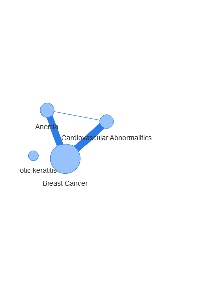
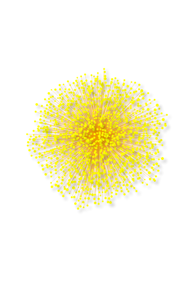
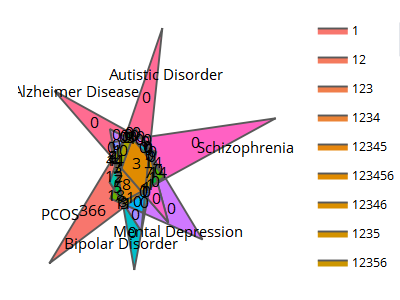

<!-- README.md is generated from README.Rmd. Please edit that file -->
# pcoskbR

pcoskbR provides an R interface to access datasets related to PCOS in PCOSKBR2. As well as, data mining tools for comorbidity prediction and identification of enriched pathways and hub genes.

## Installation

You can install the developer version from github.

``` r
devtools::install_github("omtarful/pcoskbR")
```

# Intoduction

PCOSKB is a manually curated knowledgebase on PCOS. PCOSKBR allows us. Information on associated genes, SNPs, diseases, gene ontologies and pathways along with supporting reference literature is collated and integrated in PCOSKB. Various tools are embedded in the database such as Comorbidity analysis for estimating the risk of diseases to co-occur with PCOS; Network analysis for identifying enriched pathways and hub genes and Venn analysis for finding common and unique genes, pathways and ontologies. The r "pcoskbR" package, provides an R interface to [PCOSKB](http://pcoskb.bicnirrh.res.in/). This vignette details pcoskbR functionalities and provides a number of example usecases that can be used as the basis for specifying your own queries.

# Selecting page and filters in pcoskbR

The R tool allows you to find information on genes, SNPs, diseases, gene ontologies and pathways associated with PCOS. The function `listPages()`will display information you can browse.

``` r
library(pcoskbR)
pages = listPages()
```

The function displays what kind of information associated to PCOS we can query in the database. The function `listFilters()` lists the filters you can apply to a given page.

``` r
gene_filters = listFilters("Genes")
gene_filters
#> [1] "all"              "Manually curated" "Expression study" "Other sources"
```

Now we can retrieve information on PCOS associated genes using the `browse()` function, using above filters.

``` r
gene_dataset = browse(page = "Genes", filter = "Manually curated")
head(gene_dataset)
#>       Gene Symbol Entrez ID                                           Aliases
#> row         ABCA1        19 ABC-1, ABC1, CERP, HDLCQTL13, HDLDT1, HPALP1, TGD
#> row.1       ACACA        31                     ACAC, ACACAD, ACC, ACC1, ACCA
#> row.2         ACE      1636                            ACE1, CD143, DCP, DCP1
#> row.3       ACTA2        59                                             ACTSA
#> row.4        ACTB        60                                  BRWS1, PS1TP5BP1
#> row.5       ACTG1        71                ACT, ACTG, DFNA20, DFNA26, HEL-176
#>                                       Gene Name Chromosomal Location
#> row   ATP binding cassette subfamily A member 1               9q31.1
#> row.1              Acetyl-CoA carboxylase alpha                17q12
#> row.2           Angiotensin I converting enzyme              17q23.3
#> row.3              Actin alpha 2, smooth muscle             10q23.31
#> row.4                                Actin beta               7p22.1
#> row.5                             Actin gamma 1              17q25.3
#>            Record type
#> row   Manually curated
#> row.1 Manually curated
#> row.2 Manually curated
#> row.3 Manually curated
#> row.4 Manually curated
#> row.5 Manually curated
```

# Tools available for analysis

## Comorbidity Analysis

The comorbidity Analysis tool allows us to check the comorbidity for PCOS and one or more diseases. We can call it using the function `generateComorbidityAnalysis()`. This function accepts a containing one or more diseases and the algorithm to perform the analysis. We can check a list of the available algorithms using the `listCAlgorithms()` function. For more details on how are scores are calculated refer to .

``` r
listCAlgorithms()
#> [1] "Shared genes"               "Uniqueness of shared genes"
#> [3] "Shared ontologies"          "Network-based seperation"
```

In this example we will use the algorithm based on shared genes.

``` r
generateComorbidityAnalysis(disease_list = c("Anemia", "Kawasaki disease"), algorithm = "Shared genes")
#> Warning: Removed 1 rows containing missing values (geom_text).
```


    #>          Anemia Kawasaki disease
    #> PCOS   5.328597        0.8880995
    #> Anemia       NA        3.3333333

The function returns a matrix with scores in each cell indicating the risk of comorbidity between two diseases and generates a heatmap with the risks.

## Network Analysis

### Disease-Disease Network

This tools allows us to illustrate a disease-disease network through shared genes. It can be called using the function `getNetworkAnalysis()`. It returns a dataframe with all input diseases and associated genes and displays a network of diseases where size of the node shows the size of a node is proportional to the number of genes associated with the disease and the width of each edge is proportional to the number the shared genes.

``` r

getNetworkAnalysis(disease_list = c("Cardiovascular Abnormalities","Xerotic keratitis", "Anemia",
 "Breast Cancer"), dataset = "Genes")
```

 If this your first time using , you might wonder how to find diseases associated with PCOS. The function `listDiseases()` can be used to see all diseases associated with PCOS in the database.

``` r
listDiseases(dataset = "Genes", disease_group = "Renal Disorder")
#>  [1] "Albuminuria"                        "Allanson Pantzar McLeod syndrome"  
#>  [3] "Alport Syndrome"                    "Ascites"                           
#>  [5] "Atypical Hemolytic Uremic Syndrome" "Azotemia"                          
#>  [7] "Balkan Nephropathy"                 "Bladder Neck Obstruction"          
#>  [9] "CAKUT"                              "Diabetic Kidney Disease"           
#> [11] "Diabetic Nephropathy"               "Glomerular Hyalinosis"             
#> [13] "Glomerular Hypertrophy"             "Glomerulonephritis"                
#> [15] "Glomerulopathy"                     "Glomerulosclerosis"                
#> [17] "Hematuria"                          "Hemolytic-Uremic Syndrome"         
#> [19] "Hydronephrosis"                     "Hyperuricemic Nephropathy"         
#> [21] "Hypospadias"                        "Interstitial Cystitis"             
#> [23] "Kidney Calculi"                     "Kidney Failure"                    
#> [25] "Kidney Insufficiency"               "Kidney Tubular Necrosis"           
#> [27] "Nephritis"                          "Nephritis, Interstitial"           
#> [29] "Nephrolithiasis"                    "Nephropathy"                       
#> [31] "Nephrosis"                          "Nephrotic Syndrome"                
#> [33] "Oliguria"                           "Overactive Bladder"                
#> [35] "Oxalosis"                           "Painful Bladder Syndrome"          
#> [37] "Polycystic Kidney Diseases"         "Renal Fibrosis"                    
#> [39] "Renal Osteodystrophy"               "Uremia"                            
#> [41] "Ureteral Calculi"                   "Urinary Bladder Diseases"
```

The argument can either have "Genes" or "miRNAs" as value. To see the list of disease groups that can be used as input, you can use tbe 'listDiseaseGroup()' function. Default values are "Genes" and "all" for the and arguments.

``` r
listDiseaseGroup(dataset = "Genes")
#>  [1] "all"                                                            
#>  [2] "Blood Disorders"                                                
#>  [3] "Cardiovascular Diseases"                                        
#>  [4] "Congenital, Hereditary, and Neonatal Diseases and Abnormalities"
#>  [5] "Digestive System Diseases"                                      
#>  [6] "Ear Or Mastoid Diseases"                                        
#>  [7] "Endocrine System Diseases"                                      
#>  [8] "Eye Diseases"                                                   
#>  [9] "Immune System Diseases"                                         
#> [10] "Musculoskeletal Diseases"                                       
#> [11] "Neoplasms"                                                      
#> [12] "Nervous System Diseases"                                        
#> [13] "Nutritional and Metabolic Diseases"                             
#> [14] "Psychiatric/Brain disorders"                                    
#> [15] "Renal Disorder"                                                 
#> [16] "Reproductive disorders"                                         
#> [17] "Respiratory Tract Diseases"                                     
#> [18] "Skin and Connective Tissue Diseases"
```

This list of disease groups can be used as input in the function.

### Pathway Analysis

#### Getting enriched pathways

Explain about use of enriched pathways. The pathway analysis tool gives a of enriched pathways for selected diseases. We call it using the `generatePathwayAnalysis()` function. It accepts , and as arguments. Database can either be "KEGG" or "Reactome".

``` r
pathways.df = PathwayAnalysis(disease_list = c("Anemia"),
         dataset = "Genes",
          database = "KEGG")
head(pathways.df)
#>                                      Pathway name
#> row.1...1       Phospholipase D signaling pathway
#> row.2...2 Neuroactive ligand-receptor interaction
#> row.3...3  Adrenergic signaling in cardiomyocytes
#> row.4...4      Vascular smooth muscle contraction
#> row.5...5                Renin-angiotensin system
#> row.6...6                         Renin secretion
#>           Pathway genes associated with PCOS and the selected diseases
#> row.1...1                                                  AGT, PDGFRA
#> row.2...2                                                AGT, PRL, PTH
#> row.3...3                                                          AGT
#> row.4...4                                                          AGT
#> row.5...5                                                     AGT, REN
#> row.6...6                                                     AGT, REN
#>                                                                                                                                                                                                                                                                     Pathway genes associated with PCOS
#> row.1...1                                                                                                                                                                                    AKT3, AGT, EGFR, AKT1, AKT2, CXCL8, INS, INSR, PDGFRA, PIK3CA, PIK3CG, PIK3R1, PLCB2, PLCB3, MAPK1, MAPK3
#> row.2...2 CGA, UCN3, ADM, CRH, ADRB2, ADRB3, DRD2, AGT, APLNR, EDN1, FSHB, FSHR, GCG, GH1, GHR, GHRH, GIP, GLP1R, GNRH1, GNRHR, NR3C1, HTR2C, IAPP, INSL3, KISS1, KNG1, LEP, LEPR, LHB, LHCGR, MTNR1A, MTNR1B, NPY, OXT, GHRL, POMC, PRL, PYY, PTH, RLN1, RLN2, SST, TACR3, C3, CALCA, CCK, APLN, UCN2
#> row.3...3                                                                                                                                                                                                  AKT3, MAPK14, ADRB2, AGT, AKT1, AKT2, GNAQ, KCNQ1, ATF4, PIK3CG, PLCB2, PLCB3, MAPK1, MAPK3
#> row.4...4                                                                                                                                                                                                           ADM, AGT, EDN1, GNAQ, MYH11, NPPB, PLCB2, PLCB3, MAPK1, MAPK3, ACTA2, ACTG2, CALCA
#> row.5...5                                                                                                                                                                                                                                                                                ACE, AGT, REN
#> row.6...6                                                                                                                                                                                                                                 ADRB2, ADRB3, ACE, AGT, EDN1, GNAQ, PDE3B, PLCB2, PLCB3, REN
#>           Hypergeometric probability
#> row.1...1          0.159732685532648
#> row.2...2           0.23363353260246
#> row.3...3          0.371785240224444
#> row.4...4          0.364445361612939
#> row.5...5        0.00783718583187695
#> row.6...6         0.0819318218889266
```

This function returns a list of enriched pathways. Enriched pathways are identifed based on hypergeometric distribution with the threshold p value set as 0.05 (gene dataset) and 0.001 (miRNA dataset) based on the data size.

#### Visualizing enriched pathways

Output of the `generatePathwayAnalysis()` is used as input for the `viewNetwork()` function. This functions allows us to visualize the pathways as a network.

``` r
viewNetwork(pathways.df)
```

Each pathway is represented as a node and is connected to other pathways in the network based on common genes or miRNAs. Te thickness of the edge is proportional to the number of shared genes or miRNAs. In this example there are 151 nodes. We can also filter the data.frame to just obtain a network with enriched pathways for example.

``` r
#filter dataframe to only obtain enriched pathways
enriched_pathways.df = pathways.df[which(pathways.df$`Hypergeometric probability` <= 0.005),]
viewNetwork(enriched_pathways.df)
```

### Gene Network Analysis

This tool allows us to generate hypothesis about disease targets based on network properties. Experimentally validated interactions from STRING v11 were used for creating gene interaction networks for enriched pathways. Critical genes in these pathways were identifed based on network topological properties such as degree, closeness centrality, and betweenness centrality calculated using [igraph](https://igraph.org/) package in R. You can call it using the `getGeneNetworkAnalysis()` function.

``` r
gene_tbl.df = getGeneNetworkAnalysis(disease_list =  c("Psychomotor Disorders", "Psychosexual Disorders" , "Pubertal Disorder"),
database = "Reactome")
#> Submitting with 'Add'
```

Check [PCOSKB](http://pcoskb.bicnirrh.res.in/) for details on how bottleneck genes and hub genes are chosen.

#### Visualizing interactions

We can also visualize all gene-gene interactions using `viewInteractions()` function. It has one argument and the value is a gene Symbol.

``` r
viewInteractions("INS")
```



## Venn Analysis

This tool can be used to illustrate the unique and/or common genes, pathways and ontologies for 2 or more (up to 6) diseases. The function `getVennAnalysis()` is used for that purpose. Function arguments a vector of disease of up to 6 diseases. There is alos the options argument that can be either "Genes", "Pathways" or

``` r
getVennAnalysis(disease_list = c("PCOS", "Bipolar Disorder", "Mental Depression", "Schizophrenia", "Autistic Disorder", "Alzheimer Disease" ), option = "Genes")
#> Warning: Ignoring unknown aesthetics: text
```

 Object will render the graph locally in your web browser or in the RStudio viewer.

This outputs an interactive web-based Venn-Diagram diagram created using [ggVennDiagram](https://cran.r-project.org/web/packages/ggVennDiagram/index.html) and rendered using [plotly](https://plotly.com/).
